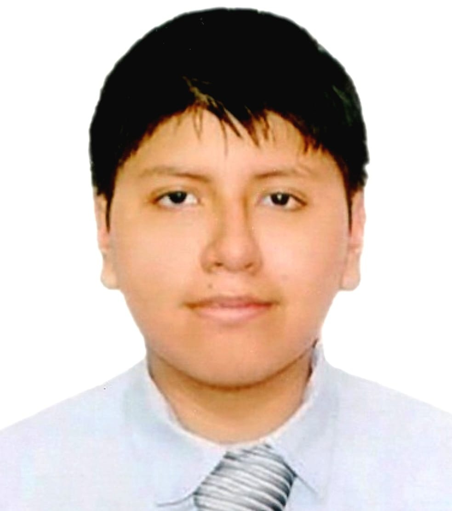

# Capítulo 1: Introducción

La presente introducción tiene como finalidad contextualizar el proyecto desarrollado, proporcionando una visión general de los antecedentes, objetivos y fundamentos que sustentan su planteamiento. Asimismo, delimita el alcance de la propuesta y establece el marco de referencia necesario para comprender su desarrollo, destacando su relevancia, los retos que busca abordar y los beneficios esperados de su implementación. De esta manera, se ofrece una base conceptual que orienta al lector y facilita la comprensión de los contenidos expuestos en las secciones posteriores del documento.

## 1.1. Startup Profile

La presente sección tiene como finalidad presentar la startup responsable de la propuesta y los elementos que definen su identidad organizacional. En ella se describen los aspectos fundamentales relacionados con la empresa, incluyendo su misión, visión, propósito, propuesta de valor y características principales de la solución planteada. Asimismo, se exponen los componentes que permiten comprender el enfoque adoptado y la manera en que la startup busca generar valor dentro de su ámbito de aplicación. De esta manera, la información desarrollada proporciona el contexto necesario para comprender la propuesta presentada y su relación con los objetivos generales del proyecto.

### 1.1.1. Descripción de la Startup

La startup IngesCompany se dedica al desarrollo de soluciones tecnológicas orientadas a la transformación digital de procesos especializados en industrias altamente reguladas. Su objetivo es contribuir a la mejora de la eficiencia operativa, la gestión de información y el cumplimiento de estándares de calidad mediante herramientas digitales que apoyen las actividades críticas de las organizaciones.

Como parte de esta visión, la empresa desarrolla DoofPlus, una plataforma web diseñada para apoyar la gestión de calidad y la trazabilidad dentro de la industria farmacéutica. La solución permite centralizar información relacionada con los procesos de fabricación y control de calidad, facilitando el acceso a registros organizados, confiables y disponibles para su consulta y seguimiento.

DoofPlus busca fortalecer la gestión de los procesos asociados al ciclo de vida de los productos farmacéuticos, apoyando actividades de documentación, trazabilidad y cumplimiento regulatorio. De esta manera, la plataforma contribuye a mejorar la visibilidad de la información requerida para la toma de decisiones y favorece el cumplimiento de las Buenas Prácticas de Manufactura (BPM) y de los estándares exigidos por las entidades regulatorias del sector.

### **Misión**

Diseñar soluciones tecnológicas abiertas que permitan digitalizar y optimizar la gestión de calidad farmacéutica, integrando información operativa y datos IoT para fortalecer la trazabilidad, el cumplimiento regulatorio y la confiabilidad de los procesos.

### **Visión**

Convertirnos en una referencia en soluciones digitales de aseguramiento de calidad para la industria farmacéutica latinoamericana, facilitando la adopción de tecnologías abiertas que mejoren la trazabilidad, la integridad de los datos y la gestión del cumplimiento regulatorio.

### 1.1.2 Perfiles de Integrantes del Equipo

|                         Foto                         |                                Detalles del Perfil                                 |                                                                                                                                                                                                                    Descripción Personal                                                                                                                                                                                                                     |
|:----------------------------------------------------:|:----------------------------------------------------------------------------------:|:-----------------------------------------------------------------------------------------------------------------------------------------------------------------------------------------------------------------------------------------------------------------------------------------------------------------------------------------------------------------------------------------------------------------------------------------------------------:|
|    |   Marcelo Martín Angulo Ramírez   (U202321425)   Ingeniería de Software.   |                                                                Tengo 21 años y soy una persona puntual, responsable y comunicativa. Me interesé por la carrera gracias a cursos de programación del colegio y a los que tomé por mi cuenta; actualmente manejo C++ y Python, y busco ampliar mis conocimientos en otros lenguajes para optimizar mi trabajo en equipo y resolver problemas.                                                                 |
|   |    Cobades Zamora Yhoshua Hebert   (U20231H117)   Ingeniería de Software.    |                                                                                            Tengo 19 años, me interesa mucho aprender sobre tecnología y soy bastante resistente al estrés. En mis tiempos libres me gusta aprender e informarme sobre la situación actual de varias tecnologías. Me divierto surfeando en las olas de internet. I use Arch btw.                                                                                             |
|      |    Nestor Daniel Rojas Ambicho   (U20241F397)   Ingeniería de Software.    |                 Tengo 20 años, apasionado por la tecnología, el desarrollo de aplicaciones y la programación. Con experiencia en proyectos académicos de software, bases de datos y metodologías de desarrollo, busco constantemente aprender y dominar nuevas herramientas técnicas. Me interesé por la carrera debido a que desde el colegio me gustaban cursos relacionados a la tecnologia, y después empecé a aprender por mi cuenta.                  |
|  |  Yarleque Ruiz, Cristina Marcela   (U202423162)   Ingeniería de Software.  | Tengo 20 años y soy una persona responsable, organizada y comprometida. Me interesa mucho la tecnología, especialmente el desarrollo de software y la creación de aplicaciones. Mi interés por la programación fue gracias a mi familia, lo que me llevó a elegir Ingeniería de Software. Actualmente cuento con conocimientos en programación, bases de datos y desarrollo de proyectos, y busco constantemente aprender nuevas herramientas y tecnologías |
|  | Rodolfo Martin Zavaleta Gutierrez   (U20241F733)   Ingeniería de Software. |                                                                                                                                 Tengo 19 años y soy una persona puntual y responsable. Me interesé por la carrera debido a mis gustos adquiridos por la programación gracias a cursos del colegio y que tomé por mi parte.                                                                                                                                  |  

## 1.2. Solution Profile

### 1.2.1. Antecedentes y problemática

#### **1. ANTECEDENTES:**

La industria farmacéutica se encuentra entre los sectores más regulados debido al impacto directo que sus productos tienen sobre la salud de la población. En el Perú, la Dirección General de Medicamentos, Insumos y Drogas (DIGEMID) exige el cumplimiento de las Buenas Prácticas de Manufactura (BPM), las cuales establecen lineamientos relacionados con la producción, el control de calidad, la documentación y la gestión de los procesos involucrados en la fabricación de medicamentos. Estas normativas tienen como finalidad garantizar que los productos elaborados mantengan estándares adecuados de calidad, seguridad y eficacia durante todo su ciclo de vida.

Asimismo, organismos internacionales como la Organización Mundial de la Salud (OMS) destacan que la trazabilidad y la integridad de los datos constituyen elementos fundamentales para la gestión de la calidad farmacéutica. La disponibilidad de información completa, precisa y accesible permite respaldar actividades de auditoría, validación, control de calidad y cumplimiento regulatorio, contribuyendo a la confiabilidad de los procesos y a la seguridad de los productos destinados a los pacientes.

En este contexto, la transformación digital representa una oportunidad para optimizar la gestión de la información generada durante la fabricación farmacéutica. La integración de plataformas digitales con tecnologías de captura automática de datos permite fortalecer la trazabilidad de los lotes, mejorar la disponibilidad de evidencias de calidad y facilitar el acceso a información crítica para la toma de decisiones y el cumplimiento de los requisitos regulatorios.

#### **2. PROBLEMATICA**

##### - **Gestión compleja de la documentación de calidad:**

Los procesos de aseguramiento y control de calidad generan una gran cantidad de información asociada a protocolos, registros de producción, resultados de análisis, desviaciones y actividades de validación. La administración eficiente de esta documentación representa un desafío para las organizaciones farmacéuticas, especialmente cuando la información se encuentra distribuida en múltiples fuentes o sistemas independientes. Esta situación puede dificultar la búsqueda de evidencias y el seguimiento oportuno de los procesos relacionados con la calidad.

##### - **Dificultades en la trazabilidad de lotes farmacéuticos:**

La trazabilidad es un requisito esencial dentro de los sistemas modernos de calidad farmacéutica, ya que permite reconstruir el historial completo de fabricación de un producto. Sin embargo, la recopilación e integración de información proveniente de distintas etapas del proceso productivo puede resultar compleja, limitando la visibilidad sobre los eventos ocurridos durante el ciclo de vida de cada lote y dificultando las actividades de seguimiento, revisión e inspección.

##### - **Necesidad de fortalecer la integridad y disponibilidad de la información:**

La OMS destaca que la integridad de los datos es un componente esencial de los sistemas de calidad farmacéuticos. Los registros utilizados para actividades de producción, control de calidad y cumplimiento regulatorio deben mantenerse completos, precisos, consistentes y disponibles durante todo su ciclo de vida. La gestión inadecuada de la información puede afectar la confiabilidad de los procesos y dificultar las actividades de auditoría e inspección.

##### - **Oportunidad de utilización de tecnologías IoT:**

Las tecnologías basadas en Internet de las Cosas (IoT) permiten capturar información directamente desde equipos, entornos y procesos mediante dispositivos conectados. Su incorporación representa una oportunidad para complementar los registros de calidad con datos obtenidos de forma automática, aumentando la confiabilidad de la información y facilitando la supervisión de variables relevantes dentro de los procesos de fabricación farmacéutica.

#### **3. ANALISIS 5W & 2H:**

- **What (¿Qué?):** ¿Qué es lo que se busca resolver?

  Se busca resolver las limitaciones relacionadas con la gestión de documentación de calidad, la trazabilidad de los lotes farmacéuticos y la disponibilidad de información confiable para actividades de aseguramiento de calidad y cumplimiento regulatorio.

- **Why (¿Por qué?):** ¿Por qué es importante resolverlo?

  Porque la calidad de los medicamentos depende de procesos adecuadamente controlados, documentados y respaldados por información íntegra y trazable. Además, una gestión eficiente de los registros facilita las auditorías, fortalece la toma de decisiones y contribuye al cumplimiento de las BPM y de los requisitos regulatorios aplicables.

- **Who (¿Quién?):** ¿A quién afecta?

  Afecta principalmente a especialistas de aseguramiento y control de calidad (QA/QC), así como a responsables de producción farmacéutica encargados de supervisar procesos, gestionar documentación y asegurar el cumplimiento de estándares regulatorios.

- **When (¿Cuándo?):** ¿Cuándo ocurre?

  La necesidad se presenta durante todas las etapas del ciclo de vida de un lote farmacéutico, incluyendo la fabricación, el control de calidad, la gestión de desviaciones, la revisión documental y las actividades de auditoría.

- **Where (¿Dónde?):** ¿En dónde ocurre?

  Se manifiesta en laboratorios y plantas farmacéuticas donde se ejecutan actividades de producción, aseguramiento de calidad y control regulatorio.

- **How (¿Cómo?):** ¿Cómo se resuelve?

  Puede abordarse mediante una plataforma digital que centralice protocolos, expedientes de calidad y registros asociados a los lotes farmacéuticos, complementando la información mediante tecnologías IoT para fortalecer la trazabilidad y disponibilidad de datos.

- **How much (¿Cuánto?):** ¿Cuánto cuesta resolverlo?

  La implementación requiere infraestructura tecnológica para el despliegue de la solución, digitalización de procesos documentales, capacitación de los usuarios e integración con fuentes de información internas y dispositivos IoT. La inversión dependerá del tamaño de la organización y del alcance de la integración requerida.

### 1.2.2. Lean UX Process

#### 1.2.2.1. Lean UX Problem Statements

#### 1.2.2.2. Lean UX Assumptions

#### 1.2.2.3. Lean UX Hypothesis Statements

#### 1.2.2.4. Lean UX Canvas

## 1.3. Segmentos objetivo

### Segmento objetivo 1: Especialista de Aseguramiento y Control de Calidad (QA/QC)

### Segmento Objetivo 2: Jefe o Supervisor de Producción Farmacéutica

