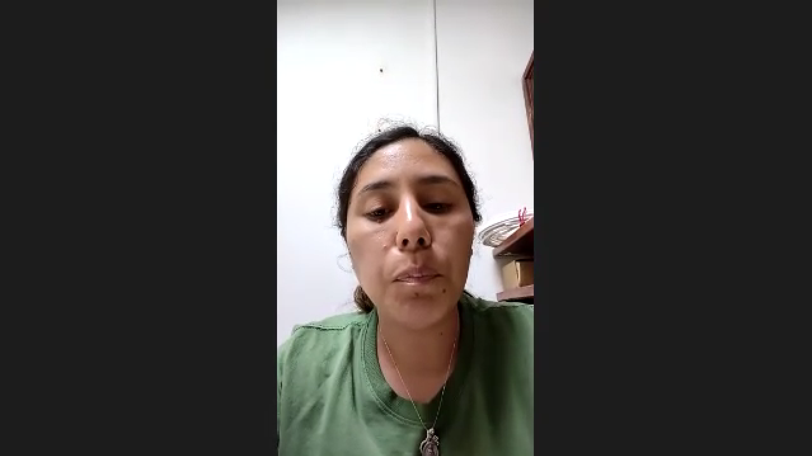
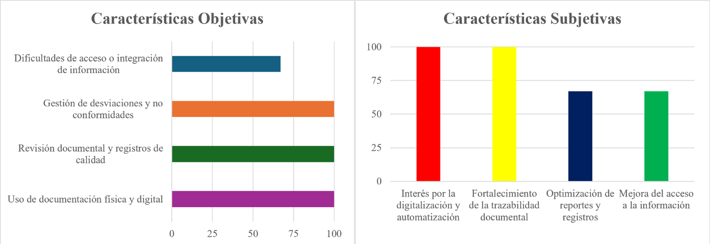
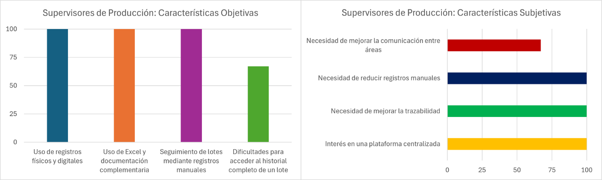
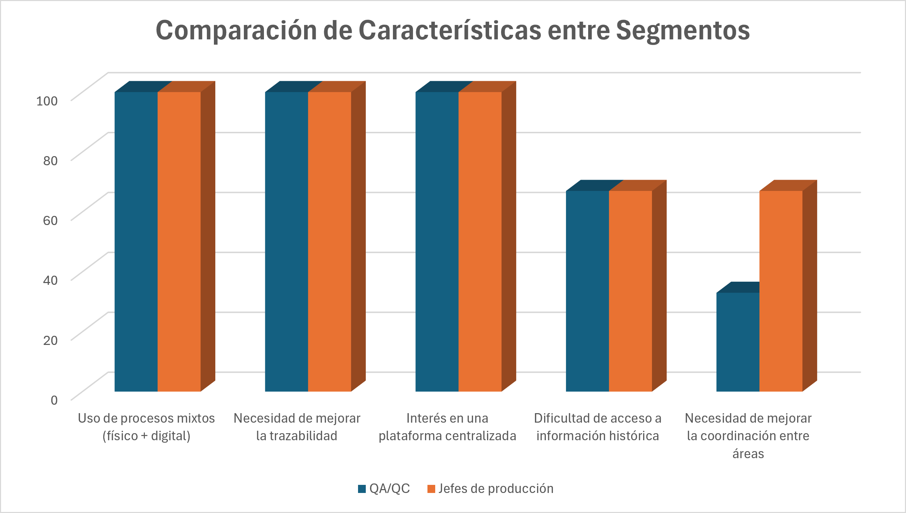
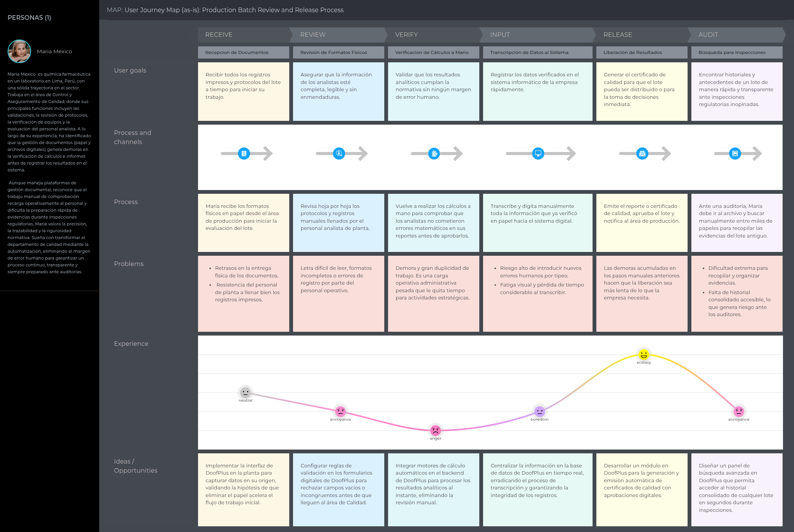
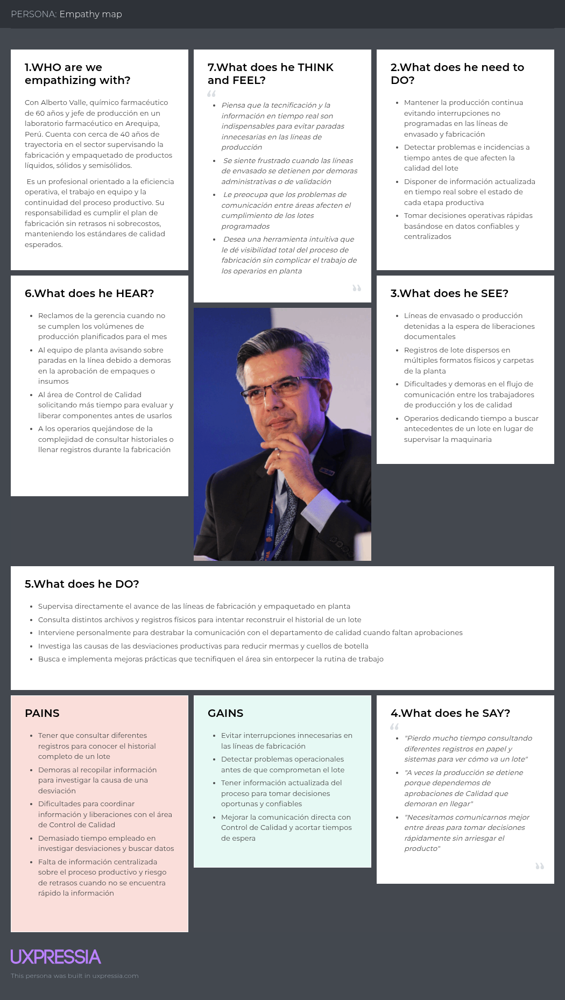
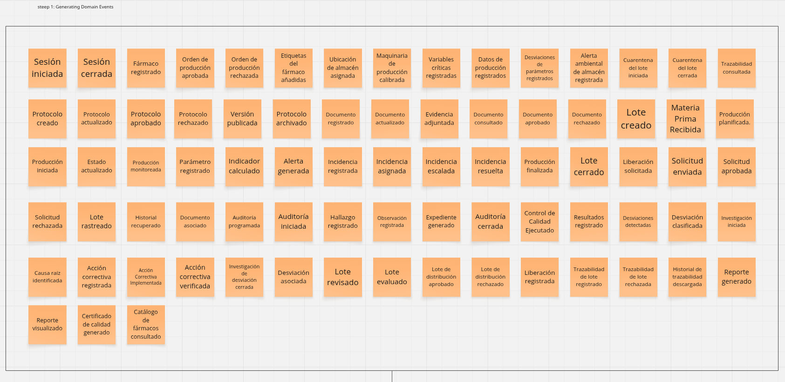
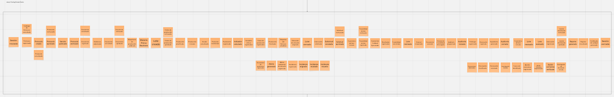
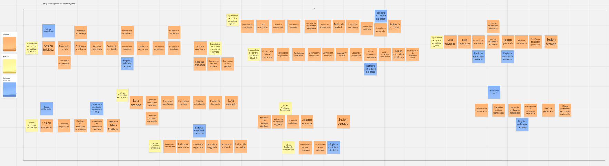

# Capítulo II: Requirements Elicitation & Analysis

## 2.1. Competidores
Para desarrollar una solución efectiva, es importante entender la situación competitiva y las diferentes variantes que se utilizan en los laboratorios farmacéuticos. Este análisis nos ayuda a identificar cómo se gestionan los procesos de calidad actualmente, y qué limitaciones presentan las soluciones existentes.

En este periodo, se analizan distintos tipos de competidores con el objetivo de entender sus fortalezas y debilidades, y así posicionar a DoofPlus como una propuesta que responda de manera más efectiva a las necesidades reales del sector.

### 2.1.1. Análisis competitivo
A continuación, se presenta una tabla comparativa sobre los principales competidores, en el que se considera su propuesta de valor, mercado objetivo y características generales. Este análisis permite evidenciar que, mientras las soluciones existentes se orientan a grandes corporaciones o dependen de procesos manuales, DoofPlus podrá destacar como una alternativa specializada, accesible y centrada en la automatización del aseguramiento de la calidad mediante integración IoT y trazabilidad digital, especialmente pensada para laboratorios medianos y entidades públicas de la región.

<table border="1" cellpadding="10" cellspacing="0" style="width: 100%; margin-left: auto; margin-right: auto; font-family: sans-serif; table-layout: fixed; word-wrap: break-word; text-align: left;">
  <colgroup>
    <col style="width: 10%;">
    <col style="width: 10%;">
    <col style="width: 20%;">
    <col style="width: 20%;">
    <col style="width: 20%;">
    <col style="width: 20%;">
  </colgroup>

  <tr>
    <th colspan="6" style="text-align: center;">Competitive Analysis Landscape</th>
  </tr>
  <tr>
    <td colspan="2" rowspan="2"><b>¿Por qué llevar a cabo este análisis?</b></td>
    <td colspan="4">¿Cómo se posiciona DoofPlus frente a sus competidores en cuanto a fortalezas, debilidades, oportunidades y su propuesta de valor dentro del mercado de gestión de calidad de máquinas farmacéutica y los fármacos producidos?</td>
  </tr>
  <tr>
    <td colspan="4">Es una propuesta que posiciona a DoofPlus como una plataforma SaaS orientada a la gestión de calidad farmacéutica, incorporando integración IoT para automatizar la captura de datos, mejorar la trazabilidad y asegurar el cumplimiento normativo frente a otras soluciones del mercado.</td>
  </tr>
  <tr>
    <td colspan="2" style="text-align: center;"><b>Competidores</b></td>
    <td style="text-align: center; vertical-align: middle;">
      <b>DoofPlus</b> 
      
    </td>
    <td style="text-align: center; vertical-align: middle;">
      <b>TuHub</b> 
      
    </td>
    <td style="text-align: center; vertical-align: middle;">
      <b>LOLFAR (Lolimsa)</b> 
      
    </td>
    <td style="text-align: center; vertical-align: middle;">
      <b>DrugXafe (Tiga Health)</b> 
      
    </td>
  </tr>

  <tr>
    <td rowspan="2"><b>Perfil</b></td>
    <td>Overview</td>
    <td>Plataforma web open source diseñada para apoyar la gestión de calidad y trazabilidad en la industria farmacéutica peruana, con integración de datos IoT para fortalecer el monitoreo de procesos productivos.</td>
    <td>Plataforma SaaS/HaaS empresarial que integra hardware IoT nativo en maquinaria para la regulación de procesos y control digitalizado de calidad ("Cuarentena/Liberación") bajo normativas BPM de DIGEMID.</td>
    <td>Plataforma global No-Code enfocada en operaciones farmacéuticas que permite digitalizar las guías de lotes (eBR) y flujos de trabajo en plantas de alta tecnología.</td>
    <td>Sistema integral peruano de serialización, agregación de empaques y trazabilidad farmacéutica enfocado en la seguridad de la cadena de suministro logístico.</td>
  </tr>
  <tr> 
    <td>Ventaja competitiva</td>
    <td>Solución open source con integración IoT nativa, enfocada específicamente en el contexto regulatorio peruano (BPM/DIGEMID), con bajo costo de adopción y capacidad de personalización.</td>
    <td>Automatización total mediante IoT que elimina el error humano en los registros, con flujos de validación preconfigurados nativamente según la ley peruana sin costos extra de consultoría.</td>
    <td>Flexibilidad total para crear aplicaciones de manufactura sin escribir código y una biblioteca global de plantillas validadas para laboratorios de primer nivel.</td>
    <td>Mitigación robusta del riesgo de falsificación de medicamentos y automatización de reportes de salida logística para cumplir normativas de distribución.</td>
  </tr>

  <tr>
    <td rowspan="2"><b>Perfil de Marketing</b></td>
    <td>Mercado objetivo</td>
    <td>Laboratorios y plantas farmacéuticas medianas y pequeñas en el Perú y Latinoamérica que buscan digitalizar sus procesos de calidad y trazabilidad con bajo presupuesto.</td>
    <td>Medianas y grandes fábricas industriales/cosméticas/farmacéuticas en Sudamérica.</td>
    <td>Laboratorios farmacéuticos nacionales, distribuidores mayoristas y entidades reguladoras de salud.</td>
    <td>Laboratorios, distribuidoras farmacéuticas, clínicas y farmacias en el mercado peruano y andino.</td>
  </tr>
  <tr>
    <td>Estrategias de marketing</td>
    <td>Marketing digital enfocado en contenido educativo sobre transformación digital farmacéutica, comunidad open source, y presencia en eventos del sector salud y tecnología en Perú.</td>
    <td>Marketing B2B global mediante webinars, whitepapers, conferencias de la industria farmacéutica (ISPE, PDA), y alianzas con consultoras de cumplimiento regulatorio.</td>
    <td>Venta corporativa directa (B2B) apoyada en consultoría técnica de eficiencia y automatización de procesos.</td>
    <td>Marketing de reputación histórica local, venta consultiva B2B presencial en Lima e industria de la salud.</td>
  </tr>

  <tr>
    <td rowspan="3"><b>Perfil de Producto</b></td>
    <td>Productos & Servicios</td>
    <td>Plataforma web de gestión de calidad farmacéutica: gestión de protocolos, expedientes de calidad, trazabilidad de lotes, gestión de desviaciones, dashboards operativos e integración con dispositivos IoT.</td>
    <td>Software MES de monitoreo de producción, integración con sensores básicos y paneles de control analíticos.</td>
    <td>Módulos de serialización, agregación de empaques, software de reportes regulatorios y despacho seguro.</td>
    <td>ERP completo: Contabilidad, compras, control de almacenes, mermas farmacéuticas y facturación.</td>
  </tr>
  <tr>
    <td>Precios & Costos</td>
    <td>Open source y gratuito con modelos de suscripción. Los costos asociados corresponden a infraestructura de despliegue (hosting) y personalización según las necesidades de la organización.</td>
    <td>ERP completo: Contabilidad, compras, control de almacenes, mermas farmacéuticas y facturación.</td>
    <td>Costo por volumen de lotes/códigos generados e implementación inicial de infraestructura de software.</td>
    <td>Licenciamiento tradicional corporativo con pago inicial por servidores y contratos anuales de soporte.</td>
  </tr>
  <tr>
    <td>Canales de distribución</td>
    <td>Plataforma web responsive accesible desde navegadores modernos en dispositivos de escritorio y móviles.</td>
    <td>Plataforma Web (Dashboards en la nube o servidores locales) para la gerencia y estaciones de planta.</td>
    <td>Web (Portales para auditoría y gestión de almacenes) junto a integración por API con sistemas logísticos.</td>
    <td>Escritorio / Web local enfocado en estaciones de oficina y terminales de inventario administrativo.</td>
  </tr>

  <tr>
    <td rowspan="4"><b>Análisis SWOT</b></td>
    <td>Fortalezas</td>
    <td>1. Código abierto con posibilidad de personalización total. 2. Integración nativa con dispositivos IoT para monitoreo en tiempo real. 3. Bajo costo de adopción. 4. Enfoque específico en el contexto regulatorio farmacéutico peruano (BPM/DIGEMID). 5. Trazabilidad integral del ciclo de vida de lotes.</td>
    <td>Integración nativa de las reglas de DIGEMID, automatización IoT en tiempo real que previene fallas y un modelo HaaS accesible que reduce el CapEx inicial del cliente.</td>
    <td>Tecnología No-Code sumamente madura, ecosistema educativo global consolidado y fuerte respaldo financiero/técnico internacional.</td>
    <td>Especialización absoluta en seguridad de empaques, cumplimiento de normativas de serialización internacional y protección ante falsificaciones.</td>
  </tr>
  <tr>
    <td>Debilidades</td>
    <td>1. Producto en fase temprana de desarrollo sin base instalada en producción. 2. Sin validación regulatoria preconfigurada (requiere validación por parte del cliente). 3. Comunidad open source incipiente. 4. Reconocimiento de marca limitado en el mercado.</td>
    <td>Startup en etapa inicial, catálogo inicial de sensores acotado a las variables críticas y equipo de soporte técnico en proceso de consolidación.</td>
    <td>Costos excesivamente elevados para laboratorios medianos, soporte regional limitado en español y complejidad para adaptarlo a la burocracia de DIGEMID.</td>
    <td>Enfoque exclusivo en la fase de empaque y logística de salida, dejando de lado el monitoreo IoT en las fases críticas de mezcla y fabricación líquida/sólida.</td>
  </tr>
  <tr>
    <td>Oportunidades</td>
    <td>1. Crecimiento del mercado de soluciones digitales en la industria farmacéutica. 2. Aumento de la regulación y necesidad de trazabilidad en el sector. 3. Interés creciente por soluciones open source con enfoque regulatorio. 4. Posibilidad de colaboración con instituciones de investigación y desarrollo.</td>
    <td>Fiscalizaciones más estrictas de DIGEMID en Lima y la urgencia de los laboratorios por digitalizar registros manuales para evitar el cierre o multas de plantas.</td>
    <td>Crecimiento de la adopción de la nube y automatización digital avanzada en grandes corporativos farmacéuticos latinoamericanos.</td>
    <td>Nuevas leyes gubernamentales y tratados en la región andina que exijan la serialización obligatoria de medicamentos para el consumidor final.</td>
  </tr>
  <tr>
    <td>Amenazas</td>
    <td>1. Resistencia al cambio: Rechazo de los laboratorios a abandonar sus procesos manuales o sistemas antiguos. 2. Competencia de gigantes: Grandes empresas (como SAP u Oracle) que podrían lanzar módulos nativos similares. 3. Vulnerabilidad cibernética: Riesgo de hackeos al manejar datos sensibles de salud y telemetría de máquinas. 4. Ciclos de venta lentos: Licitaciones largas y burocráticas, especialmente con entidades públicas. 5. Cambios regulatorios: Actualizaciones sorpresivas en las normativas de la DIGEMID que obliguen a reprogramar el software. 6. Incompatibilidad técnica: Maquinaria de laboratorio antigua o cerrada que dificulte la conexión de los sensores IoT.</td>
    <td>Resistencia cultural de los operarios tradicionales al uso de tecnología y lentitud burocrática en la aprobación de presupuestos por directorios locales.</td>
    <td>Consultorías locales especializadas que logren parametrizar Tulip de forma genérica para cumplir con las normas peruanas a mediano plazo.</td>
    <td>Gigantes logísticos que incorporen herramientas de trazabilidad gratuitas o integradas nativamente en sus servicios de distribución de fármacos.</td>
  </tr>
</table>

### 2.1.2. Estrategias y tácticas frente a competidores

Para posicionar a DoofPlus frente a la competencia internacional (como Tulip y DrugXafe) y a las soluciones locales de gestión tradicional (como LOLFAR), IngesCompany implementa las siguientes estrategias y tácticas competitivas:

#### Estrategia de Costos y Accesibilidad (Modelo HaaS/SaaS sin CapEx elevado):

A diferencia de competidores que exigen licenciamiento tradicional con pago inicial por servidores e infraestructura (LOLFAR) o suscripciones elevadas por usuario/estación (Tulip), DoofPlus ofrece un esquema flexible de licenciamiento adaptado al tamaño de la planta y al número de líneas conectadas, sin inversión inicial de capital en infraestructura de hardware. Esto elimina la barrera financiera de entrada para laboratorios farmacéuticos medianos que hoy quedan fuera del alcance de las soluciones globales.

#### Enfoque Vertical y Regulatorio (Más allá del Monitor Genérico):

Mientras que los MES generalistas (Tulip) carecen de flujos especializados para el control de calidad regulado y de personalización nativa para el marco legal peruano, y las plataformas no-code (DrugXafe) requieren configuración genérica costosa para adaptarse a la burocracia de DIGEMID, DoofPlus integra reglas de cumplimiento BPM/DIGEMID preconfiguradas nativamente, con automatización IoT en tiempo real que cubre las fases críticas de fabricación (mezcla, liberación de lote) que soluciones como LOLFAR —enfocadas solo en empaque y logística de salida— dejan sin monitorear.

#### Gestión Multi-Planta y Trazabilidad de Lotes Centralizada:

Se despliega una arquitectura pensada para que laboratorios y plantas farmacéuticas gestionen múltiples líneas de producción y lotes simultáneamente desde una única cuenta centralizada, con trazabilidad completa del ciclo de vida del producto, optimizando el control que ejercen los especialistas de QA/QC y los responsables de producción.

#### Estrategia Comercial B2B Dirigida:

La prospección se enfoca directamente en especialistas de aseguramiento y control de calidad (QA/QC) y responsables de producción farmacéutica, apoyándose en consultoría técnica de eficiencia y automatización de procesos, y demostrando una reducción directa en el riesgo de observaciones, cierres o multas ante fiscalizaciones de DIGEMID.

## 2.2. Entrevistas

Las entrevistas constituyen una herramienta fundamental para obtener información cualitativa directamente de los profesionales involucrados en los procesos de aseguramiento de calidad y producción farmacéutica. A través de conversaciones estructuradas, se busca comprender sus actividades, necesidades, desafíos, comportamientos y experiencias relacionadas con la gestión de documentación, la trazabilidad de lotes y el acceso a la información. La información recopilada permitirá identificar problemáticas, oportunidades de mejora y necesidades reales del entorno de aplicación, contribuyendo a definir una propuesta de solución alineada con los requerimientos y expectativas de los segmentos objetivo.

### 2.2.1. Diseño de entrevistas

Teniendo en cuenta la importancia de la información que pueden proporcionar los entrevistados, se presentan las preguntas clave para cada segmento objetivo identificado. Para ello, se consideran dos tipos de preguntas: las personales, orientadas a conocer el perfil profesional y la experiencia de los participantes dentro de la industria farmacéutica, y las específicas, enfocadas en comprender los procesos actuales relacionados con la gestión de calidad, la trazabilidad de lotes, el acceso a la información, la gestión documental y la coordinación entre las áreas de producción y aseguramiento de la calidad. Asimismo, se busca identificar las principales dificultades, necesidades y oportunidades de mejora presentes en sus actividades diarias, con el fin de obtener información relevante para la definición de la propuesta de solución.

#### Segmento Objetivo: Especialista de Aseguramiento y Control de Calidad (QA/QC)

##### Preguntas personales

- ¿Cuál es su nombre?
- ¿Cuál es su edad?
- ¿Que dispositivo y buscador emplea?
- ¿Cuál es su cargo actual dentro de la organización?
- ¿Cuántos años de experiencia tiene trabajando en aseguramiento o control de calidad farmacéutica?

##### Preguntas específicas

- ¿Cómo gestiona actualmente los protocolos, registros y documentación relacionada con la calidad de los productos farmacéuticos?
- ¿Qué tipo de información necesita consultar con mayor frecuencia para realizar sus actividades de aseguramiento o control de calidad?
- ¿Cuáles son las principales dificultades que encuentra al buscar información o documentación relacionada con un lote específico?
- ¿Cómo realiza el seguimiento de desviaciones, incidencias o no conformidades dentro de los procesos de calidad?
- ¿Cuánto tiempo suele dedicar a recopilar información o evidencias para auditorías, inspecciones o revisiones internas?
- ¿Qué problemas ha experimentado relacionados con la trazabilidad de los registros o la disponibilidad de información histórica?
- Si pudiera mejorar una actividad relacionada con la gestión de calidad dentro de su organización, ¿cuál sería y por qué?

#### Segmento Objetivo: Jefe o Supervisor de Producción Farmacéutica

##### Preguntas personales

- ¿Cuál es su nombre?
- ¿Cuál es su edad?
- ¿Que dispositivo y buscador emplea?
- ¿Cuál es su cargo actual dentro de la organización?
- ¿Cuántos años de experiencia tiene supervisando procesos de producción farmacéutica?

##### Preguntas específicas

- ¿Cómo realiza actualmente el seguimiento de los lotes durante las diferentes etapas del proceso de fabricación?
- ¿Qué información considera más importante para supervisar el estado de la producción y tomar decisiones operativas?
- ¿Qué herramientas o sistemas utiliza para consultar información relacionada con la producción?
- Cuando ocurre una incidencia o desviación durante la fabricación, ¿cómo se registra y comunica dicha información?
- ¿Cuáles son las principales dificultades que encuentra al acceder al historial de producción de un lote específico?
- ¿Qué tan sencillo o complejo resulta coordinar el intercambio de información con las áreas de aseguramiento y control de calidad?
- Si pudiera mejorar un aspecto relacionado con el acceso o gestión de la información de producción, ¿qué cambiaría y por qué?

### 2.2.2. Registro de entrevistas

En esta sección se presentan los resultados obtenidos de las entrevistas realizadas a los segmentos objetivo identificados para DoofPlus. Para cada entrevista se incluyen los datos generales del participante, un resumen de las respuestas más relevantes, las observaciones realizadas durante la sesión y las principales conclusiones obtenidas. La información recopilada permite comprender las necesidades, dificultades y experiencias de los profesionales vinculados a los procesos de aseguramiento de calidad y producción farmacéutica, constituyendo una fuente de evidencia para la validación de los supuestos planteados y para la definición de las funcionalidades y características de la solución propuesta.

**Segmento 1: Especialista de Aseguramiento y Control de Calidad (QA/QC)**

| Numero | 1 |
|---------|--------|
| **Campo** | **Información** |
| Nombre | Mareliena |
| Apellido | Mexico |
| Edad | 53 |
| Distrito | San Juan de Lurigancho |
| Evidencia |  |
| Link | https://shorturl.at/c0pBO |
| Inicio | 00:00 min |
| Duración | 04:38 min |
| Resumen | María es química farmacéutica y trabaja en el área de Control de Calidad de un laboratorio, donde se encarga de las validaciones, la revisión documental, la verificación de equipos y la evaluación del personal analista. Actualmente, la gestión de la documentación combina procesos manuales y digitales, aunque la empresa busca implementar un software integral que cubra todo el proceso productivo.  Para asegurar la calidad, se revisan registros, protocolos, resultados y reportes de conformidades y no conformidades. Uno de los principales problemas es la revisión manual de cálculos e informes antes de registrar los resultados en el sistema, lo que genera demoras y representa una oportunidad de automatización.  Las desviaciones se investigan analizando posibles causas relacionadas con el personal, los equipos o el producto. Además, la empresa mantiene registros actualizados para auditorías e inspecciones y realiza evaluaciones periódicas. María considera que la generación automática de reportes reduciría significativamente la carga operativa. |

| Numero | 2 |
|---------|--------|
| **Campo** | **Información** |
| Nombre | Julia  |
| Apellido | Collasos Zotelo |
| Edad | 64 |
| Distrito | San Miguel |
| Evidencia |  |
| Link | https://shorturl.at/c0pBO |
| Inicio | 04:39 min |
| Duración | 04:59 min |
| Resumen | Julia Collazo Sotelo es química farmacéutica y trabaja en el área de Aseguramiento de la Calidad de un centro de producción de productos biológicos del Instituto Nacional de Salud (INS), donde se encarga de verificar el cumplimiento de las Buenas Prácticas de Manufactura (BPM), supervisar el sistema de calidad y revisar la documentación asociada a los procesos productivos. Asimismo, participa en actividades relacionadas con auditorías, capacitación del personal, programas de limpieza, mantenimiento, calibración y calificación de equipos. Para el desarrollo de sus actividades utiliza herramientas como Microsoft Word, Excel, Google Chrome y sistemas institucionales de gestión documental y control de procesos.  Para garantizar la calidad de los productos farmacéuticos, se revisan procedimientos, instrucciones de trabajo, protocolos de validación, registros de producción y documentación técnica asociada a materias primas, materiales de empaque y productos terminados. Además, la organización mantiene un sistema de trazabilidad que permite identificar la información relacionada con proveedores, materias primas, operadores, analistas y registros de cada lote producido. Sin embargo, Julia señala que existen dificultades para acceder a determinadas fuentes de información técnica y que, en ocasiones, se presentan errores cuando el personal no sigue adecuadamente los procedimientos establecidos para el registro y seguimiento de la información.  Las desviaciones y no conformidades son registradas, investigadas mediante análisis de causa raíz y gestionadas a través de acciones correctivas y preventivas supervisadas por equipos multidisciplinarios. Aunque considera que la organización cuenta con un sistema de gestión de calidad estructurado, identifica que una de las principales oportunidades de mejora es fortalecer la capacidad del personal para analizar las causas reales de los problemas y asumir una mayor responsabilidad sobre la calidad de sus procesos. En su opinión, la calidad debe ser un compromiso compartido por todas las áreas de la organización y no únicamente una responsabilidad del departamento de Aseguramiento de la Calidad. |

| Numero | 3 |
|---------|--------|
| **Campo** | **Información** |
| Nombre | Edith |
| Apellido | Espinoza |
| Edad | 31 |
| Distrito | Lima |
| Evidencia |  |
| Link | https://shorturl.at/c0pBO |
| Inicio | 09:37 min |
| Duración | 04:58 min |
| Resumen | Edith Espinoza es técnica de enfermería y cuenta con más de cinco años de experiencia en actividades relacionadas con la atención de pacientes y la gestión de información clínica. Actualmente participa en procesos asociados al control de seguros, activaciones y verificación de datos de pacientes de 0 a 11 años, especialmente en servicios vinculados a vacunas y fármacos pediátricos. Para desarrollar sus labores utiliza herramientas como computadoras, laptops, dispositivos Android y sistemas institucionales de registro, trabajando con documentación tanto física como digital.  Para garantizar la correcta atención de los pacientes, realiza la validación de información y el seguimiento de historias clínicas, las cuales aún combinan formatos físicos y digitales debido a un proceso gradual de digitalización. Asimismo, señala que una de las principales dificultades se presenta cuando los pacientes cuentan con más de un seguro o poseen información registrada en entidades externas, ya que estos datos no siempre son visibles en el sistema utilizado, lo que puede generar demoras en la verificación y consulta de información.  Las incidencias relacionadas con medicamentos, como errores en la medicación o la detección de lotes vencidos, son gestionadas mediante reportes que permiten iniciar los procesos correspondientes de devolución, reposición o seguimiento. Aunque reconoce que la organización viene avanzando en la digitalización de sus procesos, considera que una mayor integración de la información y la automatización de los registros contribuirían a mejorar la trazabilidad, reducir errores administrativos y optimizar la gestión de la atención a los pacientes. |

**Segmento 2: Jefe o Supervisor de Producción Farmacéutica**

| Numero | 1 |
|---------|--------|
| **Campo** | **Información** |
| Nombre | Alberto |
| Apellido | Valle Vega |
| Edad | 68 |
| Distrito | Arequipa |
| Evidencia |  |
| Link | https://shorturl.at/c0pBO |
| Inicio | 14:35 min |
| Duración | 04:48 min |
| Resumen | Alberto Valle Vera, químico farmacéutico con cerca de 40 años de experiencia en la industria farmacéutica, describe los procesos de fabricación y empaquetado de productos como jarabes, inyectables, cremas y tabletas. Explica que los componentes de empaque, como frascos, etiquetas, insertos y estuches, deben ser previamente aprobados por el área de control de calidad antes de su uso.  También señala que la industria ha evolucionado desde controles manuales basados en muestreos hacia procesos más tecnificados, orientados a garantizar la calidad y reducir errores. Antes de iniciar la producción se validan los parámetros de los materiales y, durante el proceso, se realizan muestreos periódicos para verificar el cumplimiento de los estándares establecidos.  Las desviaciones se gestionan mediante procedimientos documentados. Los problemas recurrentes requieren investigaciones más profundas y, en casos críticos, la detención de la producción y la elaboración de informes de desviación. Asimismo, la coordinación entre producción y control de calidad se basa en procedimientos que definen responsabilidades, frecuencias de muestreo y criterios de aceptación, garantizando la trazabilidad y la calidad de los productos farmacéuticos. |

| Numero | 2 |
|---------|--------|
| **Campo** | **Información** |
| Nombre | Mariela |
| Apellido | Alanya Mercado |
| Edad | 35 |
| Distrito | Lima |
| Evidencia |  |
| Link | https://shorturl.at/c0pBO |
| Inicio | 19:23 min |
| Duración | 04:59 min |
| Resumen | Mariela Alanya Mercado es química farmacéutica y se desempeña como responsable del laboratorio de Control de Calidad del Centro Nacional de Productos Biológicos del Instituto Nacional de Salud (INS), donde supervisa los análisis y ensayos necesarios para verificar que sueros y antivenenos cumplan con las especificaciones de calidad establecidas. Además, participa en actividades relacionadas con la gestión de recursos, mantenimiento de equipos y adquisición de insumos necesarios para las operaciones del laboratorio.  Para garantizar la calidad de los productos, realiza el seguimiento de lotes y la revisión de resultados de control de calidad utilizando principalmente hojas de cálculo de Microsoft Excel, formularios físicos y documentación en papel. Asimismo, señala que gran parte de la información se encuentra dispersa entre archivos digitales, registros manuales, correos electrónicos y documentos físicos, dificultando el acceso oportuno a la información y aumentando el riesgo de pérdida o duplicidad de registros.  Las incidencias y desviaciones identificadas durante la producción son comunicadas a las áreas correspondientes para su evaluación y tratamiento. La coordinación entre Control de Calidad, Producción y otras áreas se realiza mediante correos electrónicos, documentación física y comunicación directa. Mariela considera que la principal oportunidad de mejora consiste en implementar una plataforma centralizada que permita gestionar documentación técnica, registros de lotes e información de seguimiento, fortaleciendo la trazabilidad, reduciendo la dependencia de procesos manuales y facilitando el acceso seguro a la información. |

| Numero | 3 |
|---------|--------|
| **Campo** | **Información** |
| Nombre | Rick |
| Apellido | Correidos |
| Edad | 26 |
| Distrito | Lima |
| Evidencia |  |
| Link | https://shorturl.at/c0pBO |
| Inicio | 24:26 min |
| Duración | 03:58 min |
| Resumen | Rick Correidos se desempeña como Supervisor de Producción Farmacéutica y cuenta con más de veinte años de experiencia supervisando procesos de fabricación. Entre sus principales responsabilidades se encuentran el seguimiento de los lotes durante las diferentes etapas de producción, la verificación del cumplimiento de los parámetros establecidos y la coordinación con las áreas de calidad para asegurar la correcta ejecución de los procesos productivos. Para desarrollar sus actividades utiliza computadoras de escritorio y laptops, apoyándose principalmente en herramientas como Microsoft Excel, correos electrónicos y sistemas internos de gestión documental.  Para realizar el seguimiento de la producción, utiliza registros de fabricación, formularios físicos y hojas de cálculo donde se documentan los parámetros operativos, controles realizados y estados de cada lote. Asimismo, considera que la información más importante para la toma de decisiones incluye el estado de los lotes, los resultados de control de calidad, las desviaciones reportadas, la disponibilidad de materiales y el cumplimiento de las especificaciones de producción. Sin embargo, señala que una de las principales dificultades se presenta al consultar el historial de un lote, ya que la información suele encontrarse distribuida entre documentos físicos, correos electrónicos, registros archivados y diversas fuentes de información.  Cuando ocurre una incidencia o desviación durante la fabricación, esta es registrada y comunicada al área de Calidad para su evaluación e investigación. La coordinación entre Producción y Calidad es constante, aunque en ocasiones puede resultar lenta debido a la dependencia de documentación física, correos electrónicos y validaciones manuales. En su opinión, una de las principales oportunidades de mejora consiste en implementar una plataforma centralizada que integre la información de producción, calidad y trazabilidad de los lotes, permitiendo acceder rápidamente a los registros, fortalecer la comunicación entre áreas y facilitar las actividades de seguimiento, auditoría y toma de decisiones. |

### 2.2.3. Análisis de entrevistas

En esta sección se presenta el análisis detallado de la información recolectada. Para cada segmento, se explican primero los hallazgos estadísticos objetivos y subjetivos, seguidos de la evidencia gráfica correspondiente.

##### Segmento 1: Especialista de Aseguramiento y Control de Calidad (QA/QC)

**Análisis de Características Objetivas y Subjetivas:** El análisis de las entrevistas evidencia que las áreas de Aseguramiento y Control de Calidad dentro de las organizaciones farmacéuticas evaluadas mantienen una fuerte dependencia de procesos documentales para garantizar el cumplimiento normativo y la trazabilidad de las operaciones. El 100% de los entrevistados desempeña funciones relacionadas con el aseguramiento de la calidad, el control de calidad, la validación de procesos o la revisión documental, lo que brinda solidez y representatividad a la información recopilada para comprender las necesidades del dominio del problema.

Respecto a la gestión de información, el 100% manifestó utilizar esquemas mixtos que combinan documentación física con sistemas digitales para registrar, consultar y controlar información técnica relacionada con procedimientos, protocolos, registros de producción, resultados analíticos y actividades de calidad. Sin embargo, estos procesos continúan requiriendo revisiones manuales, verificaciones documentales y consolidación de información antes de su registro o aprobación definitiva, generando mayores tiempos operativos. Asimismo, se identificó que aproximadamente el 67% de los entrevistados presenta dificultades asociadas a la búsqueda, acceso o integración de información proveniente de diferentes fuentes, lo que afecta la eficiencia de determinadas actividades de control y seguimiento.

Desde la perspectiva subjetiva, el 100% de los entrevistados manifestó una valoración positiva hacia la incorporación de soluciones digitales que permitan automatizar tareas operativas y fortalecer la trazabilidad de la información. Adicionalmente, alrededor del 67% señaló que la automatización de actividades como la generación de reportes, la consolidación de registros y la consulta de información histórica contribuiría significativamente a reducir la carga operativa y minimizar errores asociados a procesos manuales. En general, los entrevistados coinciden en que una plataforma centralizada facilitaría el acceso a la información, optimizaría la gestión documental y fortalecería los procesos de calidad dentro de sus organizaciones.

***Gráficos***

##### Segmento 2: Jefe o Supervisor de Producción Farmacéutica

**Análisis de Características Objetivas y Subjetivas:** El análisis de las entrevistas evidencia que las áreas de Producción Farmacéutica mantienen una elevada dependencia de registros físicos, hojas de cálculo y mecanismos manuales para realizar el seguimiento de los lotes durante las diferentes etapas de fabricación. El 100% de los entrevistados desempeña funciones relacionadas con la supervisión de procesos productivos, el monitoreo de lotes y la coordinación con las áreas de calidad, proporcionando una perspectiva representativa de las necesidades operativas asociadas a la gestión de la información de producción.

Respecto al seguimiento de los lotes, el 100% manifestó utilizar esquemas basados en formularios físicos, registros de producción, hojas de cálculo y documentación complementaria para registrar estados, parámetros operativos y actividades realizadas durante la fabricación. Asimismo, el 100% señaló que información crítica como los resultados de control de calidad, las desviaciones registradas, la disponibilidad de materiales y el cumplimiento de los parámetros de producción son elementos fundamentales para la toma de decisiones. Sin embargo, se identificó que aproximadamente el 67% de los entrevistados experimenta dificultades para acceder al historial completo de un lote debido a que la información suele encontrarse distribuida entre diferentes fuentes, incluyendo documentos físicos, correos electrónicos, registros archivados y archivos digitales independientes.

Desde la perspectiva subjetiva, el 100% de los entrevistados manifestó interés en la implementación de una plataforma centralizada que integre la información de producción, calidad y trazabilidad. Asimismo, todos coinciden en que la reducción de registros manuales, la mejora en la comunicación entre áreas y la disponibilidad inmediata de información histórica facilitarían significativamente las actividades de seguimiento, auditoría y toma de decisiones. En general, los participantes consideran que la centralización de la información permitiría optimizar la gestión operativa y fortalecer la trazabilidad de los procesos productivos.

***Gráficos***

##### Análisis Comparativo

**Contrastación de Segmentos:**  Al comparar ambos segmentos se observa una coincidencia significativa en torno a la necesidad de mejorar la trazabilidad y centralizar la información relacionada con los lotes farmacéuticos. El 100% de los entrevistados, independientemente de su área de trabajo, manifestó utilizar esquemas mixtos que combinan documentación física y herramientas digitales, así como una valoración positiva hacia la incorporación de soluciones tecnológicas orientadas a reducir la dependencia de procesos manuales.

No obstante, se identifican diferencias en el enfoque de sus necesidades. Los especialistas de Aseguramiento y Control de Calidad priorizan la gestión documental, la validación de registros, el seguimiento de desviaciones, la preparación de auditorías y la generación de evidencias regulatorias. Por su parte, los Supervisores de Producción se enfocan principalmente en el monitoreo de los lotes, el control de las operaciones productivas, la gestión de incidencias y el acceso rápido a información que facilite la toma de decisiones operativas.

Estas diferencias evidencian la necesidad de una plataforma que integre la información generada por ambas áreas dentro de un único entorno, permitiendo a Producción y Calidad trabajar sobre los mismos datos, fortalecer la trazabilidad de los lotes y mejorar la coordinación entre los diferentes actores involucrados en el proceso farmacéutico.

#### Conclusiones y Definición de Arquetipos

Basado en el análisis estadístico, se definen los siguientes perfiles para los User Personas:

1.  **User Persona Especialista de Control de Calidad:**

**Rasgo clave:** Busca garantizar el cumplimiento de los estándares de calidad y los requisitos regulatorios mediante una gestión eficiente de protocolos, documentación, desviaciones y evidencias asociadas a cada lote farmacéutico.

**Sustento:** La totalidad de los entrevistados de este segmento manifestó realizar actividades relacionadas con la validación documental, la revisión de registros, el seguimiento de desviaciones y la preparación de información para auditorías e inspecciones. Asimismo, identificaron la automatización de tareas operativas y la centralización de la información como factores clave para mejorar la eficiencia de sus actividades y fortalecer la trazabilidad de los procesos.

2.  **Jefe de Producción Farmacéutica:**

**Rasgo clave:** Busca supervisar eficientemente los procesos de fabricación mediante el acceso oportuno a información de producción, estados de los lotes e incidencias operativas, facilitando la toma de decisiones y la coordinación con las áreas de calidad.

**Sustento:** Los entrevistados pertenecientes a este segmento señalaron que gran parte de su trabajo depende de la consulta constante de registros de producción, parámetros operativos y resultados de calidad. Asimismo, identificaron que la dispersión de la información entre diferentes fuentes dificulta el seguimiento de los lotes y genera retrasos en la coordinación con otras áreas. Por ello, consideran prioritario contar con una plataforma centralizada que facilite la consulta histórica, fortalezca la trazabilidad y reduzca la dependencia de procesos manuales.

## 2.3. Needfinding

La etapa de Needfinding tiene como objetivo identificar y comprender las necesidades, problemas, motivaciones y oportunidades presentes en los segmentos objetivo de DoofPlus a partir de la información obtenida durante las entrevistas realizadas. Mediante el análisis de las experiencias y actividades de los profesionales de aseguramiento de calidad y producción farmacéutica, se busca reconocer los principales desafíos relacionados con la gestión documental, la trazabilidad de lotes, el acceso a la información y el cumplimiento regulatorio. Los hallazgos obtenidos en esta fase permiten transformar los datos recopilados en conocimientos relevantes para el proyecto, facilitando la identificación de necesidades reales de los usuarios y sirviendo como base para la definición de funcionalidades, requisitos y decisiones de diseño orientadas a generar una solución alineada con su contexto de trabajo.

### 2.3.1. User Personas

A partir del análisis de las entrevistas y la información recopilada sobre los procesos de aseguramiento de calidad y producción farmacéutica, se identificaron los principales perfiles de usuarios que interactuarían con la solución propuesta. Estos perfiles representan los segmentos clave para DoofPlus, ya que participan directamente en actividades relacionadas con la gestión de documentación de calidad, la trazabilidad de lotes, el seguimiento de incidencias y el cumplimiento de los requisitos regulatorios establecidos por el sector farmacéutico. La construcción de los User Persona permite comprender mejor sus necesidades, motivaciones, desafíos y hábitos de trabajo, proporcionando información valiosa para definir funcionalidades, priorizar requerimientos y diseñar una experiencia de usuario alineada con las problemáticas y expectativas de cada segmento objetivo.

**1) Segmento 1: Especialista de Aseguramiento y Control de Calidad (QA/QC)**

Para este segmento se elaboró el User Persona María México, tomando como referencia el perfil de los profesionales responsables de las actividades de aseguramiento y control de calidad dentro de laboratorios farmacéuticos. Se consideraron factores como su experiencia en validaciones, revisión documental, verificación de equipos y evaluación de personal analista, así como su participación en la gestión de protocolos, registros y auditorías regulatorias. Sus principales frustraciones se relacionan con la dependencia de procesos manuales para revisar cálculos, informes y documentación antes de registrar los resultados en los sistemas de la organización, lo que incrementa el tiempo invertido en tareas operativas y dificulta la preparación de evidencias para inspecciones y auditorías. Asimismo, se tomó en cuenta su necesidad de disponer de una plataforma que centralice la información de calidad, facilite la trazabilidad de los lotes, automatice la generación de reportes y reduzca la carga administrativa asociada a la gestión documental, permitiéndole dedicar más tiempo a actividades de supervisión y mejora continua de los procesos de calidad.

**2) Segmento 2: Jefe o Supervisor de Producción Farmacéutica**

Para este segmento se elaboró el User Persona Alberto Valle Vega. Se consideraron factores como su amplia experiencia en la industria farmacéutica, su responsabilidad en la supervisión de los procesos de fabricación y su participación en la coordinación con las áreas de aseguramiento y control de calidad. Sus principales motivaciones están orientadas a garantizar que la producción se desarrolle conforme a los procedimientos establecidos, manteniendo la calidad, la trazabilidad y el cumplimiento de los estándares regulatorios durante todas las etapas de fabricación. Entre sus principales dificultades se encuentra el acceso oportuno a información consolidada sobre los lotes en producción, así como la gestión y comunicación de incidencias que requieren seguimiento y documentación formal. Asimismo, se tomó en cuenta su necesidad de disponer de herramientas que faciliten la consulta del historial de producción, mejoren la coordinación entre las diferentes áreas involucradas y permitan acceder a información confiable para la toma de decisiones operativas, contribuyendo a una gestión más eficiente y a la reducción de errores durante el proceso productivo.

### 2.3.2. User Task Matrix
En esta sección se presenta el User Task Matrix, que concentra las tareas que los User Persona realizan para cumplir sus objetivos en su día a día, independientemente de la existencia de una solución de software. Para este análisis se consideran los dos segmentos objetivo identificados: el Especialista de Aseguramiento y Control de Calidad (QA/QC), representado por María México, y el Jefe de Producción Farmacéutica, representado por Alberto Valle. Se evalúa la frecuencia y la importancia de cada tarea para cada segmento con el fin de identificar dónde aportar mayor valor.

<table border="1" cellpadding="8" cellspacing="0" style="border-collapse:collapse; width:100%; font-family:Arial, sans-serif; text-align:center;">
  <thead>
    <tr style="background-color:#eef3f7;">
      <th rowspan="2">Tarea (Task)</th>
      <th colspan="2">Especialista QA/QC (María México)</th>
      <th colspan="2">Jefe de Producción (Alberto Valle)</th>
    </tr>
    <tr style="background-color:#eef3f7;">
      <th>Frecuencia</th>
      <th>Importancia</th>
      <th>Frecuencia</th>
      <th>Importancia</th>
    </tr>
  </thead>
  <tbody>
    <tr>
      <td style="text-align:left;">Consultar el historial y trazabilidad de un lote</td>
      <td>Often</td><td>High</td>
      <td>Often</td><td>High</td>
    </tr>
    <tr>
      <td style="text-align:left;">Registrar y dar seguimiento a desviaciones e incidencias</td>
      <td>Occasionally</td><td>High</td>
      <td>Occasionally</td><td>High</td>
    </tr>
    <tr>
      <td style="text-align:left;">Revisar y validar cálculos analíticos e informes de calidad</td>
      <td>Often</td><td>High</td>
      <td>Rarely</td><td>Low</td>
    </tr>
    <tr>
      <td style="text-align:left;">Gestionar protocolos, registros y documentación de calidad</td>
      <td>Often</td><td>High</td>
      <td>Occasionally</td><td>Medium</td>
    </tr>
    <tr>
      <td style="text-align:left;">Recopilar evidencias para auditorías e inspecciones</td>
      <td>Occasionally</td><td>High</td>
      <td>Rarely</td><td>Medium</td>
    </tr>
    <tr>
      <td style="text-align:left;">Supervisar el estado de los lotes durante la fabricación</td>
      <td>Rarely</td><td>Low</td>
      <td>Often</td><td>High</td>
    </tr>
    <tr>
      <td style="text-align:left;">Coordinar la aprobación de insumos y materiales con Calidad</td>
      <td>Rarely</td><td>Medium</td>
      <td>Often</td><td>High</td>
    </tr>
  </tbody>
</table>

**Análisis del Task Matrix:**
Se observa que las tareas **"Consultar el historial y trazabilidad de un lote"** y **"Registrar y dar seguimiento a desviaciones e incidencias"** presentan una Importancia **High** para ambos segmentos, confirmando que la trazabilidad centralizada y la gestión de desviaciones son las necesidades más críticas y compartidas del negocio. Las principales diferencias radican en que María México concentra su actividad diaria en tareas documentales de aseguramiento —como revisar cálculos analíticos, gestionar protocolos y recopilar evidencias para auditorías (todas con Importancia High para ella)—, mientras que Alberto Valle prioriza la supervisión operativa de la fabricación y la coordinación de aprobaciones de insumos con el área de Calidad (Often / High). Esta complementariedad evidencia que ambos perfiles dependen de información oportuna sobre los mismos lotes, pero desde perspectivas distintas, lo que valida la necesidad de una plataforma que centralice dicha información y facilite la comunicación entre las áreas de Producción y Calidad.

### 2.3.3. User Journey Mapping

**Segmento 1 – Especialista de Aseguramiento y Control de Calidad (María Mexico)**

El User Journey Map de María ilustra su recorrido integral (end-to-end) en el proceso de validación documental y liberación de lotes de producción. Este diagrama documenta su flujo de trabajo paso a paso: desde la recepción de expedientes de planta en formato físico, pasando por la verificación de cálculos analíticos, hasta la transcripción de datos y la búsqueda de antecedentes frente a auditorías inopinadas.

En el escenario actual (As-Is), María se desenvuelve en un entorno altamente dependiente del papel que limita su eficiencia. Su rutina le exige auditar registros manuales, rehacer cálculos con calculadora para evitar errores operativos y digitar extensamente información hacia sistemas desconectados. Estas tareas repetitivas no solo duplican su carga laboral, sino que ralentizan la liberación del producto y generan picos de estrés cuando debe rastrear evidencias físicas en los archivos para los inspectores.

El análisis de su mapa evidencia estos quiebres operativos y emocionales, justificando la necesidad de nuestra solución tecnológica para digitalizar la captura de datos en el origen, automatizar los cálculos de calidad y centralizar el historial de los lotes en una base de datos accesible al instante.

**Segmento 2 – Jefe de Producción Farmacéutica (Alberto Valle)**

El User Journey Map de Alberto detalla el ciclo operativo que experimenta al liderar la fabricación diaria en la planta. El recorrido abarca desde la revisión de la planificación del turno y el arranque de las máquinas, hasta la solicitud de validaciones de calidad, la gestión de incidencias operativas y el cierre de la orden de producción.

Bajo la situación actual (As-Is), el principal obstáculo en la experiencia de Alberto es la falta de visibilidad y la comunicación fragmentada. Al depender de formatos impresos y esperas presenciales para lograr la aprobación de insumos por parte de Calidad, la línea de envasado sufre paradas innecesarias. Sumado a esto, registrar desviaciones operativas a mano dificulta la trazabilidad y retrasa la toma de decisiones.

Este mapa expone cómo la desconexión interdepartamental impacta negativamente en la continuidad de la producción, generando frustración en su perfil de liderazgo. A partir de la identificación de estos puntos de dolor, se establecen las bases para diseñar un sistema que ofrezca comunicación directa, validaciones ágiles y un tablero de control integrado para optimizar los tiempos de la fábrica.

### 2.3.4. Empathy Mapping

Para la elaboración de los Empathy Maps, el equipo partió del conocimiento y observaciones recolectadas durante el análisis de los User Persona. Se colocó al centro de cada mapa al usuario correspondiente (María México y Alberto Valle Vega) y se respondieron las preguntas claves sobre su entorno, emociones, comportamientos y necesidades.

**1) Segmento 1: Especialista de Aseguramiento y Control de Calidad (QA/QC)**

En este mapa se analizó a María México, química farmacéutica encargada del área de aseguramiento y control de calidad en un laboratorio farmacéutico. Se identificó que piensa constantemente en la necesidad de automatizar procesos e informes para liberar la alta carga administrativa del departamento, preocupándose por el riesgo de errores humanos al momento de revisar registros manualmente. Escucha la exigencia de la gerencia para agilizar la entrega de documentación y de las autoridades de salud requerir trazabilidad inmediata. Observa el entorno cargado de expedientes físicos, tablas dispersas y la recurrencia de errores de llenado por parte del personal. María expresa la necesidad de reducir la carga operativa y actúa revisando minuciosamente cálculos a mano e investigando desviaciones operativas junto a su equipo. Su dolor principal es el tiempo invertido en revisiones manuales y la dificultad para recopilar evidencias en auditorías inopinadas, mientras que su ganancia esperada es disponer de generación automática de reportes, un expediente de lotes centralizado y tranquilidad en el cumplimiento normativo.

**Segmento 2: Jefe o Supervisor de Producción Farmacéutica**

En este mapa se analizó a Alberto Valle, jefe de producción farmacéutica con amplia experiencia en la supervisión de líneas de fabricación. Él piensa en la importancia de integrar información en tiempo real para evitar interrupciones innecesarias en las líneas de envasado. Escucha los reclamos cuando se retrasan las metas de fabricación y los avisos de planta sobre paradas de línea por demoras en las aprobaciones del área de calidad. Observa la dispersión de los registros de lote en papel y las dificultades en la comunicación entre el personal de planta y los departamentos de apoyo. Alberto suele expresar la urgencia de tecnificar la planta y actúa supervisando directamente los avances en línea e investigando las causas de las mermas o desviaciones. Su dolor principal es tener que consultar diferentes registros fragmentados y las demoras al coordinar liberaciones de insumos con Control de Calidad, mientras que su ganancia esperada es garantizar la continuidad productiva, detectar problemas de forma preventiva y tomar decisiones oportunas basadas en datos confiables.

## 2.4. Big Picture Event Storming

Para comprender el dominio del negocio de DoofPlus, el equipo realizó una sesión colaborativa de **Big Picture Event Storming** en Miro. Esta dinámica permitió mapear el flujo operativo del laboratorio farmacéutico, el proceso constó de cuatro etapas:

**Step 1 – Generating Domain Events**
Cada integrante propuso eventos relevantes del negocio en tiempo pasado usando post-its naranjas.

[click aqui para ver el mirro](https://miro.com/welcomeonboard/bnZYMkFJdmI5RE9HRkFuaXQzV24zSTBVWnMvNXdMRnZ3NWIyTHl3dDRnalM3MVN5RlV6S3NyK0hMTEI1bm5OdDFHeWZoM1pRMHAydU5pNUlzNjBsQ3crcFdoY0Y2ZkIxYU5GRUhsWk9keCtRVkVrV2toK2NCM3ErTTNqMEV5d21yVmtkMG5hNDA3dVlncnBvRVB2ZXBnPT0hdjE=?share_link_id=703178381974)

**Step 2 – Sorting Domain Events**
Se ordenaron los eventos cronológicamente para reflejar las etapas operativas reales del laboratorio, visualizando el ciclo de vida completo de un lote.

**Step 3 – Adding Actors and External Systems**
Se identificaron los actores (post-its azules, ej. QA/QC, Jefe de Producción) y los sistemas externos.

**Step 4 – Storytelling**
Se narró la historia completa del flujo de manera secuencial. Durante este proceso no se detectaron incoherencias, lo que permitió al equipo confirmar el orden de los eventos y ratificar su comprensión sobre el funcionamiento del negocio farmacéutico.

## 2.5. Ubiquitous Language

En este proyecto, cuyo objetivo principal es mejorar la trazabilidad, la gestión documental y la eficiencia en los procesos de calidad de laboratorios y plantas farmacéuticas mediante la plataforma DoofPlus, se ha definido el siguiente **lenguaje ubicuo (ubiquitous language)** para asegurar claridad y consistencia entre desarrolladores, usuarios (QA/QC, Jefes de Producción) y stakeholders:

| Term (Término) | Definition (Definición) |
|---|---|
| Batch (Lote) | Cantidad definida de un producto farmacéutico elaborado en un mismo ciclo de fabricación, caracterizada por su homogeneidad. |
| Batch Record (Expediente de Lote) | Conjunto consolidado de documentos físicos o digitales que proporcionan el historial completo de la producción, controles y distribución de un lote específico. |
| Quality Assurance / QA (Aseguramiento de Calidad) | Conjunto de acciones planificadas y sistemáticas necesarias para garantizar que un producto farmacéutico se fabrique cumpliendo los estándares de calidad exigidos. |
| Quality Control / QC (Control de Calidad) | Área encargada de ejecutar pruebas, validaciones y muestreos operativos para verificar que los productos o insumos cumplen con especificaciones técnicas precisas. |
| Good Manufacturing Practices / GMP (Buenas Prácticas de Manufactura / BPM) | Conjunto de normativas y lineamientos regulatorios (como los exigidos por DIGEMID) que aseguran que los productos se fabriquen y controlen de forma consistente. |
| Deviation (Desviación) | Cualquier alteración, no conformidad o evento imprevisto que se aleje de los procedimientos, protocolos o parámetros establecidos durante el proceso de fabricación. |
| Traceability (Trazabilidad) | Capacidad de rastrear y reconstruir el historial completo, la aplicación o la ubicación de un lote farmacéutico a lo largo de toda su cadena de producción. |
| Batch Release (Liberación de Lote) | Aprobación formal otorgada por el área de calidad que certifica que un lote ha sido fabricado según las normativas y parámetros, permitiendo su fase de distribución comercial. |
| Raw Material (Materia Prima / Insumo) | Toda sustancia, activa o inactiva, que es empleada e incorporada durante el proceso de formulación o fabricación de un producto farmacéutico. |
| Analytical Protocol (Protocolo Analítico) | Documento técnico normado que describe detalladamente los métodos, equipos y criterios de aceptación utilizados para realizar las pruebas de control de un producto. |
| Audit (Auditoría) | Revisión sistemática e independiente, ya sea interna o realizada por entidades regulatorias, para evaluar el estricto cumplimiento de las normativas y reportes de calidad. |
| Production Parameter (Parámetro de Producción) | Variables críticas del proceso de manufactura (como temperatura, velocidad o peso) que deben ser monitoreadas constantemente en la maquinaria de la planta. |

**Beneficios esperados del Ubiquitous Language:**
- Facilita la comunicación directa sin ambigüedades entre desarrolladores de software, especialistas de QA/QC, Jefes de Producción y otros stakeholders.
- Mejora la comprensión profunda del core de negocio farmacéutico (domain) para la implementación de reglas de validación en la plataforma DoofPlus.
- Evita errores de interpretación conceptual en el diseño de los expedientes digitales y flujos de aprobación.
- Asegura consistencia y coherencia entre la documentación técnica, las interfaces de usuario del sistema (dashboards) y el código fuente.
