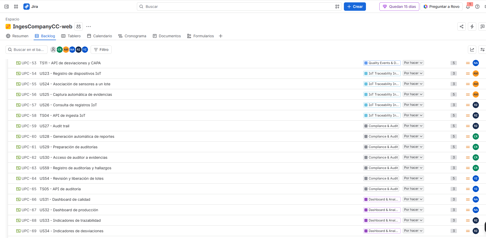

# Capítulo III: Requirements Specification

En este capítulo se presenta los requisitos especìficados de DoofPlus, acorde al análisis de la problemática, los segmentos objetivo y el alcance obtenido durante el desarrollo. La especificación cubre tres productos de la solución: la landing page pública, la aplicación web frontend y los servicios backend RESTful implementados con una arquitectura basada en bounded contexts.

## 3.1. User Stories

| Epic / Story ID | Título | Descripción | Criterios de Aceptación | Relacionado con (Epic ID) |
|---|---|---|---|---|
| **EP01** | Plataforma Web Estática e Informativa (Landing Page) | Epic que agrupa las secciones informativas y de captación de clientes de la Landing Page. | N/A | N/A |
| **US01** | Visualización de la Propuesta de Valor y Beneficios del Sistema | Como Visitante de la plataforma, quiero conocer los beneficios y la propuesta de valor de DoofPlus para determinar si la solución responde a las necesidades de mi organización. | **Escenario 1 (Visualización Estándar - Happy Path):** Dado que un visitante accede a la Landing Page, cuando consulta la información de la propuesta de valor, entonces el sistema presenta información sobre el propósito de DoofPlus, los problemas que aborda y los principales beneficios de la solución.  **Escenario 2 (Visualización Segmento Corporativo - Alternative Path):** Dado que un visitante del segmento corporativo busca soluciones de alta escala, cuando interactúa con la propuesta de valor, entonces el sistema presenta información relacionada con los beneficios que DoofPlus ofrece para la gestión de calidad farmacéutica. | EP01 |
| **US02** | Presentación de Características Técnicas y Módulos | Como Visitante interesado en tecnología, quiero explorar las características detalladas del sistema (IoT, Control de Calidad) para entender el alcance funcional de la solución. | **Escenario 1 (Exploración Exitosa - Happy Path):** Dado que el visitante navega hacia la sección de características, cuando selecciona un módulo específico (como Monitoreo IoT), entonces el sistema muestra la descripción técnica detallada y los beneficios de dicho componente.  **Escenario 2 (Módulo no disponible - Unhappy Path):** Dado que el visitante intenta acceder a la información de un módulo futuro o en mantenimiento, cuando selecciona dicho módulo, entonces el sistema muestra un mensaje de "Próximamente" y sugiere suscribirse al boletín. | EP01 |
| **US03** | Formulario de Contacto y Solicitud de Demostración | Como Visitante de un segmento empresarial, quiero enviar mis datos de contacto para solicitar una demostración personalizada del software de producción. | **Escenario 1 (Flujo Exitoso - Happy Path):** Dado que el visitante proporciona los datos requeridos para solicitar información, cuando envía una solicitud con información válida, entonces el sistema registra la información del interesado y envía una confirmación automática por correo electrónico.  **Escenario 2 (Validación de Datos - Unhappy Path):** Dado que el visitante proporciona información incompleta o inválida, cuando intenta enviar la solicitud, entonces el sistema indica que la información requerida debe ser corregida antes de registrar la solicitud. | EP01 |
| **US04** | Sección de Casos de Éxito y Testimonios | Como Visitante del sector industrial, quiero revisar testimonios y casos de éxito de otras empresas para validar la fiabilidad y el impacto real del sistema. | **Escenario 1 (Visualización Exitosa - Happy Path):** Dado que el visitante busca referencias de la industria, cuando accede a la sección de testimonios, entonces el sistema despliega las reseñas verificadas y los indicadores de mejora de clientes previos.  **Escenario 2 (Fallo en carga de datos - Unhappy Path):** Dado que el visitante accede a la sección de testimonios, cuando el servidor no logra recuperar la información externa, entonces el sistema oculta la sección temporalmente y registra el error sin interrumpir la navegación general. | EP01 |
| **US05** | Visualización de Planes y Tarifas de Suscripción | Como Visitante del segmento PyME o Corporativo, quiero ver los diferentes planes de precios para presupuestar la implementación del sistema según el tamaño de mi planta. | **Escenario 1 (Visualización Base - Happy Path):** Dado que el visitante consulta los costos del servicio, cuando el sistema detecta la consulta de tarifas, entonces muestra el desglose de precios mensuales, límites de dispositivos IoT y características incluidas por cada plan.  **Escenario 2 (Cálculo de Descuento Anual - Alternative Path):** Dado que el visitante evalúa opciones de pago a largo plazo, cuando selecciona la modalidad de facturación anual, entonces el sistema calcula y muestra dinámicamente los precios reducidos reflejando el porcentaje de descuento por año. | EP01 |
| **US06** | Sección de Preguntas Frecuentes (FAQ) | Como Visitante nuevo en la plataforma, quiero acceder a una sección de preguntas frecuentes para resolver dudas inmediatas sobre la instalación, compatibilidad IoT y soporte. | **Escenario 1 (Búsqueda Exitosa - Happy Path):** Dado que el visitante tiene dudas sobre los requisitos de infraestructura, cuando interactúa con la sección de soporte informativo, entonces el sistema provee las respuestas estandarizadas a las consultas técnicas más habituales.  **Escenario 2 (Consulta sin resultados - Unhappy Path):** Dado que el visitante utiliza la barra de búsqueda de las FAQ, cuando ingresa un término que no coincide con ninguna respuesta, entonces el sistema muestra el mensaje "No se encontraron resultados" y proporciona un enlace directo al formulario de contacto. | EP01 |
| **EP02** | Gestión de Control de Calidad y Producción Farmacéutica | Epic que consolida las operaciones de control de procesos, trazabilidad de lotes, gestión de desviaciones y cumplimiento de BPM de la plataforma. | N/A | N/A |
| **US07** | Gestión y Control Digital de Protocolos de Calidad | Como Especialista de Aseguramiento y Control de Calidad, quiero registrar y estandarizar los protocolos digitales de calidad para asegurar que la producción cumpla con las normativas vigentes. | **Escenario 1 (Creación Exitosa - Happy Path):** Dado que el especialista inicia la creación de un nuevo estándar con datos válidos, cuando el sistema procesa la solicitud, entonces almacena el protocolo en estado "Borrador" y genera un historial de versiones.  **Escenario 2 (Código Duplicado - Unhappy Path):** Dado que el especialista intenta registrar un protocolo, cuando el sistema detecta que el código del documento ya existe en la base de datos, entonces bloquea el guardado y el sistema rechaza el registro e informa que el código debe ser único. | EP02 |
| **US08** | Registro y Trazabilidad Centralizada de Lotes | Como Jefe o Supervisor de Producción Farmacéutica, quiero centralizar el expediente y el historial de cada lote de manufactura para mantener la trazabilidad completa de su ciclo de vida. | **Escenario 1 (Apertura Exitosa):** Dado que la planta inicia una orden de fabricación, cuando el supervisor asocia un protocolo vigente al nuevo lote, entonces el sistema genera el código de trazabilidad único y establece el estado del lote en "En Proceso".  **Escenario 2 (Protocolo no vigente):** Dado que se intenta asociar un protocolo a un nuevo lote, cuando el sistema verifica que el protocolo no se encuentra vigente, entonces impide la asociación del protocolo y mantiene el lote sin iniciar. | EP02 |
| **US09** | Muestreo Automatizado según Tabla Militar Estándar | Como Especialista de Aseguramiento y Control de Calidad, quiero que el sistema calcule el tamaño de muestra requerido para optimizar el tiempo de auditoría según normas estadísticas del sector. | **Escenario 1 (Cálculo del tamaño de muestra):** Dado que se registra un lote con una cantidad válida de unidades, cuando el sistema determina el tamaño de muestra correspondiente según la Tabla Militar Estándar, entonces calcula y registra la cantidad de muestras requerida para el lote.  **Escenario 2 (Tamaño de lote no válido):** Dado que se registra un lote sin una cantidad válida de unidades, cuando el sistema intenta determinar el tamaño de muestra, entonces rechaza el cálculo e informa que la cantidad del lote debe ser válida. | EP02 |
| **US10** | Monitoreo de Telemetría e Integración IoT en Línea | Como Jefe o Supervisor de Producción Farmacéutica, quiero integrar las lecturas automáticas de los sensores de maquinaria para robustecer la integridad de los datos de fabricación sin intervención manual. | **Escenario 1 (Almacenamiento Normal - Happy Path):** Dado que la línea de producción se encuentra activa y vinculada a un lote, cuando los dispositivos IoT transmiten variables críticas dentro de los rangos normales, entonces el sistema indexa y almacena cronológicamente cada lectura en el expediente digital del lote en curso sin interrumpir el proceso.  **Escenario 2 (Activación de Alertas - Unhappy Path Operativo):** Dado que el sistema procesa lecturas en tiempo real, cuando un parámetro de los sensores supera los límites críticos de tolerancia configurados, entonces el sistema genera de forma inmediata una alerta de desviación operativa y despacha una notificación de urgencia al supervisor. | EP02 |
| **US11** | Gestión y Registro de Desviaciones y Eventos de Calidad | Como Especialista de Aseguramiento y Control de Calidad, quiero registrar y documentar cualquier evento imprevisto o desviación detectada para mitigar los riesgos de contaminación y cumplir con las auditorías. | **Escenario 1 (Apertura y Retención - Alternative Path):** Dado que el especialista identifica una desviación durante un proceso de calidad, Cuando registra la incidencia y la información correspondiente, Entonces el sistema almacena la desviación asociada al proceso o lote correspondiente.  **Escenario 2 (Registro de Desviación - Happy Path):** Dado que existe una desviación registrada, cuando el responsable registra su resolución, entonces el sistema actualiza el estado de la desviación y conserva el historial de acciones realizadas. | EP02 |
| **US12** | Panel de Control (Dashboard) e Indicadores de Cumplimiento | Como Supervisor de Producción, quiero visualizar gráficos unificados con el estado de los procesos y tasas de aprobación para tomar decisiones operativas oportunas y agilizar la preparación de auditorías. | **Escenario 1 (Consolidación de Métricas - Happy Path):** Dado que existen registros de producción en un período determinado, cuando el supervisor consulta los indicadores de producción, entonces el sistema calcula y presenta el porcentaje de lotes aprobados y las desviaciones activas correspondientes al período.  **Escenario 2 (Filtro sin resultados - Unhappy Path):** Dado que un Supervisor de Producción consulta el dashboard, cuando aplica un filtro de fechas donde no hubo producción registrada, entonces el sistema muestra un panel vacío con el mensaje "No existen registros para el rango seleccionado". | EP02 |
| **US13** | Gestión de Roles y Permisos basados en Firmas Electrónicas | Como Administrador del Sistema, quiero gestionar los accesos y roles del personal de la planta para garantizar la integridad de los datos y cumplir con las normativas de seguridad digital farmacéutica. | **Escenario 1 (Validación Exitosa - Happy Path):** Dado que un especialista con rol permitido aprueba un cambio de estado, cuando el sistema solicita la confirmación de la firma digital (Doble Factor), entonces valida las credenciales y aplica de manera permanente el cambio en la base de datos.  **Escenario 2 (Control de Acceso Denegado - Unhappy Path):** Dado que un usuario sin privilegios intenta realizar una acción crítica como liberar un lote, cuando el sistema verifica que su rol no posee los permisos de firma digital autorizados, entonces deniega la acción y registra un intento de acceso no autorizado en la bitácora. | EP02 |
| **US14** | Registro de Auditoría Inalterable (Audit Trail) | Como Especialista de Aseguramiento de Calidad, quiero que el sistema registre de forma automática e irreversible cualquier cambio en los datos para asegurar la trazabilidad exigida por los inspectores regulatorios. | **Escenario 1 (Registro Automático - Happy Path):** Dado que un usuario autorizado modifica información de una orden de producción, cuando el sistema registra el cambio, entonces conserva el valor anterior, el valor nuevo, el usuario responsable y la fecha y hora de la modificación.  **Escenario 2 (Intento de Manipulación - Unhappy Path):** Dado que existe un registro de auditoría, cuando un usuario intenta modificar o eliminar dicho registro, entonces el sistema rechaza la operación y conserva la información registrada. | EP02 |
| **US15** | Gestión del Catálogo de Productos y Fórmulas Maestras | Como Director de Producción, quiero registrar los productos farmacéuticos y sus fórmulas maestras de composición para asegurar que cada lote se fabrique con las especificaciones exactas autorizadas. | **Escenario 1 (Registro de Fórmula - Happy Path):** Dado que el usuario inicia el registro de un nuevo fármaco, cuando ingresa los componentes activos, excipientes y tolerancias permitidas válidas, entonces el sistema almacena la fórmula en estado "Por Validar" y la vincula al catálogo oficial.  **Escenario 2 (Relación Inválida - Unhappy Path):** Dado que se intenta abrir una orden de producción para un fármaco, cuando el sistema detecta que su fórmula maestra asociada no se encuentra en estado "Aprobada", entonces impide la creación del lote y solicita la regularización de la fórmula. | EP02 |
| **US16** | Gestión de Alertas y Calibración de Dispositivos IoT | Como Supervisor de Producción, quiero administrar el estado y la calibración de los sensores IoT para garantizar que las mediciones de telemetría recopiladas en la línea sean fidedignas. | **Escenario 1 (Reconexión y Calibración Exitosa - Happy Path):** Dado que un sensor recibe mantenimiento, cuando el supervisor actualiza la fecha de calibración a una fecha vigente en el sistema, entonces el dispositivo cambia a estado "Activo" y sus lecturas vuelven a ser procesadas en la orden de producción.  **Escenario 2 (Alerta por Descalibración - Unhappy Path):** Dado que un dispositivo IoT se encuentra transmitiendo datos en la línea, cuando el sistema detecta que la fecha de calibración obligatoria del equipo ha expirado, entonces el sistema identifica el dispositivo como no calibrado y notifica al responsable correspondiente. | EP02 |
| **US17** | Repositorio Centralizado de Documentación Técnica y SOPs | Como Especialista de Aseguramiento de Calidad, quiero acceder a un repositorio centralizado de Procedimientos Operativos Estandarizados (SOPs) y fichas técnicas para asegurar que el personal consulte siempre la versión vigente y reducir los errores por falta de información. | **Escenario 1 (Acceso a Versión Vigente - Happy Path):** Dado que un analista busca un procedimiento específico (ej. limpieza de equipos), cuando ingresa el código del documento en el repositorio, entonces el sistema identifica la versión vigente del procedimiento y permite consultar su contenido.  **Escenario 2 (Restricción de Subida - Unhappy Path):** Dado que un usuario intenta cargar un nuevo documento técnico, cuando intenta publicarlo sin las firmas electrónicas de revisión requeridas, entonces el sistema bloquea la publicación y la mantiene en estado "Borrador". | EP02 |
| **US18** | Módulo de Análisis de Causa Raíz (RCA) para Desviaciones | Como Especialista de Aseguramiento de Calidad, quiero registrar el análisis de causa raíz de las desviaciones utilizando herramientas integradas (ej. Ishikawa o 5 Porqués) para asegurar que el equipo multidisciplinario aplique acciones preventivas efectivas. | **Escenario 1 (Vinculación de RCA a CAPA - Happy Path):** Dado que el equipo investiga una desviación de producción, cuando completa el formulario estructurado de Análisis de Causa Raíz, entonces el sistema vincula automáticamente el análisis al registro CAPA correspondiente.  **Escenario 2 (Bloqueo de Cierre sin RCA - Unhappy Path):** Dado que un usuario intenta cerrar formalmente una desviación, cuando el sistema detecta que el campo de Análisis de Causa Raíz está vacío, entonces bloquea el cierre de la desviación y exige completar la investigación. | EP02 |
| **US19** | Bandeja de Coordinación y Notificaciones Inter-Áreas | Como Jefe de Producción, quiero visualizar una bandeja de tareas y notificaciones centralizada para agilizar la coordinación de aprobaciones con el área de Calidad | **Escenario 1 (Notificación Automática - Happy Path):** Dado que el área de Producción finaliza la manufactura de un lote, cuando el estado del lote cambia a "Cuarentena", entonces el sistema genera una alerta instantánea en la bandeja del equipo de Control de Calidad solicitando el muestreo.  **Escenario 2 (Permisos Denegados - Unhappy Path):** Dado que un usuario intenta aprobar una tarea en la bandeja que corresponde a otro departamento, cuando intenta aprobar una tarea que no corresponde a sus permisos, entonces el sistema rechaza la acción y registra el intento. | EP02 |
| **US20** | Automatización de cálculos para protocolos de calidad | Como Especialista de Aseguramiento y Control de Calidad, quiero automatizar los cálculos requeridos para la generación de protocolos de calidad para reducir el trabajo manual y disminuir errores en los resultados. | **Escenario 1 – Cálculo exitoso:** Dado que el especialista registra los datos requeridos para un cálculo, cuando el sistema procesa la información, entonces genera el resultado correspondiente y lo asocia al protocolo.  **Escenario 2 – Datos incompletos:** Dado que el especialista registra información incompleta para realizar un cálculo, cuando el sistema valida los datos, entonces indica que la información requerida está incompleta y no genera el resultado. | EP02 |
| **US21** | Consulta del historial de lotes | Como Especialista de Aseguramiento y Control de Calidad, quiero consultar el historial de un lote para revisar los registros y resultados asociados durante su proceso. | **Escenario 1 – Búsqueda de registros:** Dado que el especialista solicita información de un lote registrado, Cuando el sistema realiza la búsqueda, Entonces el sistema presenta los registros asociados al lote en orden cronológico.  **Escenario 2 – Registros Inexistentes:** Dado el especialista solicita información de un lote inexistente, Cuando el sistema realiza la búsqueda, Entonces el sistema informa que no existen registros asociados al lote consultado. | EP02 |
| **EP03** | Gestión de Logística, Mantenimiento y Trazabilidad Externa | Epic que consolida la trazabilidad de materias primas, la gestión y calificación de equipos de laboratorio, y la trazabilidad inversa (devoluciones/lotes vencidos) para la integración clínica. | N/A | N/A |
| **US22** | Gestión de Mantenimiento y Calificación de Equipos Analíticos | Como Responsable de Control de Calidad, quiero gestionar el calendario de mantenimiento preventivo y calificación de los equipos del laboratorio para evitar el uso de instrumentos no aptos que invaliden los ensayos. | **Escenario 1 (Alerta de Mantenimiento - Happy Path):** Dado que un equipo analítico se acerca a su fecha de calificación obligatoria, cuando el equipo se encuentra próximo a su fecha límite de calificación, entonces el sistema genera una alerta preventiva a los responsables correspondientes.  **Escenario 2 (Bloqueo de Equipo Vencido - Unhappy Path):** Dado que un equipo analítico tiene su calificación expirada, cuando un analista intenta utilizarlo para registrar los resultados de un ensayo de calidad, entonces el sistema impide utilizar el equipo y registra que se encuentra inhabilitado. | EP03 |
| **US23** | Trazabilidad de Materias Primas y Proveedores | Como Analista de Aseguramiento de Calidad, quiero registrar la información de los proveedores y los lotes de materias primas ingresadas para vincularlos exactamente a las fórmulas y lotes de producción terminados. | **Escenario 1 (Vinculación de Insumos - Happy Path):** Dado que el área de almacén registra el ingreso de una nueva materia prima, cuando el sistema valida el certificado de calidad del proveedor, entonces genera un código de trazabilidad interna apto para ser añadido a una orden de producción.  **Escenario 2 (Uso de Materia Prima Rechazada - Unhappy Path):** Dado que un supervisor de producción intenta asociar una materia prima a un lote, cuando el insumo escaneado figura con estado "Rechazado" por Control de Calidad, entonces el sistema impide la adición y genera una alerta de riesgo crítico. | EP03 |
| **US24** | Reporte y Trazabilidad Inversa de Lotes Vencidos o Devueltos | Como Técnico Clínico / Personal de Salud, quiero reportar lotes de medicamentos vencidos o con incidencias desde mi dispositivo móvil para iniciar automáticamente el flujo de devolución y retiro del sistema central. | **Escenario 1 (Inicio de Trazabilidad Inversa - Happy Path):** Dado que se detecta un medicamento vencido en el centro de salud, cuando el técnico escanea o ingresa el código del lote en el módulo de reportes, entonces el sistema registra la incidencia, inicia el flujo de devolución y alerta al área de Aseguramiento de Calidad.  **Escenario 2 (Código de Lote Inválido - Unhappy Path):** Dado que el usuario intenta reportar un medicamento defectuoso, cuando ingresa un número de lote que no existe en la base de datos de producción, entonces el sistema muestra un mensaje de error indicando que el lote no es reconocido y solicita revisión manual. | EP03 |
| **EP04** | API RESTful y Servicios de Integración Backend | Epic que agrupa los endpoints y servicios técnicos necesarios para soportar la lógica de negocio, la ingesta de datos IoT y la seguridad del sistema. | N/A | N/A |
| **TS01** | Ingesta de Telemetría IoT mediante Endpoint | Como Developer, quiero implementar un endpoint POST seguro para recibir las mediciones de los sensores IoT y registrarlas en la base de datos, para habilitar el monitoreo y la trazabilidad de las condiciones del lote. | **Escenario 1 (Request Exitoso - Happy Path):** Dado que el dispositivo IoT envía un request POST válido con el payload de temperatura y presión, cuando el API procesa la solicitud, entonces devuelve un response 201 Created y guarda el registro asociado al código del lote activo.  **Escenario 2 (Payload Inválido - Unhappy Path):** Dado que el dispositivo envía un request con formato JSON malformado o variables nulas, cuando el API valida el payload, entonces devuelve un response 400 Bad Request indicando el error de sintaxis y rechaza la inserción. | EP04 |
| **TS02** | Autenticación y Generación de Token JWT | Como Developer, quiero implementar un servicio de autenticación para validar las credenciales de los usuarios y emitir un token JWT que proteja las rutas privadas. | **Escenario 1 (Credenciales Válidas - Happy Path):** Dado que el cliente envía un request POST con email y contraseña correctos, cuando el servicio valida la identidad contra la base de datos, entonces devuelve un response 200 OK adjuntando un token JWT firmado y los permisos del rol.  **Escenario 2 (Acceso Denegado - Unhappy Path):** Dado que el cliente envía un request POST con credenciales incorrectas, cuando el servicio valida la identidad contra la base de datos, entonces devuelve un response 401 Unauthorized y no genera ningún token. | EP04 |
| **TS03** | API de Consulta de Historial de Lotes | Como Developer, quiero implementar un endpoint GET parametrizado para consultar el historial de eventos de un lote, para que los módulos del sistema puedan consumir y visualizar la información de auditoría. | **Escenario 1 (Consulta de Lote Existente - Happy Path):** Dado que el cliente envía un request GET con un ID de lote válido, cuando el API consulta la base de datos relacional, entonces devuelve un response 200 OK con un array JSON ordenado cronológicamente con todos los eventos de dicho lote.  **Escenario 2 (Lote No Encontrado - Unhappy Path):** Dado que se envía un request GET con un ID de lote inexistente, cuando el servicio realiza la búsqueda, entonces devuelve un response 404 Not Found con un mensaje indicando que el registro no existe. | EP04 |
| **TS04** | Endpoint para Cambio de Estado de Lote | Como Developer, quiero implementar un endpoint PATCH para procesar las solicitudes de cambio de estado de un lote, validando las reglas de negocio antes de actualizarlo. | **Escenario 1 (Actualización Exitosa - Happy Path):** Dado que el cliente con rol autorizado envía un request PATCH para liberar el lote, cuando el API verifica que no existen desviaciones activas pendientes, entonces devuelve un response 200 OK y actualiza el estado en la base de datos.  **Escenario 2 (Regla de Negocio Incumplida - Unhappy Path):** Dado que se intenta aprobar un lote que tiene alertas críticas sin resolver, cuando el servicio valida las condiciones previas, entonces devuelve un response 409 Conflict detallando que el lote no puede cambiar de estado. | EP04 |
| **TS05** | Servicio de Notificaciones en Tiempo Real (WebSockets) | Como Developer, quiero implementar un servidor de WebSockets para emitir notificaciones y alertas en tiempo real entre las áreas de Producción y Calidad, eliminando la latencia de las comunicaciones basadas en correo electrónico. | **Escenario 1 (Emisión de Evento):** Dado que un lote cambia de estado de "En Proceso" a "Cuarentena", cuando el backend procesa la transacción, entonces emite inmediatamente un payload JSON a los clientes conectados del grupo "Calidad" para actualizar su interfaz sin recargar la página.  **Escenario 2 (Cliente Desconectado ):** Dado que un cliente pierde temporalmente la conexión WebSocket, cuando el sistema intenta emitir una notificación, entonces conserva el evento para que pueda ser consultado posteriormente mediante el servicio de notificaciones. | EP04 |
| **TS06** | API de Consulta Externa para Validación de Lotes | Como Developer, quiero implementar un endpoint REST protegido para que sistemas externos (clínicas, seguros) puedan consultar la vigencia y el estado de un lote farmacéutico, facilitando la verificación de datos fuera de la planta. | **Escenario 1 (Consulta Válida - Happy Path):** Dado que un sistema hospitalario autorizado envía un request GET con un ID de lote específico, cuando el API procesa la solicitud, entonces devuelve un response 200 OK con un objeto JSON indicando el estado del lote (Vigente, Retirado, Vencido) y su fecha de expiración.  **Escenario 2 (Acceso Externo No Autorizado - Unhappy Path):** Dado que una entidad externa intenta consultar el endpoint de validación de lotes, cuando la solicitud no incluye un API Key válido en los headers, entonces el API bloquea la petición y devuelve un response 401 Unauthorized. | EP04 |

## 3.2. Impact Mapping

El Impact Mapping de DoofPlus conecta los objetivos estratégicos del negocio con los actores involucrados, los impactos esperados, los entregables digitales y sus respectivas User Stories. La solución busca optimizar los tiempos de liberación de lotes y erradicar los errores de transcripción manual en la planta, garantizando el estricto cumplimiento de las normativas de calidad farmacéutica (BPM) mediante trazabilidad centralizada, monitoreo automatizado vía dispositivos IoT, gestión digital de desviaciones y un registro de auditoría inalterable (Audit Trail).

## 3.3. Product Backlog

El Product Backlog de DoofPlus consolida todas las User Stories y Technical Stories identificadas, ordenadas según el valor que aportan al negocio. Las historias relacionadas con la Landing Page se posicionan al inicio dado que corresponden al primer sprint y son el primer punto de contacto con los potenciales clientes. A continuación se presentan las historias del core de calidad y producción farmacéutica, y finalmente las Technical Stories del API.

| # | User Story Id | Título | Descripción | Story Points |
|:---:|:---:|---|---|:---:|
| 1 | US01 | Visualización de la Propuesta de Valor y Beneficios del Sistema | Como Visitante, quiero conocer los beneficios y la propuesta de valor del sistema para evaluar si se adapta a las necesidades de mi fábrica. | 2 |
| 2 | US02 | Presentación de Características Técnicas y Módulos | Como Visitante interesado en tecnología, quiero explorar las características detalladas del sistema para entender el alcance funcional de la solución. | 2 |
| 3 | US05 | Visualización de Planes y Tarifas de Suscripción | Como Visitante del segmento PyME o Corporativo, quiero ver los diferentes planes de precios para presupuestar la implementación del sistema. | 2 |
| 4 | US04 | Sección de Casos de Éxito y Testimonios | Como Visitante del sector industrial, quiero revisar testimonios y casos de éxito para validar la fiabilidad y el impacto real del sistema. | 1 |
| 5 | US06 | Sección de Preguntas Frecuentes (FAQ) | Como Visitante nuevo, quiero acceder a una sección de preguntas frecuentes para resolver dudas inmediatas sobre instalación, compatibilidad IoT y soporte. | 1 |
| 6 | US03 | Formulario de Contacto y Solicitud de Demostración | Como Visitante de un segmento empresarial, quiero enviar mis datos de contacto para solicitar una demostración personalizada del software. | 3 |
| 7 | US08 | Registro y Trazabilidad Centralizada de Lotes | Como Jefe de Producción, quiero centralizar el expediente y el historial de cada lote para mantener la trazabilidad completa de su ciclo de vida. | 8 |
| 8 | US07 | Gestión y Control Digital de Protocolos de Calidad | Como Especialista QA/QC, quiero registrar y estandarizar los protocolos digitales de calidad para asegurar el cumplimiento de las normativas vigentes. | 5 |
| 9 | US11 | Gestión y Registro de Desviaciones y Eventos de Calidad | Como Especialista QA/QC, quiero registrar y documentar cualquier desviación detectada para mitigar riesgos y cumplir con las auditorías. | 5 |
| 10 | US09 | Muestreo Automatizado según Tabla Militar Estándar | Como Especialista QA/QC, quiero que el sistema calcule el tamaño de muestra requerido para optimizar el tiempo de auditoría según normas estadísticas. | 5 |
| 11 | US10 | Monitoreo de Telemetría e Integración IoT en Línea | Como Jefe de Producción, quiero integrar las lecturas automáticas de los sensores de maquinaria para robustecer la integridad de los datos de fabricación. | 8 |
| 12 | US12 | Panel de Control (Dashboard) e Indicadores de Cumplimiento | Como Supervisor de Producción, quiero visualizar gráficos unificados con el estado de los procesos y tasas de aprobación para tomar decisiones oportunas. | 5 |
| 13 | US15 | Gestión del Catálogo de Productos y Fórmulas Maestras | Como Director de Producción, quiero registrar los productos farmacéuticos y sus fórmulas maestras para asegurar que cada lote se fabrique con las especificaciones autorizadas. | 5 |
| 14 | US14 | Registro de Auditoría Inalterable (Audit Trail) | Como Especialista QA, quiero que el sistema registre de forma automática e irreversible cualquier cambio en los datos para asegurar la trazabilidad regulatoria. | 5 |
| 15 | US16 | Gestión de Alertas y Calibración de Dispositivos IoT | Como Supervisor de Producción, quiero administrar el estado y la calibración de los sensores IoT para garantizar que las mediciones sean fidedignas. | 3 |
| 16 | US13 | Gestión de Roles y Permisos basados en Firmas Electrónicas | Como Administrador del Sistema, quiero gestionar los accesos y roles del personal para garantizar la integridad de los datos y cumplir con las normativas de seguridad. | 3 |
| 17 | TS01 | Ingesta de Telemetría IoT mediante Endpoint | Como Developer, quiero implementar un endpoint POST seguro para recibir las mediciones de los sensores IoT y registrarlas en la base de datos. | 5 |
| 18 | TS03 | Endpoint para Trazabilidad y Audit Trail | Como Developer, quiero desarrollar un endpoint GET parametrizado que exponga el historial inmutable de un lote para el dashboard. | 3 |
| 19 | TS04 | Endpoint para Cambio de Estado de Lote | Como Developer, quiero implementar un endpoint PATCH para actualizar el estado del ciclo de vida de un lote validando las reglas de negocio. | 3 |
| 20 | TS02 | Autenticación y Generación de Token JWT | Como Developer, quiero implementar un servicio de autenticación para validar credenciales y emitir un token JWT que proteja las rutas privadas. | 3 |

**Evidencia de Product Backlog en Jira:**

A continuación, se muestra la gestión del backlog en la herramienta Jira Software, evidenciando la priorización y estimación de las historias.

*Figura: Captura del Product Backlog en Jira Software.*

**Enlace al Product Backlog en Jira:** click aquí (https://inges-company-cc.atlassian.net/jira/software/projects/SCRUM/boards/1/backlog?atlOrigin=eyJpIjoiNzQ5MjEwOGYzMjI3NDg3OGIxNTg3MmZkNzY5ZGJmMjUiLCJwIjoiaiJ9)
