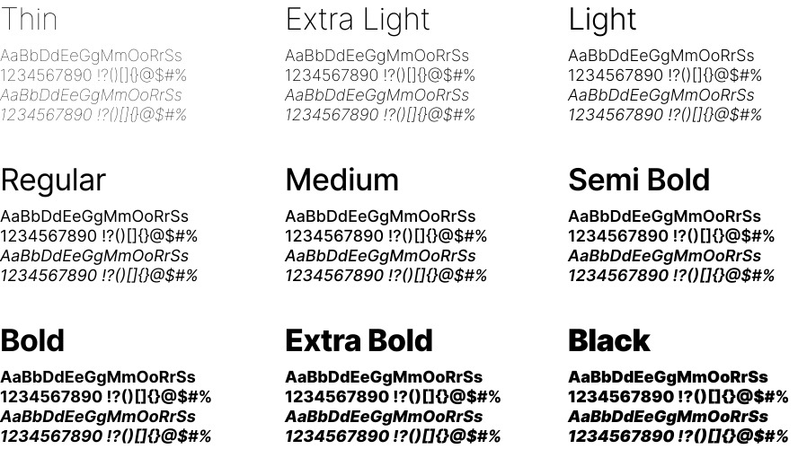
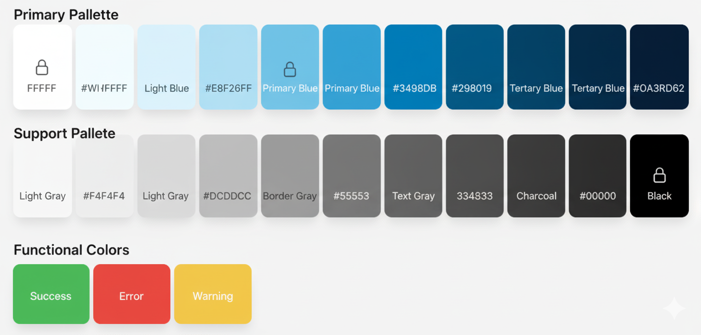

# Capítulo IV: Product Design

En este capítulo se detallan las decisiones de diseño del producto para su plataforma DoofPlus, junto con la Landing Page. Se establecen guías de estilo visuales, arquitectura de la información (AI) y criterios que aseguran que la experiencia de usuario (UX) sea intuitiva y profesional, donde alineamos a las exigencias en las máquinas de la industria farmacéutica y entidades regulatorias para la calidad de los fármacos como la DIGEMID.

## 4.1. Style Guidelines

En esta sección se establecen las bases visuales y de comunicación para DoofPlus, centralizando los recursos que serán de uso común para todo el equipo de desarrollo y diseño. El objetivo es garantizar una presentación consistente, inclusiva y enfocada a través de todos los puntos de contacto del producto, facilitando la mantenibilidad y escalabilidad del código y del diseño a lo largo del ciclo de vida del proyecto.

### 4.1.1. General Style Guidelines

Para asegurar una interfaz coherente y alineada a los estándares que exige la industria farmacéutica, el sistema de diseño de DoofPlus toma como base fundamental **Material Design**. Esta decisión permite una integración nativa con la biblioteca de componentes Angular Material, que será utilizada en la implementación del frontend.

#### Branding:
El logotico escogido para DoofPlus comunica de forma directa y sintética la propuesta de valor del sistema: la integración de la automatización industrial con la rigurosidad del control farmacéutico. Para la sección de Branding, el análisis de los componentes de dicho logotipo se desglosa de la siguiente manera:
 

 
- Maquinaria y Cinta Transportadora: La silueta industrial con cápsulas en la cinta representa el núcleo operativo de la plataforma, lo que simboliza la manufactura y conexión de IoT en la línea de producción.
- Escudo de Verificación: Representa el Aseguramiento de Calidad de los productos. Transmite bioseguridad, protección de los datos y el cumplimiento regulatorio estricto que se exige por DIGEMID y las BPM.
- Construcción Tipográfica y Cromática: El nombre "DoofPLus" divide sus conceptos visualmente utilizando una fuente sans-serif sólida. El prefijo "Doof" en azul marino corporativo evoca la base tecnológica y la seriedad farmacéutica, mientras que el sufijo "PLus" en verde esmeralda conecta con la salud y la validación de procesos.

#### Typography
La tipografía empleada en DoofPlus será una fuente inter moderna, limpia y altamente versátil, la cual cuenta con una extensa familia de pesos que incluye: Thin, Extra Light, Light, Regular, Medium, Semi Bold, Bold, Extra Bold y Black. Esta amplia disponibilidad de grosores, junto con sus respectivas versiones en cursiva (italic) para cada peso, permite estructurar una jerarquía visual extremadamente precisa. Su diseño geométrico garantiza una legibilidad excepcional para datos numéricos críticos, tablas de lotes y gráficos de telemetría, tanto en pantallas industriales como en dispositivos móviles.   

 
La jerarquía tipográfica se establece de la siguiente manera para garantizar claridad y ritmo visual:
- Títulos principales (H1 / Section heading): 3rem (aprox. 48px) en escritorio, utilizando pesos pesados como Extra Bold o Black para máximo impacto y jerarquía.
- Subtítulos (H2 / Sub-headings): 2rem (aprox. 32px) en peso Bold o Semi Bold.
- Títulos de componentes y tarjetas (H3 / H4): 1.25rem (20px) a 1.5rem (24px) en peso Medium.
- Cuerpo del texto y Tablas de Datos (p / td): 1rem (16px) en peso Regular, con un interlineado de 1.5. Para datos complementarios o notas secundarias se podrán aplicar pesos más ligeros como Light o Extra Light.
- Botones y etiquetas de estado (span): 0.875rem (14px) en peso Medium o Semi Bold para resaltar la acción.

#### Colors
La paleta de colores de DoofPlus está diseñada para evocar pulcritud clínica, seguridad tecnológica y control absoluto sobre los procesos. Se distribuye en tres categorías:

**Paleta principal**: Colores que definen la identidad de QualiTrack y se usan en elementos clave.
* **Primario (Verde Marino):** var(--primary-color | #0D9488) (referencia principal).
* **Secundario (Azul Pizarra Oscuro):** var(--secondary-color | #0F172A) (para texto principal y elementos interactivos).
* **Terciario (Gris Pizarra):** var(--tertiary-color | #64748B) (para texto secundario y detalles).
* **Fondo Claro:** var(--bg-light) (fondos de listas, dashboard y secciones).
* **Fondo Blanco:** var(--white) (fondos de tarjetas y elementos principales).

**Paleta de Soporte**: Colores complementarios que añaden profundidad y contraste.
* **Gris Neutro:** Para bordes sutiles, líneas divisorias y fondos de alternancia.

**Colores Funcionales**: Reservados para comunicar estados específicos al usuario.
* **Éxito:** Verde (#4CAF50) para confirmaciones y acciones exitosas.
* **Error:** Rojo (#F44336) para alertas y mensajes de error.
* **Advertencia:** Amarillo (#FFC107) para notificaciones y avisos importantes.
  

#### Spacing
El espaciado en DoofPlus se rige por el sistema de cuadrícula de 8 puntos de Material Design. Esto asegura un ritmo vertical constante y facilita la lectura rápida de los reportes técnicos sin abrumar al usuario.
- Margen Interno (Padding) de Secciones: Las áreas de trabajo principales y dashboards utilizan un padding aproximado de 40px a 48px para separar claramente los bloques de información.

- Espacio entre Elementos: La separación entre tarjetas de métricas o controles de filtros varía entre 16px y 24px, manteniendo cohesión lógica.

- Line Height: El interlineado base es de 1.5 para párrafos, reduciéndose a 1.2 en las celdas de las tablas de datos para maximizar la cantidad de registros visibles sin perder claridad.

#### Tono de Comunicación
La voz y el tono de DoofPlus están diseñados para reflejar la misma fiabilidad e inmutabilidad que su arquitectura de software, conectando directamente con Supervisores de Producción, Especialistas QA/QC y auditores externos.

- Tono: Formal, corporativo y analítico. Proyecta dominio absoluto sobre las normativas de calidad (BPM, Data Integrity), manteniendo el rigor que exige la industria farmacéutica.

- Actitud: Resolutiva y proactiva. La comunicación se enfoca en la eficiencia operativa ("Trazabilidad automatizada", "Monitoreo en tiempo real") y en la alerta temprana de desviaciones.

- Lenguaje: Técnico y preciso. Se utiliza terminología propia del dominio farmacéutico y tecnológico (telemetría, IoT, Cuarentena, Fórmulas Maestras, Audit Trail, DIGEMID) asumiendo que el usuario es un profesional capacitado en estas áreas.

- Voz: Experta e inquebrantable. Posiciona a DoofPlus como el puente definitivo entre la maquinaria industrial y el cumplimiento normativo, siendo una fuente de verdad única y segura para las auditorías.

### 4.1.2. Web Style Guidelines

Las directrices de estilo web de DoofPlus explican e ilustran las decisiones sobre los estándares visuales y de interacción para las interfaces web responsivas de la plataforma. Nuestro objetivo es crear una experiencia visual que refleje la misión del sistema: digitalizar el control de calidad farmacéutico y la telemetría industrial mediante un diseño limpio, riguroso y altamente funcional, minimizando la carga cognitiva en la planta de producción.

1. Layout
- Sistema de Grid: Utilizamos un diseño de cuadrícula fluida de 12 columnas para garantizar que el contenido de DoofPlus se adapte perfectamente a cualquier resolución de pantalla. Este enfoque permite que los dashboards de telemetría, las tablas de trazabilidad de lotes y los planes de suscripción se ajusten dinámicamente, manteniendo la jerarquía visual requerida en un entorno industrial.
- Headers y Footers (encabezados y pies de página): El encabezado es fijo en la parte superior, proporcionando acceso constante a la navegación principal, alertas de desviaciones críticas y a las acciones de sesión. El pie de página centraliza los enlaces normativos, políticas de privacidad, términos de servicio, copyright y contacto de soporte.
- Cards y Data Tables: Las tarjetas (Cards) estructuran la información de los módulos del sistema (IoT, Compliance, Auditorías) en la Landing Page. Para la aplicación web, el componente central son las Tablas de Datos (Data Tables), diseñadas con bordes sutiles y alternancia de color (Zebra striping) para facilitar la lectura de expedientes de lotes y registros inmutables (Audit Trail) sin fatiga visual.
2. Responsive Design
- Desktop: Orientado al Jefe de Producción y al Administrador. La navegación principal es visible en una barra lateral o superior. El contenido aprovecha múltiples columnas para desplegar gráficos unificados de rendimiento y tablas complejas de fórmulas maestras en monitores de estaciones de trabajo.
- Tablet: Orientado al Especialista QA/QC en la línea de producción. La cuadrícula se adapta a un diseño compacto. Los botones, selectores de estado y campos táctiles se ajustan a un área mínima de 48x48 píxeles para facilitar la interacción de operarios que utilicen guantes de nitrilo o equipos de protección.
- Mobile: Optimizado para la lectura rápida y atención de emergencias. El diseño colapsa a una sola columna y la navegación se agrupa en un menú hamburguesa. Los elementos interactivos priorizan la visualización de notificaciones de urgencia.
3. Interaction Design
- Botones: Los botones de llamado a la acción (CTA) utilizan un azul marino para generar contraste. Los estados de interacción (Hover, Focus, Active, Disabled) existen para asegurar la accesibilidad. Las acciones destructivas o de rechazo de lotes utilizan un color rojo semántico para prevenir accidentes.
- Formularios y Validaciones: Los formularios de captura de datos integran validación en tiempo real. Utilizan contornos verdes para datos correctos y mensajes de error descriptivos en rojo debajo de los campos obligatorios incompletos, lo que garantiza una integridad de los datos antes del envío a la base de datos.
4. Images and Icons
- Imágenes: En la Landing Page se utilizan fotografías de alta calidad, optimizadas en formato WebP, que evocan el entorno de manufactura: líneas de producción automatizadas, laboratorios esterilizados y operarios utilizando tablets. Refuerzan el mensaje de tecnología aplicada al cumplimiento BPM.
- Íconos: Se emplea la biblioteca Material Symbols para un estilo lineal y minimalista. Estos íconos ofrecen una guía visual rápida para representar servicios críticos: un microchip o antena para la telemetría, un escudo con un símbolo de check para el cumplimiento regulatorio y cápsulas o maquinaria para la gestión de producción.
5. Repositorio Central
- Organización: El proyecto frontend en Angular sigue una estructura de directorios modular. Los activos visuales estáticos se almacenan centralizados en `src/assets/images` y `src/assets/icons`, los estilos globales y variables SCSS en `src/styles`, y los componentes reutilizables en `src/app/shared/components`.
- Versionado: Se utiliza Git gestionado desde GitHub como sistema de control de versiones central. El equipo aplica GitFlow y Conventional Commits para gestionar los cambios en el código, lo que ayuda a garantizar que el entorno de desarrollo mantenga una integración continua y una versión estable del producto en todo momento. Además, se aplica Semantic Versioning para darle un orden a las versiones.

## 4.2. Information Architecture
La arquitectura de la información de DoofPlus establece las decisiones que dirigen la organización del contenido en las experiencias web, lo que está orientado a que tanto los visitantes del sector comercial como los usuarios operativos, que forman parte de los segmentos objetivos, se adapten con facilidad a la funcionalidad del producto y puedan encontrar lo que necesitan sin esfuerzo.

### 4.2.1. Organization Systems
Para estructurar los grupos de información de la plataforma de manera lógica, se aplican los siguientes sistemas de organización visual y de categorización:
- Organización Visual Jerárquica (Visual Hierarchy): Se aplica en la Landing Page estructurando el contenido de mayor a menor impacto, inicia con la Propuesta de Valor (Hero), luego a las Características (Features) y culmina en los Planes de Suscripción y Contacto.
- Organización Visual Secuencial (Step-by-step to accomplish): Se utiliza en la Web Application para los flujos operativos estrictos, como la liberación de un lote farmacéutico, donde el usuario debe validar parámetros de telemetría IoT antes de firmar electrónicamente la aprobación.
- Organización Visual Matricial: Aplicada en los dashboards para cruzar variables críticas de maquinaria frente a los índices de calidad y cumplimiento normativo en tiempo real.
- Categorización Cronológica: Fundamental para el módulo de Audit Trail y el registro de telemetría IoT, ordenando los eventos y lecturas de sensores por fecha y hora exacta para garantizar la trazabilidad requerida por DIGEMID.
- Categorización según Audiencia: Utilizada para segmentar los planes de suscripción en la Landing Page, y para estructurar los accesos en la Web App según los grupos de usuarios.

### 4.2.2. Labeling Systems
Para asegurar la simplicidad y evitar la confusión de los visitantes y usuarios, la representación de los datos se realiza mediante etiquetas que utilizan el mínimo número de palabras posibles, lo que representa la terminología técnica de la industria farmacéutica:
- Landing Page: Se emplean asociaciones de uso estándar como "Features" (para módulos técnicos), "Pricing" (para los planes) y "Request Demo" (para el contacto comercial).
- Web Application: Las etiquetas operativas evitan ambigüedades. Se utiliza "Lotes" (agrupando el historial de fabricación), "Cuarentena" (asociado a la evaluación de calidad), "Desviaciones" (asociado a alertas IoT y errores) y "Audit Trail" (asociado al registro inmutable de auditoría).

### 4.2.3. SEO Tags and Meta Tags
Para el posicionamiento y la indexación correcta de las principales páginas de la experiencia web, se asignan los siguientes valores mínimos exigidos:

| Meta Tag | Valor Asignado para DoofPlus                                                                                                                                 |
| :--- |:-------------------------------------------------------------------------------------------------------------------------------------------------------------|
| **Title** | DoofPlus \| Plataforma IoT y Control de Calidad Farmacéutica                                                                                                 |
| **Description** | Sistema SaaS para la manufactura 4.0 farmacéutica. Automatiza el control de calidad, integra telemetría IoT y asegura el cumplimiento BPM y DIGEMID.         |
| **Keywords** | manufactura farmacéutica, telemetría IoT, trazabilidad de lotes, BPM, DIGEMID, software industrial, audit trail.                                             |
| **Author** | Equipo de Desarrollo DoofPlus                                                                                                                                |

### 4.2.4. Searching Systems
Para evitar que los usuarios se sientan perdidos ante el alto volumen de información generada por la producción y la telemetría, se brindan los siguientes medios de ayuda dentro del producto digital:
- Búsqueda Global y Específica: La App Web ofrece una barra de búsqueda en el encabezado centrada en la consulta rápida por identificadores exactos (ID de Lote, Código de Protocolo de Calidad o ID de Dispositivo IoT).
- Filtros y Facetas: El usuario contará con filtros combinados para refinar las listas de datos. Podrá filtrar expedientes por "Estado" (En Proceso, Cuarentena, Aprobado, Rechazado), por "Rango de Fechas de Manufactura", o aislar eventos por la "Severidad" de las desviaciones (Crítica, Advertencia).
- Visualización de Resultados: Después de la búsqueda, los datos lucirán en formato de tabla de datos (Data Table), resaltando visualmente la coincidencia del término ingresado y mostrando el estado actual del lote para permitir una toma de decisión inmediata.

### 4.2.5. Navigation Systems
Las acciones y técnicas para guiar a los usuarios a través del ecosistema y permitirles interactuar de forma satisfactoria se definen de la siguiente manera:
- Navegación Continua y de Anclaje (Landing Page): Los visitantes recorrerán el contenido mediante desplazamiento vertical (Scroll). El sistema de navegación se apoya en una barra superior fija (Sticky Top Navigation) con enlaces ancla que dirigen suavemente a las secciones clave, manteniendo siempre visible el botón de acción principal.
- Navegación Global y Contextual (Web Application): Los usuarios operativos utilizarán una barra lateral izquierda (Sidebar Drawer) como sistema principal para conmutar entre los módulos core (Dashboard, Fórmulas Maestras, Lotes, IoT). Adicionalmente, se emplearán "Migas de Pan" (Breadcrumbs) en la parte superior del área de trabajo para mostrar la ubicación exacta dentro de un expediente profundo, lo que permite retornar a vistas generales sin esfuerzo.

## 4.3. Landing Page UI Design

### 4.3.1. Landing Page Wireframe

### 4.3.2. Landing Page Mock-up

## 4.4. Web Applications UX/UI Design

### 4.4.1. Web Applications Wireframes

### 4.4.2. Web Applications Wireflow Diagrams

### 4.4.3. Web Applications Mock-ups

### 4.4.4. Web Applications User Flow Diagrams

## 4.5. Web Applications Prototyping

## 4.6. Domain-Driven Software Architecture

### 4.6.1. Design-Level Event Storming

### 4.6.2. Software Architecture Context Diagram

### 4.6.3. Software Architecture Container Diagrams

### 4.6.4. Software Architecture Components Diagrams

## 4.7. Software Object-Oriented Design

### 4.7.1. Class Diagrams

## 4.8. Database Design

### 4.8.1. Database Diagrams