# Capítulo IV: Product Design

En este capítulo se detallan las decisiones de diseño del producto para su plataforma DoofPlus, junto con la Landing Page. Se establecen guías de estilo visuales, arquitectura de la información (AI) y criterios que aseguran que la experiencia de usuario (UX) sea intuitiva y profesional, donde alineamos a las exigencias en las máquinas de la industria farmacéutica y entidades regulatorias para la calidad de los fármacos como la DIGEMID.

## 4.1. Style Guidelines

En esta sección se establecen las bases visuales y de comunicación para DoofPlus, centralizando los recursos que serán de uso común para todo el equipo de desarrollo y diseño. El objetivo es garantizar una presentación consistente, inclusiva y enfocada a través de todos los puntos de contacto del producto, facilitando la mantenibilidad y escalabilidad del código y del diseño a lo largo del ciclo de vida del proyecto.

### 4.1.1. General Style Guidelines

Para asegurar una interfaz coherente y alineada a los estándares que exige la industria farmacéutica, el sistema de diseño de DoofPlus toma como base fundamental **Material Design**. Esta decisión permite una integración nativa con la biblioteca de componentes Angular Material, que será utilizada en la implementación del frontend.

#### Branding:

El logotico escogido para DoofPlus comunica de forma directa y sintética la propuesta de valor del sistema: la integración de la automatización industrial con la rigurosidad del control farmacéutico. Para la sección de Branding, el análisis de los componentes de dicho logotipo se desglosa de la siguiente manera:

- Maquinaria y Cinta Transportadora: La silueta industrial con cápsulas en la cinta representa el núcleo operativo de la plataforma, lo que simboliza la manufactura y conexión de IoT en la línea de producción.
- Escudo de Verificación: Representa el Aseguramiento de Calidad de los productos. Transmite bioseguridad, protección de los datos y el cumplimiento regulatorio estricto que se exige por DIGEMID y las BPM.
- Construcción Tipográfica y Cromática: El nombre "DoofPLus" divide sus conceptos visualmente utilizando una fuente sans-serif sólida. El prefijo "Doof" en azul marino corporativo evoca la base tecnológica y la seriedad farmacéutica, mientras que el sufijo "PLus" en verde esmeralda conecta con la salud y la validación de procesos.

#### Typography
La tipografía empleada en DoofPlus será una fuente inter moderna, limpia y altamente versátil, la cual cuenta con una extensa familia de pesos que incluye: Thin, Extra Light, Light, Regular, Medium, Semi Bold, Bold, Extra Bold y Black. Esta amplia disponibilidad de grosores, junto con sus respectivas versiones en cursiva (italic) para cada peso, permite estructurar una jerarquía visual extremadamente precisa. Su diseño geométrico garantiza una legibilidad excepcional para datos numéricos críticos, tablas de lotes y gráficos de telemetría, tanto en pantallas industriales como en dispositivos móviles.   

La jerarquía tipográfica se establece de la siguiente manera para garantizar claridad y ritmo visual:
- Títulos principales (H1 / Section heading): 3rem (aprox. 48px) en escritorio, utilizando pesos pesados como Extra Bold o Black para máximo impacto y jerarquía.
- Subtítulos (H2 / Sub-headings): 2rem (aprox. 32px) en peso Bold o Semi Bold.
- Títulos de componentes y tarjetas (H3 / H4): 1.25rem (20px) a 1.5rem (24px) en peso Medium.
- Cuerpo del texto y Tablas de Datos (p / td): 1rem (16px) en peso Regular, con un interlineado de 1.5. Para datos complementarios o notas secundarias se podrán aplicar pesos más ligeros como Light o Extra Light.
- Botones y etiquetas de estado (span): 0.875rem (14px) en peso Medium o Semi Bold para resaltar la acción.

#### Colors
La paleta de colores de DoofPlus está diseñada para evocar pulcritud clínica, seguridad tecnológica y control absoluto sobre los procesos. Se distribuye en tres categorías:

**Paleta principal**: Colores que definen la identidad de QualiTrack y se usan en elementos clave.
* **Primario (Verde Marino):** var(--primary-color | #0D9488) (referencia principal).
* **Secundario (Azul Pizarra Oscuro):** var(--secondary-color | #0F172A) (para texto principal y elementos interactivos).
* **Terciario (Gris Pizarra):** var(--tertiary-color | #64748B) (para texto secundario y detalles).
* **Fondo Claro:** var(--bg-light) (fondos de listas, dashboard y secciones).
* **Fondo Blanco:** var(--white) (fondos de tarjetas y elementos principales).

**Paleta de Soporte**: Colores complementarios que añaden profundidad y contraste.
* **Gris Neutro:** Para bordes sutiles, líneas divisorias y fondos de alternancia.

**Colores Funcionales**: Reservados para comunicar estados específicos al usuario.
* **Éxito:** Verde (#4CAF50) para confirmaciones y acciones exitosas.
* **Error:** Rojo (#F44336) para alertas y mensajes de error.
* **Advertencia:** Amarillo (#FFC107) para notificaciones y avisos importantes.
  

#### Spacing
El espaciado en DoofPlus se rige por el sistema de cuadrícula de 8 puntos de Material Design. Esto asegura un ritmo vertical constante y facilita la lectura rápida de los reportes técnicos sin abrumar al usuario.
- Margen Interno (Padding) de Secciones: Las áreas de trabajo principales y dashboards utilizan un padding aproximado de 40px a 48px para separar claramente los bloques de información.

- Espacio entre Elementos: La separación entre tarjetas de métricas o controles de filtros varía entre 16px y 24px, manteniendo cohesión lógica.

- Line Height: El interlineado base es de 1.5 para párrafos, reduciéndose a 1.2 en las celdas de las tablas de datos para maximizar la cantidad de registros visibles sin perder claridad.

#### Tono de Comunicación
La voz y el tono de DoofPlus están diseñados para reflejar la misma fiabilidad e inmutabilidad que su arquitectura de software, conectando directamente con Supervisores de Producción, Especialistas QA/QC y auditores externos.

- Tono: Formal, corporativo y analítico. Proyecta dominio absoluto sobre las normativas de calidad (BPM, Data Integrity), manteniendo el rigor que exige la industria farmacéutica.

- Actitud: Resolutiva y proactiva. La comunicación se enfoca en la eficiencia operativa ("Trazabilidad automatizada", "Monitoreo en tiempo real") y en la alerta temprana de desviaciones.

- Lenguaje: Técnico y preciso. Se utiliza terminología propia del dominio farmacéutico y tecnológico (telemetría, IoT, Cuarentena, Fórmulas Maestras, Audit Trail, DIGEMID) asumiendo que el usuario es un profesional capacitado en estas áreas.

- Voz: Experta e inquebrantable. Posiciona a DoofPlus como el puente definitivo entre la maquinaria industrial y el cumplimiento normativo, siendo una fuente de verdad única y segura para las auditorías.

### 4.1.2. Web Style Guidelines

Las directrices de estilo web de DoofPlus explican e ilustran las decisiones sobre los estándares visuales y de interacción para las interfaces web responsivas de la plataforma. Nuestro objetivo es crear una experiencia visual que refleje la misión del sistema: digitalizar el control de calidad farmacéutico y la telemetría industrial mediante un diseño limpio, riguroso y altamente funcional, minimizando la carga cognitiva en la planta de producción.

1. Layout
- Sistema de Grid: Utilizamos un diseño de cuadrícula fluida de 12 columnas para garantizar que el contenido de DoofPlus se adapte perfectamente a cualquier resolución de pantalla. Este enfoque permite que los dashboards de telemetría, las tablas de trazabilidad de lotes y los planes de suscripción se ajusten dinámicamente, manteniendo la jerarquía visual requerida en un entorno industrial.
- Headers y Footers (encabezados y pies de página): El encabezado es fijo en la parte superior, proporcionando acceso constante a la navegación principal, alertas de desviaciones críticas y a las acciones de sesión. El pie de página centraliza los enlaces normativos, políticas de privacidad, términos de servicio, copyright y contacto de soporte.
- Cards y Data Tables: Las tarjetas (Cards) estructuran la información de los módulos del sistema (IoT, Compliance, Auditorías) en la Landing Page. Para la aplicación web, el componente central son las Tablas de Datos (Data Tables), diseñadas con bordes sutiles y alternancia de color (Zebra striping) para facilitar la lectura de expedientes de lotes y registros inmutables (Audit Trail) sin fatiga visual.
2. Responsive Design
- Desktop: Orientado al Jefe de Producción y al Administrador. La navegación principal es visible en una barra lateral o superior. El contenido aprovecha múltiples columnas para desplegar gráficos unificados de rendimiento y tablas complejas de fórmulas maestras en monitores de estaciones de trabajo.
- Tablet: Orientado al Especialista QA/QC en la línea de producción. La cuadrícula se adapta a un diseño compacto. Los botones, selectores de estado y campos táctiles se ajustan a un área mínima de 48x48 píxeles para facilitar la interacción de operarios que utilicen guantes de nitrilo o equipos de protección.
- Mobile: Optimizado para la lectura rápida y atención de emergencias. El diseño colapsa a una sola columna y la navegación se agrupa en un menú hamburguesa. Los elementos interactivos priorizan la visualización de notificaciones de urgencia.
3. Interaction Design
- Botones: Los botones de llamado a la acción (CTA) utilizan un azul marino para generar contraste. Los estados de interacción (Hover, Focus, Active, Disabled) existen para asegurar la accesibilidad. Las acciones destructivas o de rechazo de lotes utilizan un color rojo semántico para prevenir accidentes.
- Formularios y Validaciones: Los formularios de captura de datos integran validación en tiempo real. Utilizan contornos verdes para datos correctos y mensajes de error descriptivos en rojo debajo de los campos obligatorios incompletos, lo que garantiza una integridad de los datos antes del envío a la base de datos.
4. Images and Icons
- Imágenes: En la Landing Page se utilizan fotografías de alta calidad, optimizadas en formato WebP, que evocan el entorno de manufactura: líneas de producción automatizadas, laboratorios esterilizados y operarios utilizando tablets. Refuerzan el mensaje de tecnología aplicada al cumplimiento BPM.
- Íconos: Se emplea la biblioteca Material Symbols para un estilo lineal y minimalista. Estos íconos ofrecen una guía visual rápida para representar servicios críticos: un microchip o antena para la telemetría, un escudo con un símbolo de check para el cumplimiento regulatorio y cápsulas o maquinaria para la gestión de producción.
5. Repositorio Central
- Organización: El proyecto frontend en Angular sigue una estructura de directorios modular. Los activos visuales estáticos se almacenan centralizados en `src/assets/images` y `src/assets/icons`, los estilos globales y variables SCSS en `src/styles`, y los componentes reutilizables en `src/app/shared/components`.
- Versionado: Se utiliza Git gestionado desde GitHub como sistema de control de versiones central. El equipo aplica GitFlow y Conventional Commits para gestionar los cambios en el código, lo que ayuda a garantizar que el entorno de desarrollo mantenga una integración continua y una versión estable del producto en todo momento. Además, se aplica Semantic Versioning para darle un orden a las versiones.

## 4.2. Information Architecture
La arquitectura de la información de DoofPlus establece las decisiones que dirigen la organización del contenido en las experiencias web, lo que está orientado a que tanto los visitantes del sector comercial como los usuarios operativos, que forman parte de los segmentos objetivos, se adapten con facilidad a la funcionalidad del producto y puedan encontrar lo que necesitan sin esfuerzo.

### 4.2.1. Organization Systems
Para estructurar los grupos de información de la plataforma de manera lógica, se aplican los siguientes sistemas de organización visual y de categorización:
- Organización Visual Jerárquica (Visual Hierarchy): Se aplica en la Landing Page estructurando el contenido de mayor a menor impacto, inicia con la Propuesta de Valor (Hero), luego a las Características (Features) y culmina en los Planes de Suscripción y Contacto.
- Organización Visual Secuencial (Step-by-step to accomplish): Se utiliza en la Web Application para los flujos operativos estrictos, como la liberación de un lote farmacéutico, donde el usuario debe validar parámetros de telemetría IoT antes de firmar electrónicamente la aprobación.
- Organización Visual Matricial: Aplicada en los dashboards para cruzar variables críticas de maquinaria frente a los índices de calidad y cumplimiento normativo en tiempo real.
- Categorización Cronológica: Fundamental para el módulo de Audit Trail y el registro de telemetría IoT, ordenando los eventos y lecturas de sensores por fecha y hora exacta para garantizar la trazabilidad requerida por DIGEMID.
- Categorización según Audiencia: Utilizada para segmentar los planes de suscripción en la Landing Page, y para estructurar los accesos en la Web App según los grupos de usuarios.

### 4.2.2. Labeling Systems
Para asegurar la simplicidad y evitar la confusión de los visitantes y usuarios, la representación de los datos se realiza mediante etiquetas que utilizan el mínimo número de palabras posibles, lo que representa la terminología técnica de la industria farmacéutica:
- Landing Page: Se emplean asociaciones de uso estándar como "Features" (para módulos técnicos), "Pricing" (para los planes) y "Request Demo" (para el contacto comercial).
- Web Application: Las etiquetas operativas evitan ambigüedades. Se utiliza "Lotes" (agrupando el historial de fabricación), "Cuarentena" (asociado a la evaluación de calidad), "Desviaciones" (asociado a alertas IoT y errores) y "Audit Trail" (asociado al registro inmutable de auditoría).

### 4.2.3. SEO Tags and Meta Tags
Para el posicionamiento y la indexación correcta de las principales páginas de la experiencia web, se asignan los siguientes valores mínimos exigidos:

| Meta Tag | Valor Asignado para DoofPlus                                                                                                                                 |
| :--- |:-------------------------------------------------------------------------------------------------------------------------------------------------------------|
| **Title** | DoofPlus \| Plataforma IoT y Control de Calidad Farmacéutica                                                                                                 |
| **Description** | Sistema SaaS para la manufactura 4.0 farmacéutica. Automatiza el control de calidad, integra telemetría IoT y asegura el cumplimiento BPM y DIGEMID.         |
| **Keywords** | manufactura farmacéutica, telemetría IoT, trazabilidad de lotes, BPM, DIGEMID, software industrial, audit trail.                                             |
| **Author** | Equipo de Desarrollo DoofPlus                                                                                                                                |

### 4.2.4. Searching Systems
Para evitar que los usuarios se sientan perdidos ante el alto volumen de información generada por la producción y la telemetría, se brindan los siguientes medios de ayuda dentro del producto digital:
- Búsqueda Global y Específica: La App Web ofrece una barra de búsqueda en el encabezado centrada en la consulta rápida por identificadores exactos (ID de Lote, Código de Protocolo de Calidad o ID de Dispositivo IoT).
- Filtros y Facetas: El usuario contará con filtros combinados para refinar las listas de datos. Podrá filtrar expedientes por "Estado" (En Proceso, Cuarentena, Aprobado, Rechazado), por "Rango de Fechas de Manufactura", o aislar eventos por la "Severidad" de las desviaciones (Crítica, Advertencia).
- Visualización de Resultados: Después de la búsqueda, los datos lucirán en formato de tabla de datos (Data Table), resaltando visualmente la coincidencia del término ingresado y mostrando el estado actual del lote para permitir una toma de decisión inmediata.

### 4.2.5. Navigation Systems
Las acciones y técnicas para guiar a los usuarios a través del ecosistema y permitirles interactuar de forma satisfactoria se definen de la siguiente manera:
- Navegación Continua y de Anclaje (Landing Page): Los visitantes recorrerán el contenido mediante desplazamiento vertical (Scroll). El sistema de navegación se apoya en una barra superior fija (Sticky Top Navigation) con enlaces ancla que dirigen suavemente a las secciones clave, manteniendo siempre visible el botón de acción principal.
- Navegación Global y Contextual (Web Application): Los usuarios operativos utilizarán una barra lateral izquierda (Sidebar Drawer) como sistema principal para conmutar entre los módulos core (Dashboard, Fórmulas Maestras, Lotes, IoT). Adicionalmente, se emplearán "Migas de Pan" (Breadcrumbs) en la parte superior del área de trabajo para mostrar la ubicación exacta dentro de un expediente profundo, lo que permite retornar a vistas generales sin esfuerzo.

## 4.3. Landing Page UI Design

### 4.3.1. Landing Page Wireframe

El wireframe de nuestra página de inicio sirve como un mapa visual que define la estructura y el flujo de la información, alineado con los principios de rigurosidad y claridad que exige el sector farmacéutico. Este esquema asegura una disposición lógica de los componentes, facilitando la navegación y destacando la propuesta de valor de **DoofPlus.** Las secciones del wireframe están diseñadas para contar una historia completa y persuasiva:

**Nav y Hero:**

Esta sección inicial incluye el logotipo de DoofPlus junto con una presentación breve que introduce al visitante en la propuesta de valor de la plataforma: 'The Future of Pharmaceutical Quality Management' (El futuro de la gestión de calidad farmacéutica). La barra de navegación permite un acceso rápido a secciones clave como Features, Benefits y About Us, mientras que el área principal ofrece una visión concisa del producto, acompañada de un claro llamado a la acción: 'Request a Demo' (Solicitar Demo). Un elemento visual atractivo refuerza el mensaje de innovación tecnológica, precisión y cumplimiento regulatorio que distingue a DoofPlus.

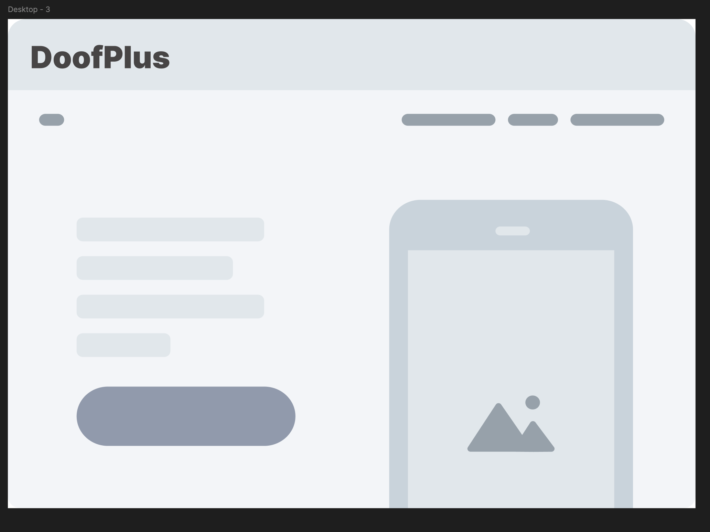

**Services (What We Offer):**

Aquí se detallan los servicios principales de DoofPlus: Real-Time IoT Monitoring, Automated BPM Compliance, Immutable Traceability y Digital Batch Management. Cada servicio se presenta con un icono representativo y una breve descripción, haciendo que nuestra oferta sea fácil de entender y visualmente accesible.

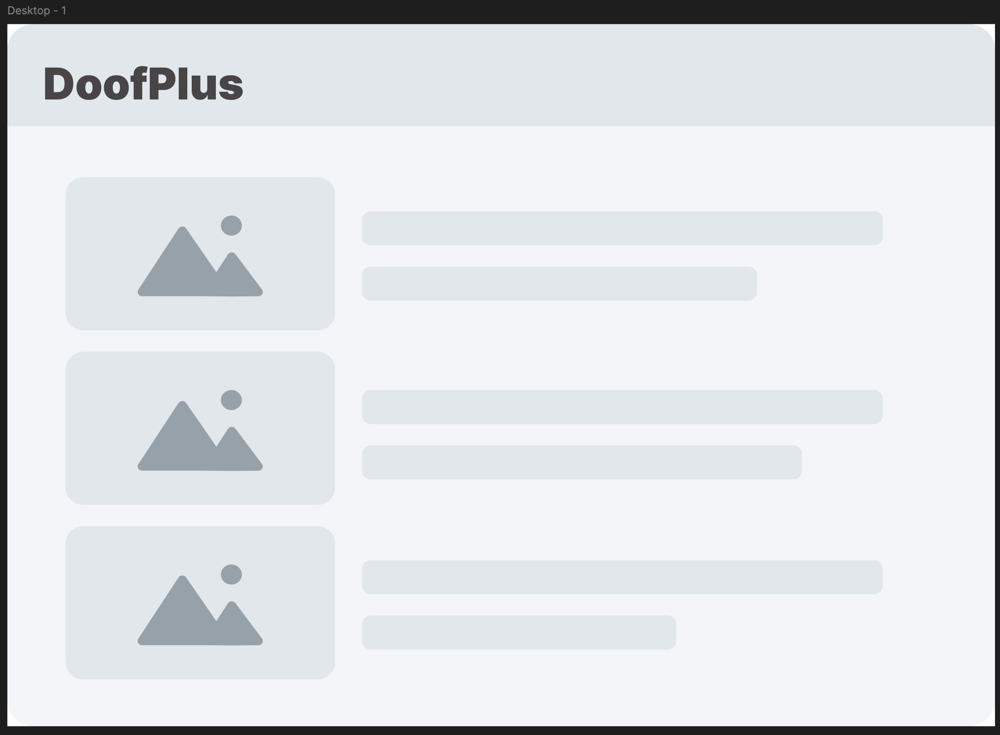

**Acerca de la aplicación (About the Platform):**

Esta sección presenta lo que hace única a DoofPlus: una plataforma para laboratorios farmacéuticos que automatiza el control de calidad mediante integración IoT, elimina errores manuales y garantiza la trazabilidad inmutable. Destacamos beneficios clave como captura automática de telemetría, alertas en tiempo real y cumplimiento nativo con normativas DIGEMID.

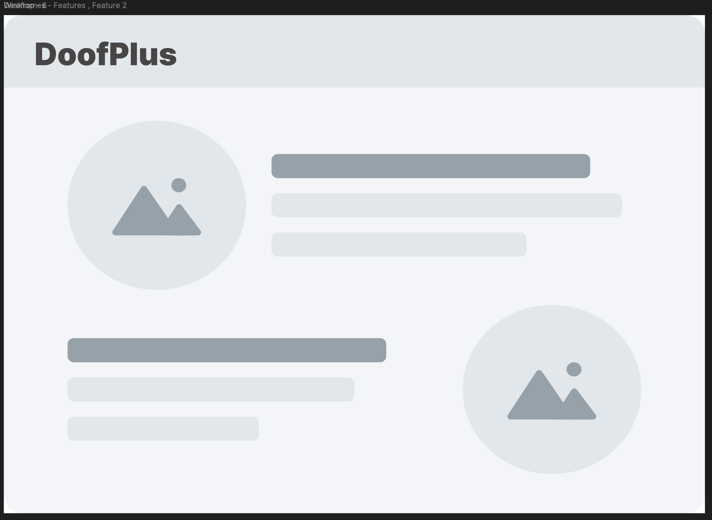

**Sobre el Equipo (Our Team):**

En esta sección, se humaniza la marca al presentar al equipo detrás de DoofPlus (Inges Company). Con fotos y descripciones de los miembros, mostramos a las personas dedicadas a este proyecto, construyendo confianza y una conexión personal con los visitantes.

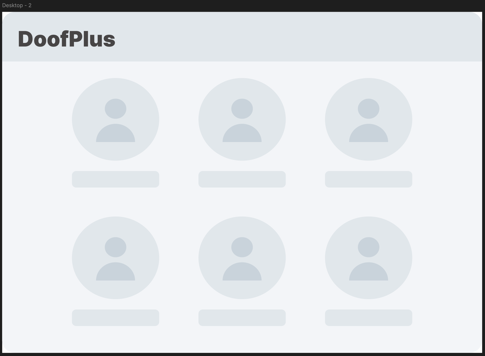

**Precios (Plans):**

La sección de Precios ofrece una visión clara de los planes disponibles. Presentamos el Standard Lab Plan y el Enterprise Plan, con una comparativa de características para ayudar a los usuarios a elegir la opción que mejor se adapte a sus necesidades, ya sea para un laboratorio mediano o para una institución de salud pública. Un selector entre tarifas mensuales y anuales, junto con la indicación del ahorro asociado, facilita una elección más informada.

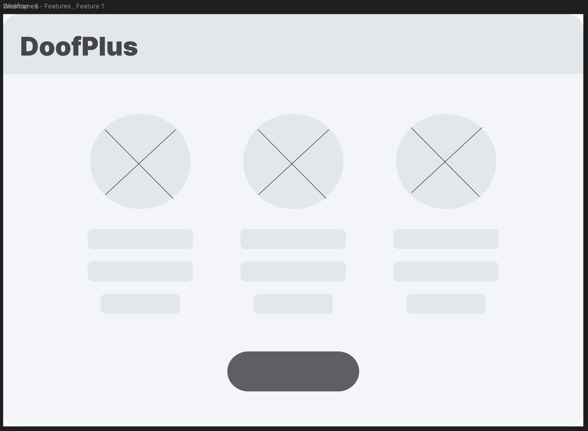

**Footer:**

El pie de página es un elemento crucial para la usabilidad. Contiene enlaces a información de contacto (correo electrónico, teléfono y ubicación). Esto proporciona un acceso rápido a la información sin saturar la interfaz, ofreciendo un cierre limpio y funcional a la página.

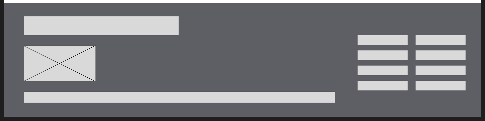

Este wireframe sienta las bases para un diseño visual que no solo se ve bien, sino que también guía al usuario de manera intuitiva a través de nuestra propuesta de valor, reforzando la confianza y la conexión que DoofPlus promete.

### 4.3.2. Landing Page Mock-up

Esta sección presenta y explica los Mock-ups del Landing Page, tanto en su versión para Desktop Web Browser como Mobile Web Browser. En la propuesta y la explicación se evidencia la aplicación de los principios, elementos de diseño, diseño inclusivo y arquitectura de información, así como el Design System establecido para los productos digitales.

**Hero de la aplicación**

El hero de nuestra plataforma **DoofPlus** presenta un fondo moderno e institucional que evoca precisión tecnológica y cumplimiento normativo, con un título claro: 'The Future of Pharmaceutical Quality Management'. Una breve descripción capta nuestra esencia para el control de calidad, y un botón de llamado a la acción sólido y centrado ('Request a Demo') invita a los usuarios a dar el primer paso hacia la digitalización de sus procesos. Una barra de navegación en la parte superior con el logotipo de DoofPlus permite acceder de forma fluida a todas las secciones de la página, proporcionando una experiencia de usuario intuitiva.

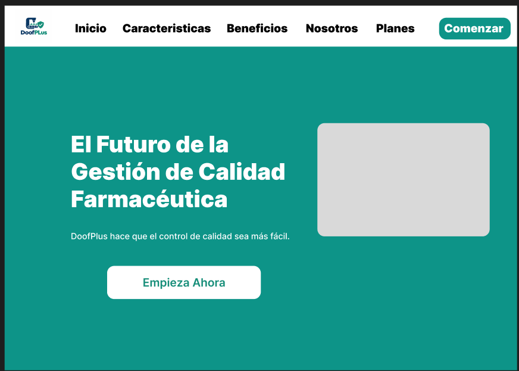

**What We Offer**

En la sección 'What we offer', presentamos nuestras principales áreas de servicio a través de tarjetas limpias. Cada tarjeta cuenta con un título y una descripción enfocada, como 'Real-Time IoT Monitoring', 'Automated BPM Compliance', 'Immutable Traceability' y 'Digital Batch Management'. Esto permite a los usuarios entender rápidamente el alcance de nuestra plataforma para resolver los problemas de documentación de calidad farmacéutica.

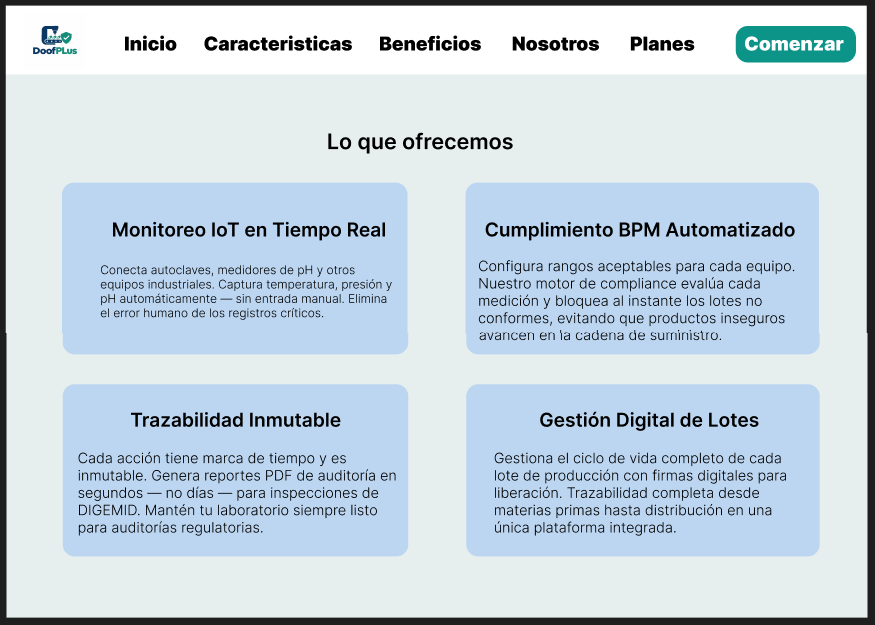

**Features**

La sección de "Features" muestra las funcionalidades clave de DoofPlus. El diseño tipo acordeón interactivo permite a los usuarios expandir cada característica (como la integración de sensores IoT o alertas instantáneas por desviación) para leer su descripción completa, mientras que el recuadro visual de la izquierda balancea el contenido. Este formato combina información técnica detallada con un diseño dinámico.

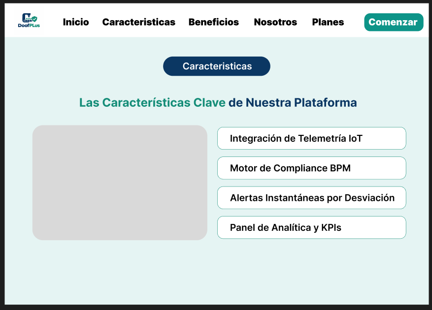

**Benefits**

En 'Benefits', destacamos las ventajas tangibles de utilizar DoofPlus. A través de un diseño de tarjetas (cards) sobre fondo claro con íconos representativos, comunicamos de manera directa cómo nuestra plataforma reduce el tiempo de preparación para auditorías en un 80%, elimina el error humano en los registros y proporciona una infraestructura SaaS escalable.

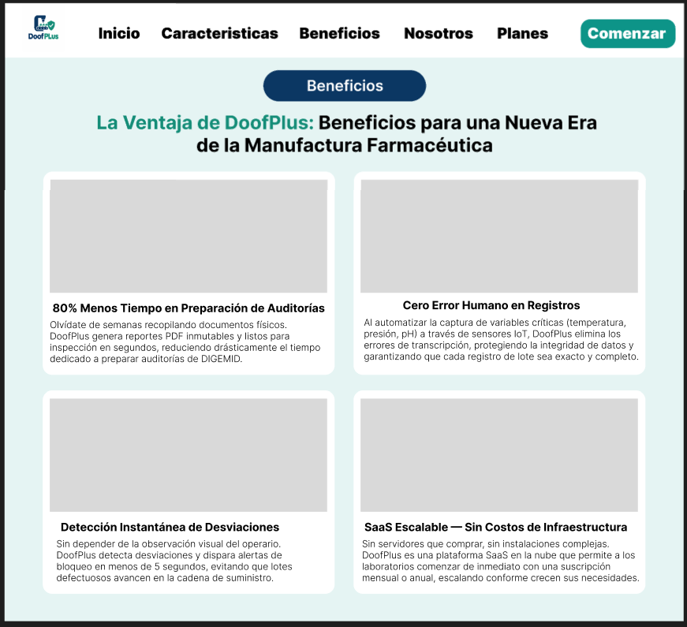

**About Us**

La sección 'About Us' presenta a **Inges Company**, la startup detrás de DoofPlus. Aquí compartimos nuestra visión de transformar digitalmente procesos especializados, detallando cómo nuestra solución permite centralizar información para el ciclo de vida farmacéutico y asegurar las BPM. El diseño separa claramente la misión de la empresa de una lista puntual con los pilares del servicio (IoT, Trazabilidad, Cumplimiento).

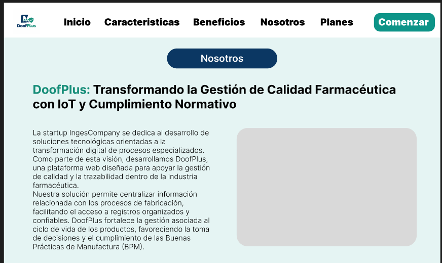

**Our Team**

La sección "Our Team" presenta a los ingenieros de software detrás de Inges Company: Marcelo Angulo, Yhoshua Cobades, Ricardo Flores, Nestor Rojas y Rodolfo Zavaleta. Las tarjetas de perfil muestran una foto, el nombre, el rol de Software Engineer y una biografía detallada para cada miembro. El diseño de tarjetas alineadas en cuadrícula brinda un aspecto organizado, humanizando el desarrollo del software.

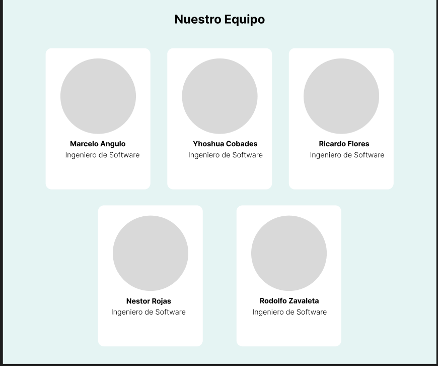

**Plans**

En la sección de "Plans", ofrecemos los detalles de nuestros planes de suscripción. Las tarjetas de "Standard Lab" y "Enterprise" incluyen descripciones precisas para los segmentos objetivos, precios mensuales/anuales, y listas completas de características. El Plan Enterprise destaca visualmente con el color Verde Marino principal como fondo sólido para distinguirlo, y se incorpora un toggle para facilitar la vista de precios anuales.

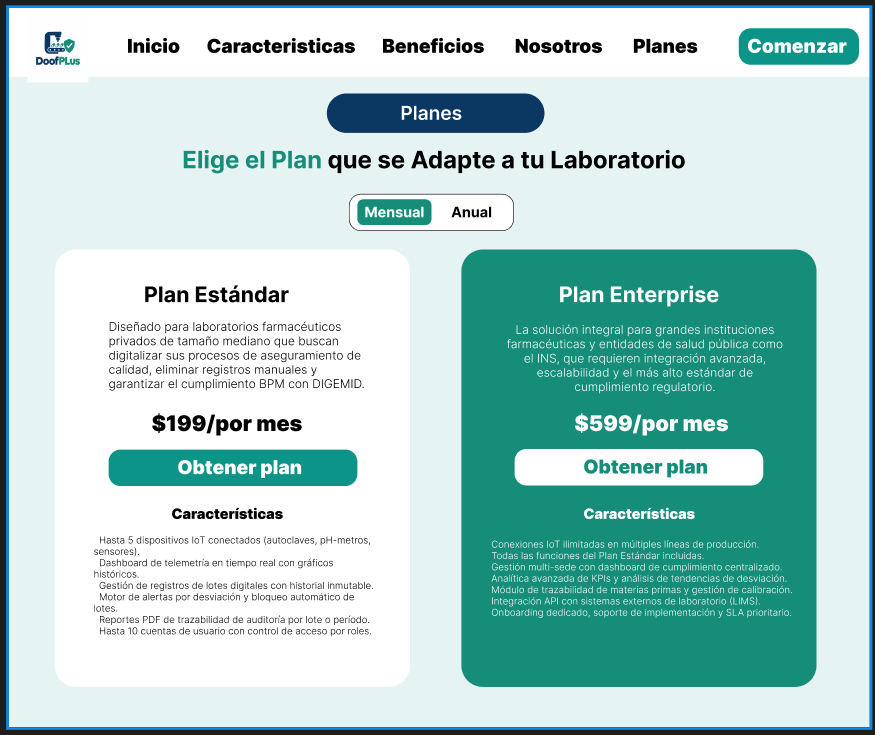

**Footer**

El "Footer" de nuestra landing page actúa como cierre funcional de la navegación. Contiene el logotipo en su versión blanca y el nombre de DoofPlus, enlaces de contacto y acceso a recursos. Finalmente, se observa la declaración oficial "Copyright © 2026 Inges Company", asegurando la propiedad del producto en una interfaz ordenada con los colores oscuros corporativos.

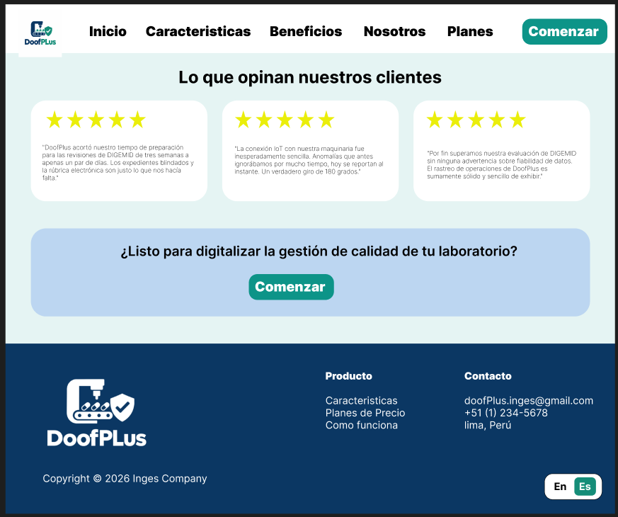

## 4.4. Web Applications UX/UI Design

La presente sección describe el diseño de experiencia de usuario (UX) e interfaz de usuario (UI) desarrollado para la plataforma web DoofPlus. La propuesta fue diseñada para apoyar la gestión integral de calidad farmacéutica bajo entornos regulados GxP, facilitando la administración documental, la trazabilidad de procesos productivos, la gestión de desviaciones y el monitoreo operativo de laboratorios y líneas de manufactura.

El diseño considera principios de usabilidad, accesibilidad, consistencia visual y eficiencia operativa, asegurando que los diferentes perfiles de usuario puedan ejecutar actividades críticas relacionadas con el cumplimiento normativo, la liberación de lotes y la auditoría regulatoria.

### 4.4.1. Web Applications Wireframes

En esta sección se presentan los wireframes diseñados para la aplicación web de DoofPlus. Cada pantalla fue desarrollada para gestionar procesos de calidad farmacéutica, producción regulada GxP, trazabilidad de lotes, control documental y cumplimiento normativo mediante firmas electrónicas y registros auditables.

A continuación, se muestran las representaciones esquemáticas de baja fidelidad que describen la estructura, distribución de componentes y funcionalidades principales de cada módulo de la plataforma.

- **Landing Page - DoofPlus**

Pantalla de presentación de la plataforma que comunica la propuesta de valor de DoofPlus y permite acceder al portal especializado para gestión de calidad y producción farmacéutica bajo normativas GxP.

- **Regulatory Identification - DoofPlus**

Pantalla de autenticación regulatoria que solicita las credenciales corporativas y la firma electrónica necesarias para acceder a funcionalidades sujetas a cumplimiento FDA 21 CFR Part 11 y normativas GxP.

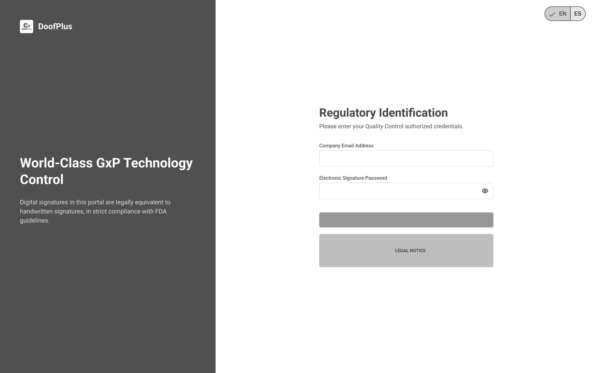

- **Environment Selection Portal - DoofPlus**

Interfaz que permite seleccionar el entorno de trabajo autorizado, diferenciando entre el segmento de calidad (QA/QC) y el entorno de producción farmacéutica.

- **QA & Lab Console Dashboard - DoofPlus**

Panel principal para usuarios de calidad que centraliza la supervisión de lotes pendientes, ensayos analíticos, desviaciones abiertas y actividades del laboratorio.

- **Document Management & Master SOPs - DoofPlus**

Repositorio documental diseñado para gestionar procedimientos operativos estándar (SOPs), registros electrónicos, certificados de análisis y documentación regulatoria controlada.

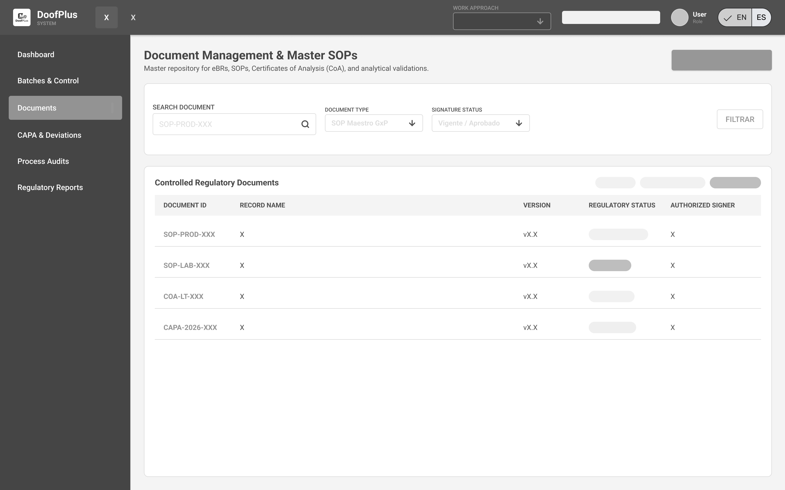

- **Quality Protocols & Validation Management - DoofPlus**

Módulo destinado a la administración de protocolos de validación, cualificación de equipos y seguimiento de actividades relacionadas con IQ, OQ y PQ.

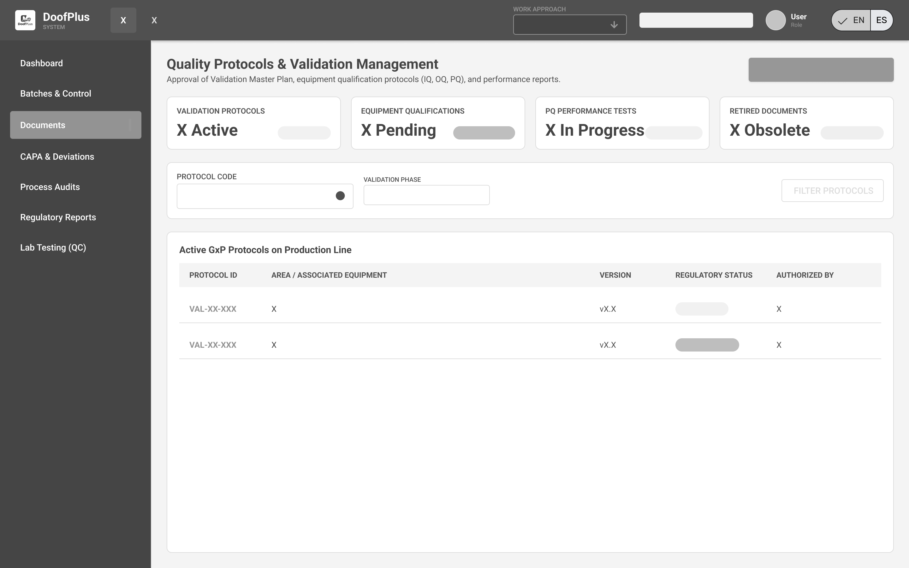

- **Critical Deviations & CAPA Actions Control - DoofPlus**

Pantalla de seguimiento de desviaciones críticas, análisis de impacto GMP y control de acciones correctivas y preventivas (CAPA).

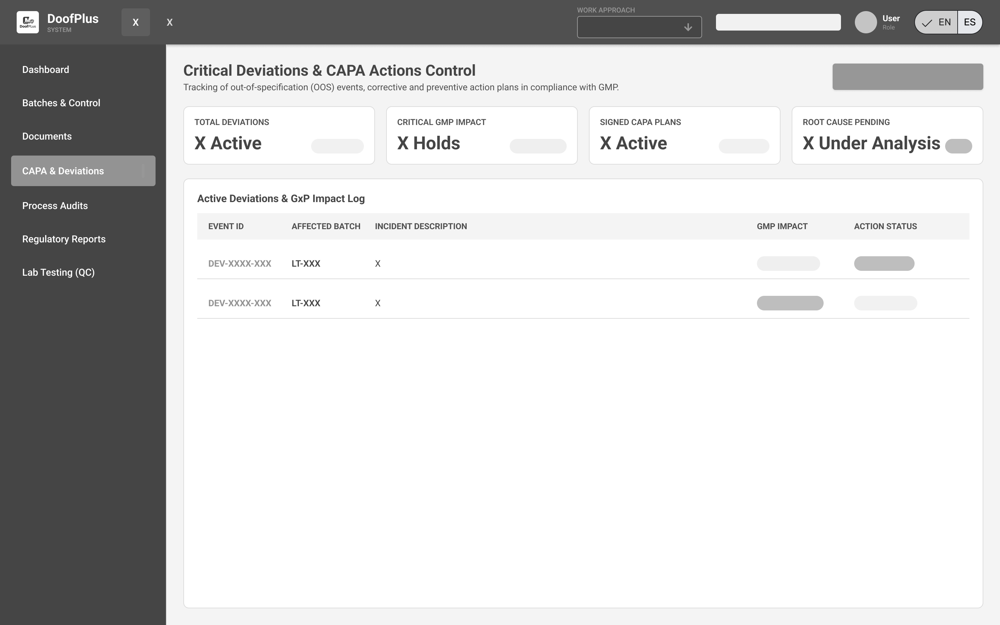

- **Process Audit Master Plan - DoofPlus**

Módulo para planificar, ejecutar y monitorear auditorías internas, inspecciones regulatorias y hallazgos asociados al cumplimiento GMP.

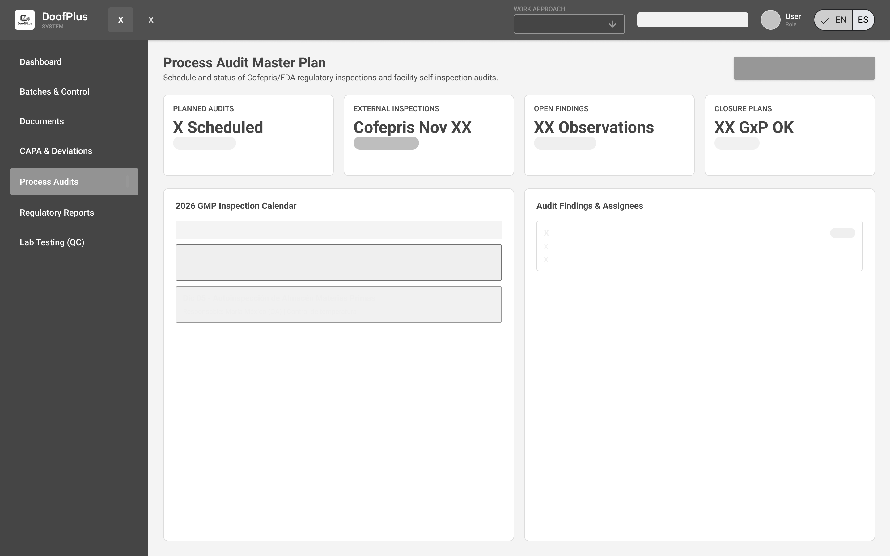

- **GxP Regulatory Reports & Metrics - DoofPlus**

Panel de análisis que permite generar reportes regulatorios, revisar métricas de desempeño y exportar información validada para auditorías e inspecciones.

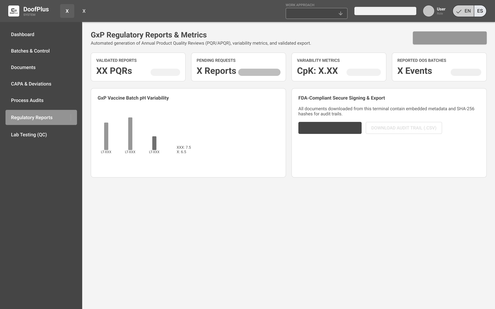

- **Analytical Testing & Microbiology Control (QC) - DoofPlus**

Pantalla de control de ensayos analíticos y microbiológicos que permite gestionar muestras, equipos de laboratorio y resultados fuera de especificación (OOS).

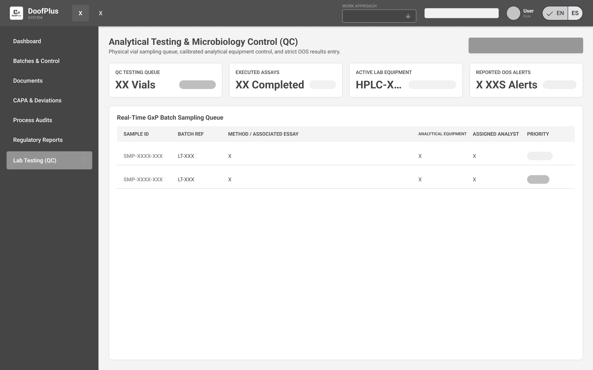

- **Analytical Results Entry & Validation - DoofPlus**

Interfaz destinada al registro y validación de resultados analíticos, integrando verificación de especificaciones y aprobación mediante firma electrónica.

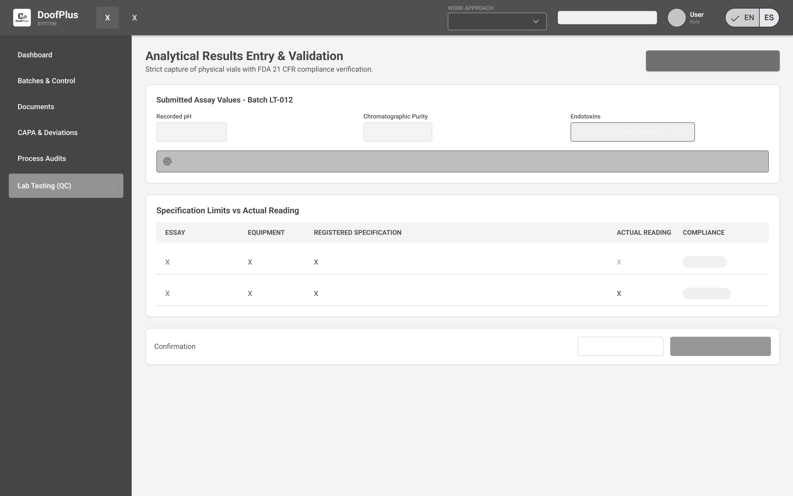

- **Pharmaceutical Batch History & Traceability - DoofPlus**

Módulo de consulta histórica que permite rastrear lotes farmacéuticos, consultar estados regulatorios y acceder a certificados de análisis.

- **Cross-Traceability & Audit Center - DoofPlus**

Centro de trazabilidad que integra genealogía de lotes, registros de laboratorio, documentación asociada y auditoría completa de eventos regulatorios.

- **GxP Production Control Console - DoofPlus**

Panel principal del entorno de producción que permite supervisar órdenes activas, progreso de eBR y estado de los procesos de manufactura.

- **GxP Batch Execution & Management Console - DoofPlus**

Interfaz para la gestión operativa de lotes de fabricación, incluyendo seguimiento de etapas de producción, firmas electrónicas y responsables asignados.

- **GxP Incident Registration & Deviation Management - DoofPlus**

Módulo de registro de incidencias que permite documentar eventos de desviación, adjuntar evidencias y gestionar acciones de contención.

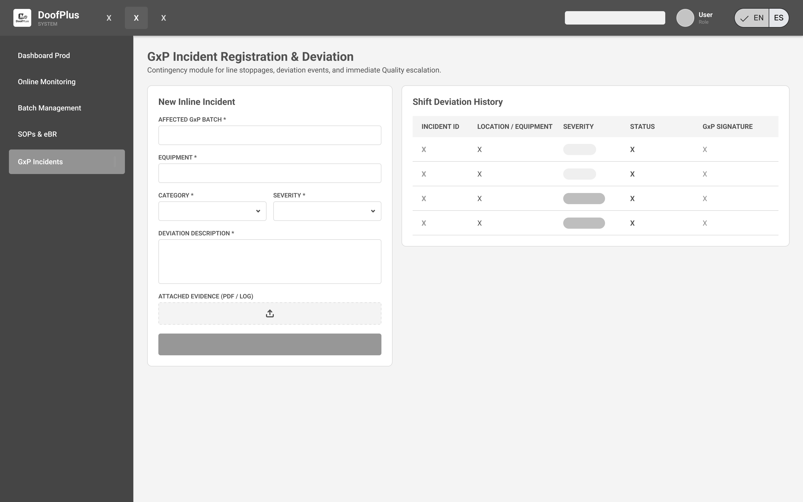

- **GxP Profile & Regulatory Credentials - DoofPlus**

Pantalla de perfil regulatorio donde los usuarios administran credenciales, firmas electrónicas y permisos asociados a los distintos contextos del sistema.

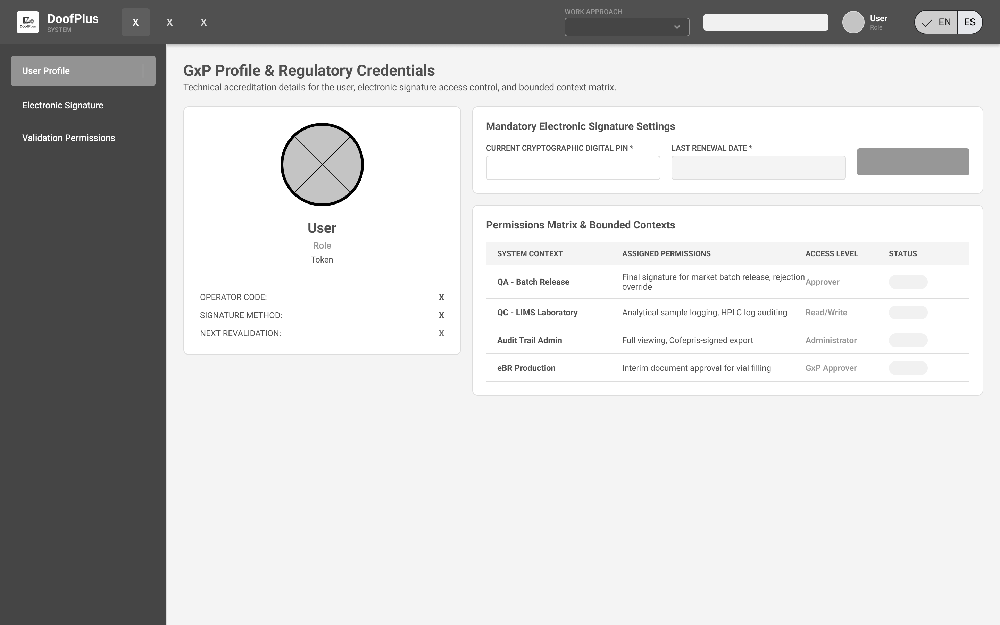

- **General Settings & GxP Policies - DoofPlus**

Módulo de configuración orientado a la administración de políticas GxP, parámetros de seguridad, auditorías internas y canales de notificación regulatoria.

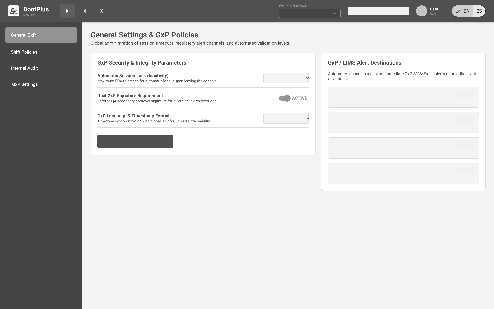

### 4.4.2. Web Applications Wireflow Diagrams

Los Wireflow Diagrams se utilizan para representar visualmente la navegación y las interacciones que realizan los usuarios dentro de una aplicación para alcanzar un objetivo determinado. Estos diagramas combinan wireframes y flujos de usuario, permitiendo visualizar las diferentes pantallas involucradas en cada proceso y la secuencia de acciones necesarias para completar una tarea.

Para DoofPlus se desarrollaron distintos Wireflow Diagrams basados en los principales objetivos de los usuarios dentro de un entorno farmacéutico regulado por normas GxP. Cada diagrama describe el flujo que siguen los usuarios para gestionar procesos de producción, control de calidad, documentación regulatoria, trazabilidad y cumplimiento normativo.

**Especialista de Aseguramiento y Control de Calidad (QA/QC)**

**User Goal 1:** Acceder a la plataforma y configurar el entorno regulatorio de trabajo.

Como usuario, quiero ingresar a DoofPlus y configurar el entorno regulatorio correspondiente para acceder a los módulos y funciones necesarias para la gestión de calidad farmacéutica.

[User 1](../assets/img/chapter4/prototype/wireflow-diagrams/segmento-2-user-goal-1.png)

**User Goal 2:** Monitorear equipos y condiciones ambientales asociadas a la producción.

Como usuario, quiero supervisar el estado de los equipos y las variables ambientales críticas para asegurar que las operaciones de manufactura cumplan con los requisitos regulatorios establecidos.

[User 2](../assets/img/chapter4/prototype/wireflow-diagrams/segmento-2-user-goal-2.png)

**User Goal 3:** Gestionar lotes de producción y garantizar su trazabilidad.

Como usuario, quiero registrar y monitorear los lotes de producción para asegurar la trazabilidad completa desde su fabricación hasta su liberación.

[User 3](../assets/img/chapter4/prototype/wireflow-diagrams/segmento-2-user-goal-3.png)

**User Goal 4:** Consultar la trazabilidad histórica y el plan maestro de auditorías.

Como usuario, quiero acceder al historial de lotes y a los registros de auditoría para verificar evidencias de cumplimiento y mantener la integridad de la información regulatoria.

[User 4](../assets/img/chapter4/prototype/wireflow-diagrams/segmento-2-user-goal-4.png)

User Goal 5: Gestionar protocolos de laboratorio y validar resultados de calidad.

Como usuario de control de calidad, quiero administrar protocolos de laboratorio y registrar resultados analíticos para garantizar el cumplimiento de los estándares GxP y los procedimientos de validación.

[User 5](../assets/img/chapter4/prototype/wireflow-diagrams/segmento-2-user-goal-5.png)

**User Goal 6:** Supervisar desviaciones, CAPA y métricas regulatorias.

Como usuario, quiero registrar desviaciones, gestionar acciones correctivas y preventivas (CAPA) y consultar métricas regulatorias para facilitar el cumplimiento normativo y la mejora continua.

[User 6](../assets/img/chapter4/prototype/wireflow-diagrams/segmento-2-user-goal-6.png)

**Jefe o Supervisor de Producción Farmacéutica**

User Goal 1: Acceder al dashboard de calidad para supervisar el estado de los procesos.

Como especialista de QA, quiero acceder a un dashboard centralizado que me permita monitorear indicadores de calidad, lotes en revisión y elementos pendientes de validación.

[User 1](../assets/img/chapter4/prototype/wireflow-diagrams/segmento-1-user-goal-1.png)

User Goal 2: Gestionar auditorías y evidencias de cumplimiento regulatorio.

Como especialista de QA, quiero revisar auditorías y evidencias documentadas para verificar el cumplimiento de los requisitos regulatorios y de calidad.

[User 2](../assets/img/chapter4/prototype/wireflow-diagrams/segmento-1-user-goal-2.png)

User Goal 3: Registrar desviaciones e iniciar acciones CAPA.

Como especialista de QA, quiero registrar incidencias y gestionar acciones correctivas y preventivas para controlar riesgos y asegurar la mejora continua de los procesos.

[User 3](../assets/img/chapter4/prototype/wireflow-diagrams/segmento-1-user-goal-3.png)

User Goal 4: Gestionar protocolos de validación y control de calidad.

Como especialista de QA, quiero administrar protocolos de validación para verificar que los procesos y procedimientos cumplan con los requisitos regulatorios establecidos.

[User 4](../assets/img/chapter4/prototype/wireflow-diagrams/segmento-1-user-goal-4.png)

User Goal 5: Administrar documentación regulatoria y procedimientos operativos estándar.

Como especialista de QA, quiero gestionar documentos y SOPs para mantener registros controlados, actualizados y trazables dentro del sistema.

[User 5](../assets/img/chapter4/prototype/wireflow-diagrams/segmento-1-user-goal-5.png)

User Goal 6: Consultar reportes regulatorios y métricas de desempeño.

Como especialista de QA, quiero visualizar reportes regulatorios e indicadores de calidad para evaluar tendencias, identificar riesgos y respaldar la toma de decisiones.

[User 6](../assets/img/chapter4/prototype/wireflow-diagrams/segmento-1-user-goal-6.png)

### 4.4.3. Web Applications Mock-ups

En esta sección se presentan los mock-ups desarrollados para la aplicación web de DoofPlus. Estas representaciones de alta fidelidad muestran la apariencia final de la plataforma, incorporando la identidad visual del producto, componentes interactivos y elementos orientados al cumplimiento regulatorio farmacéutico bajo estándares GMP y FDA 21 CFR Part 11.

Los mock-ups fueron diseñados considerando los procesos críticos de aseguramiento y control de calidad, manufactura farmacéutica, trazabilidad de lotes y gestión documental, garantizando una experiencia de usuario intuitiva y alineada con los requisitos de integridad de datos, auditoría y firmas electrónicas.

- **Landing Page - DoofPlus**

Pantalla de presentación de la plataforma que comunica la propuesta de valor de DoofPlus y permite acceder al portal especializado para gestión de calidad y producción farmacéutica bajo normativas GxP.

- **Regulatory Identification - DoofPlus**

Pantalla de autenticación regulatoria que solicita las credenciales corporativas y la firma electrónica necesarias para acceder a funcionalidades sujetas a cumplimiento FDA 21 CFR Part 11 y normativas GxP.

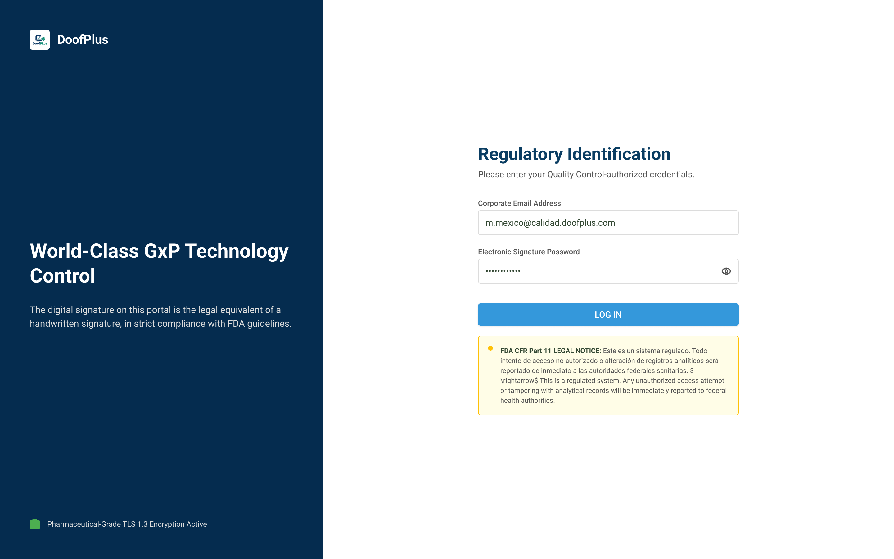

- **Environment Selection Portal - DoofPlus**

Interfaz que permite seleccionar el entorno de trabajo autorizado, diferenciando entre el segmento de calidad (QA/QC) y el entorno de producción farmacéutica.

- **QA & Lab Console Dashboard - DoofPlus**

Panel principal para usuarios de calidad que centraliza la supervisión de lotes pendientes, ensayos analíticos, desviaciones abiertas y actividades del laboratorio.

- **Document Management & Master SOPs - DoofPlus**

Repositorio documental diseñado para gestionar procedimientos operativos estándar (SOPs), registros electrónicos, certificados de análisis y documentación regulatoria controlada.

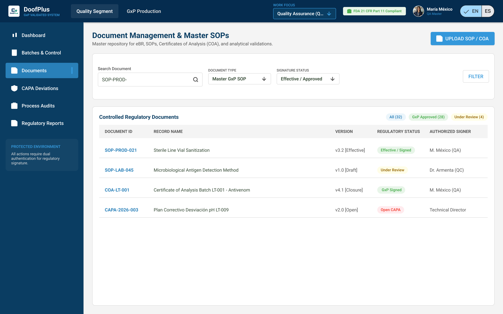

- **Quality Protocols & Validation Management - DoofPlus**

Módulo destinado a la administración de protocolos de validación, cualificación de equipos y seguimiento de actividades relacionadas con IQ, OQ y PQ.

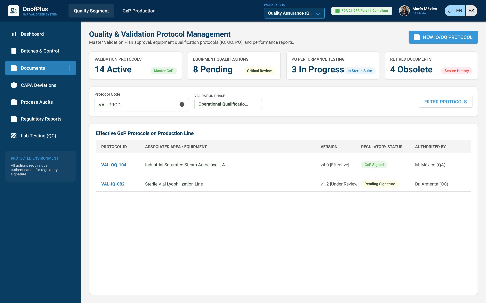

- **Critical Deviations & CAPA Actions Control - DoofPlus**

Pantalla de seguimiento de desviaciones críticas, análisis de impacto GMP y control de acciones correctivas y preventivas (CAPA).

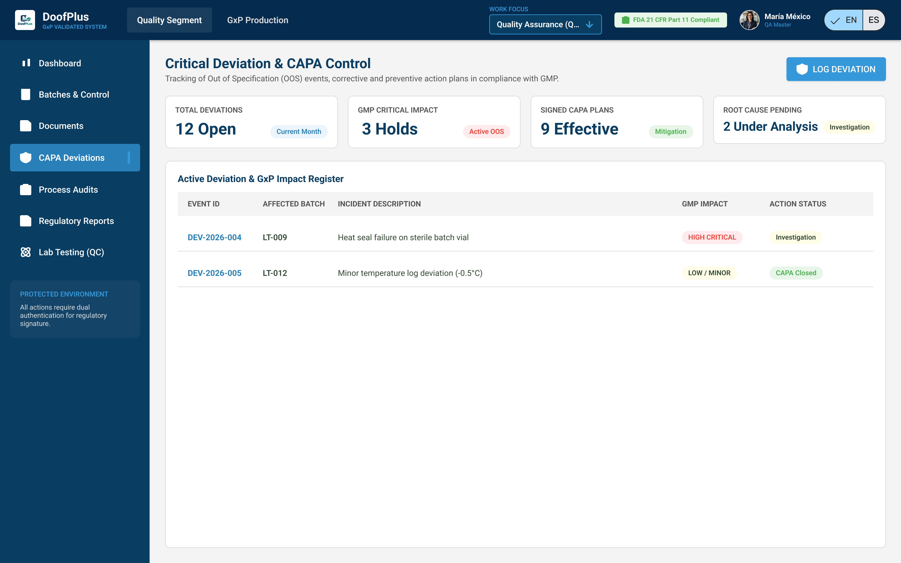

- **Process Audit Master Plan - DoofPlus**

Módulo para planificar, ejecutar y monitorear auditorías internas, inspecciones regulatorias y hallazgos asociados al cumplimiento GMP.

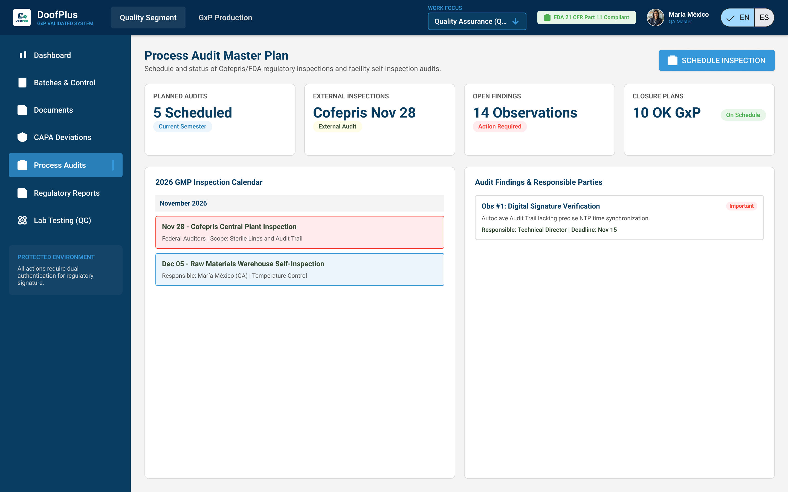

- **GxP Regulatory Reports & Metrics - DoofPlus**

Panel de análisis que permite generar reportes regulatorios, revisar métricas de desempeño y exportar información validada para auditorías e inspecciones.

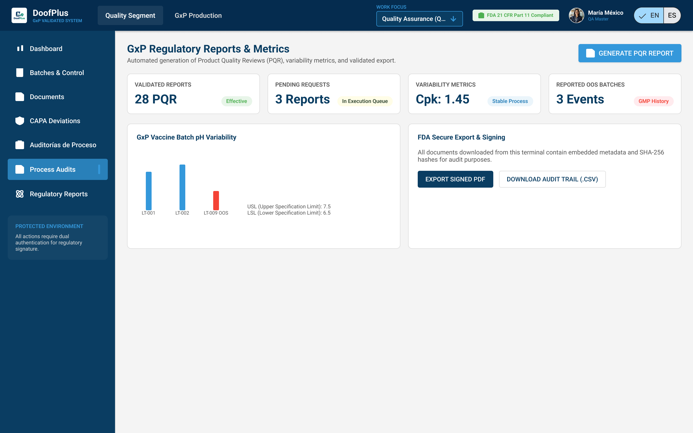

- **Analytical Testing & Microbiology Control (QC) - DoofPlus**

Pantalla de control de ensayos analíticos y microbiológicos que permite gestionar muestras, equipos de laboratorio y resultados fuera de especificación (OOS).

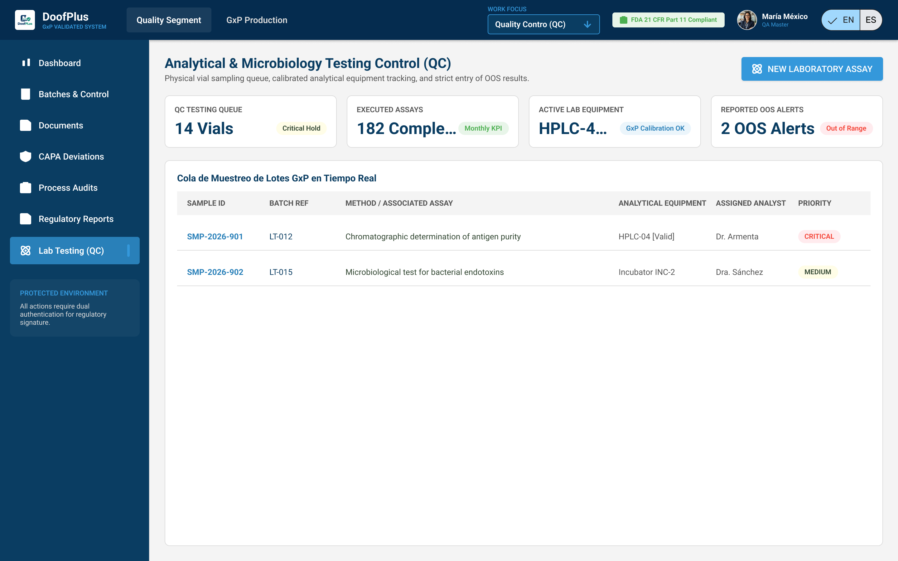

- **Analytical Results Entry & Validation - DoofPlus**

Interfaz destinada al registro y validación de resultados analíticos, integrando verificación de especificaciones y aprobación mediante firma electrónica.

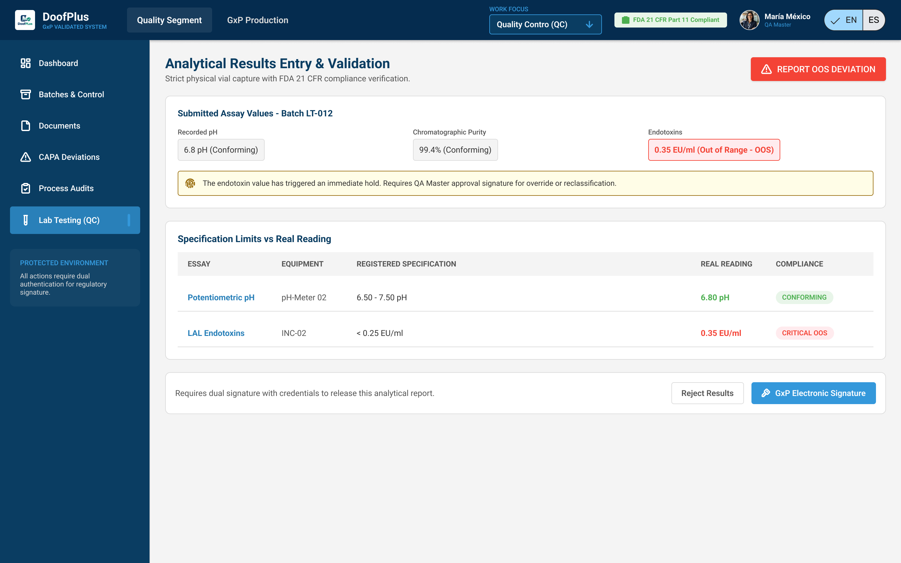

- **Pharmaceutical Batch History & Traceability - DoofPlus**

Módulo de consulta histórica que permite rastrear lotes farmacéuticos, consultar estados regulatorios y acceder a certificados de análisis.

- **Cross-Traceability & Audit Center - DoofPlus**

Centro de trazabilidad que integra genealogía de lotes, registros de laboratorio, documentación asociada y auditoría completa de eventos regulatorios.

- **GxP Production Control Console - DoofPlus**

Panel principal del entorno de producción que permite supervisar órdenes activas, progreso de eBR y estado de los procesos de manufactura.

- **GxP Batch Execution & Management Console - DoofPlus**

Interfaz para la gestión operativa de lotes de fabricación, incluyendo seguimiento de etapas de producción, firmas electrónicas y responsables asignados.

- **GxP Incident Registration & Deviation Management - DoofPlus**

Módulo de registro de incidencias que permite documentar eventos de desviación, adjuntar evidencias y gestionar acciones de contención.

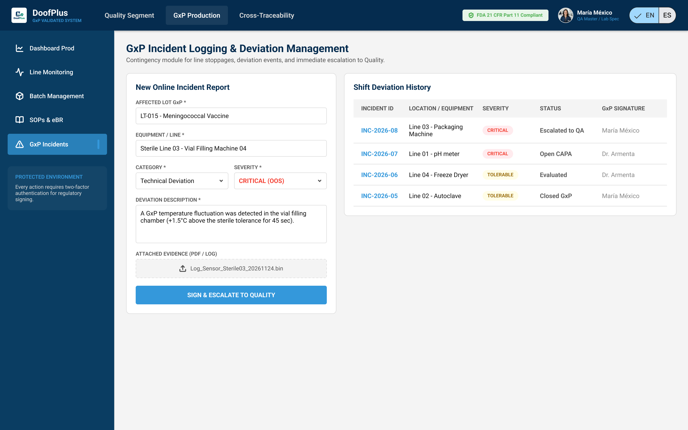

- **GxP Profile & Regulatory Credentials - DoofPlus**

Pantalla de perfil regulatorio donde los usuarios administran credenciales, firmas electrónicas y permisos asociados a los distintos contextos del sistema.

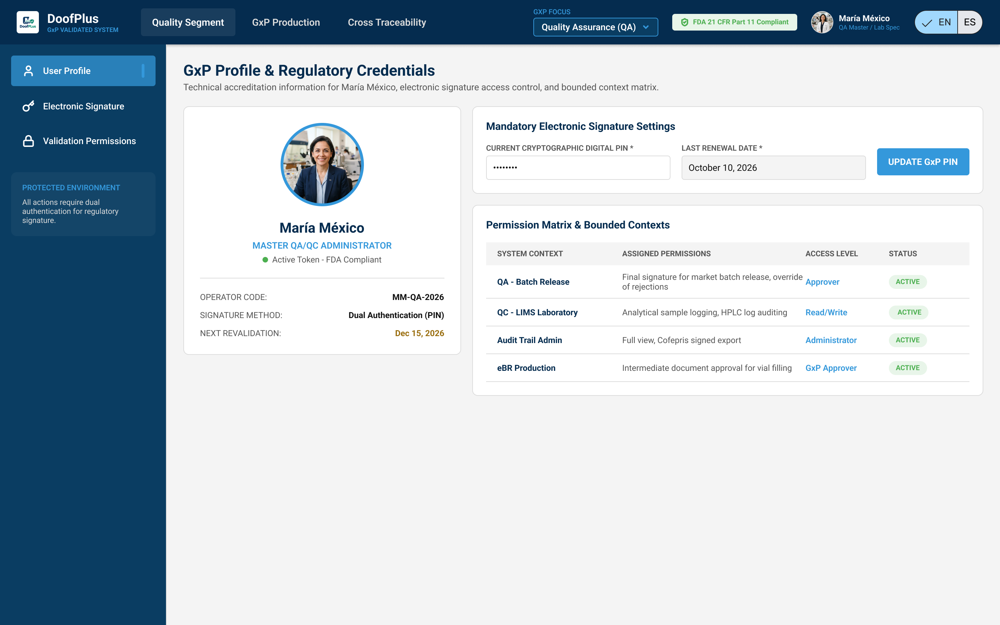

- **General Settings & GxP Policies - DoofPlus**

Módulo de configuración orientado a la administración de políticas GxP, parámetros de seguridad, auditorías internas y canales de notificación regulatoria.

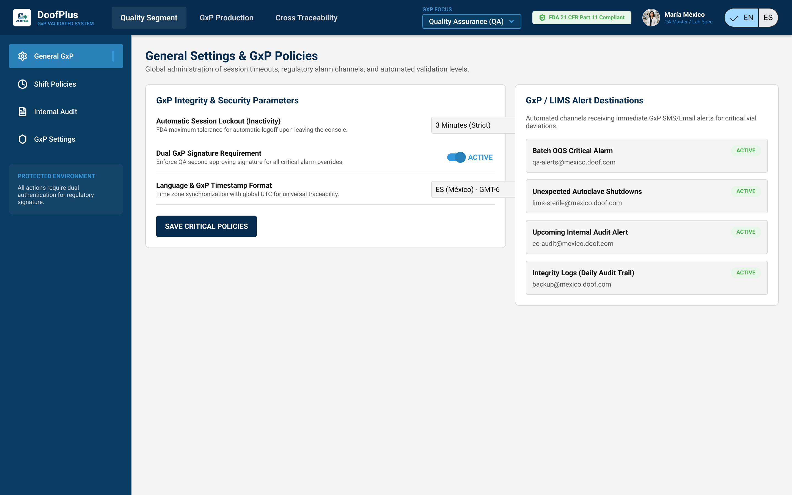

### 4.4.4. Web Applications User Flow Diagrams

Los User Flow Diagrams representan la secuencia de acciones que realizan los usuarios dentro de la plataforma para alcanzar un objetivo específico. Estos diagramas permiten visualizar la navegación entre módulos, las decisiones tomadas durante el proceso y los diferentes escenarios que pueden ocurrir durante la interacción con el sistema.

Para DoofPlus se definieron distintos flujos asociados a los procesos críticos de calidad y manufactura farmacéutica. Cada User Flow se clasifica como Happy Path, cuando el usuario completa exitosamente el objetivo planteado, o Unhappy Path, cuando el flujo se origina a partir de una incidencia, desviación o situación excepcional que requiere atención y seguimiento.

***User Flow 1: Acceso a la plataforma y selección del entorno operativo***

Este flujo describe el proceso que realiza un usuario desde el ingreso a la plataforma hasta el acceso al entorno de trabajo correspondiente según su rol y permisos regulatorios.

**Happy Path**

Como usuario autorizado, quiero acceder a la plataforma, completar la autenticación regulatoria y seleccionar mi entorno de trabajo para comenzar a utilizar las funcionalidades correspondientes a mi perfil.

**Unhappy Path*

Como usuario, quiero acceder a la plataforma y al entorno de manufactura para consultar indicadores regulatorios y reportes asociados al proceso productivo.

***User Flow 2: Gestión de muestras y consulta de trazabilidad***

Este flujo representa el proceso mediante el cual un especialista de calidad registra una muestra, valida los resultados obtenidos y consulta posteriormente la trazabilidad asociada al lote analizado.

**Happy Path**

Como especialista de calidad, quiero registrar muestras y validar resultados analíticos para garantizar la trazabilidad y el cumplimiento de los procedimientos de laboratorio.

**Unhappy Path**

Como usuario de manufactura, quiero consultar el historial de trazabilidad y auditoría de un lote para investigar eventos o situaciones excepcionales detectadas durante la producción.

***User Flow 3: Registro de incidencias y gestión de desviaciones***

Este flujo muestra cómo una incidencia detectada durante las operaciones es registrada y posteriormente evaluada mediante el proceso de gestión de desviaciones y acciones correctivas.

**Happy Path**

Como especialista de calidad, quiero gestionar desviaciones y registrar acciones CAPA para corregir incumplimientos identificados y reducir riesgos regulatorios.

**Unhappy Path**

Como operador de manufactura, quiero registrar una incidencia operativa para documentar una desviación que pueda afectar la calidad, seguridad o continuidad del proceso.

***User Flow 4: Gestión documental y protocolos de validación***

Este flujo describe la administración de documentos regulados y protocolos de validación necesarios para mantener la conformidad con los estándares GMP.

**Happy Path**

Como especialista de calidad, quiero gestionar documentos y protocolos de validación para asegurar que los procedimientos se encuentren actualizados y correctamente controlados.

**Unhappy Path**

Como usuario de manufactura, quiero monitorear equipos y consultar el estado de ejecución de lotes para identificar anomalías que puedan afectar la operación.

***User Flow 5: Evaluación de cumplimiento regulatorio***

Este flujo representa el proceso de análisis del estado de cumplimiento mediante la revisión de desviaciones, validaciones y reportes regulatorios.

**Happy Path**

Como especialista de calidad, quiero revisar el estado del sistema de calidad y consultar métricas regulatorias para evaluar el nivel de cumplimiento de la organización.

**Unhappy Path**

Como usuario de manufactura, quiero realizar seguimiento a la ejecución de lotes y verificar posteriormente la información de trazabilidad para investigar posibles desviaciones.

***User Flow 6: Auditoría y trazabilidad de lotes***

Este flujo muestra cómo los usuarios acceden a la información histórica de los lotes y a los registros de auditoría para respaldar procesos de inspección y liberación farmacéutica.

**Happy Path**

Como especialista de calidad, quiero consultar la trazabilidad completa de un lote y revisar el historial de auditoría para verificar la integridad y consistencia de los registros.

**Unhappy Path**

Como usuario de manufactura, quiero acceder al historial y la trazabilidad de un lote para analizar información relacionada con una situación excepcional o una observación generada durante el proceso productivo.

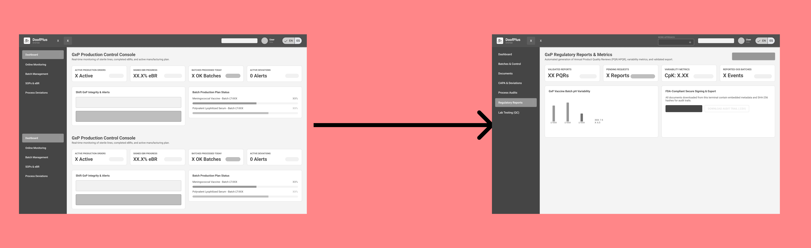

## 4.5. Web Applications Prototyping

La sección de Web Applications Prototyping presenta los prototipos interactivos desarrollados para validar los flujos operativos y regulatorios de DoofPlus antes de su implementación. Estos prototipos permiten simular la experiencia real de navegación dentro de la plataforma, evaluando la accesibilidad, usabilidad y eficiencia de las interacciones propuestas.

El diseño de los prototipos fue guiado por cuatro principios fundamentales:

1. Cumplimiento regulatorio por diseño

Todas las interacciones fueron concebidas considerando requisitos de FDA 21 CFR Part 11, GMP y buenas prácticas de documentación, incorporando controles asociados a firmas electrónicas, auditoría de registros y segregación de funciones.

2. Arquitectura basada en procesos farmacéuticos

La navegación se organiza alrededor de los procesos más frecuentes dentro de la industria farmacéutica:

- Gestión documental regulatoria.
- Control y liberación de lotes.
- Investigación de desviaciones.
- Gestión CAPA.
- Auditorías regulatorias.
- Validación y control analítico.

3. Consistencia visual y operativa

Los prototipos mantienen una identidad visual uniforme mediante el uso consistente de colores institucionales, componentes reutilizables, tablas regulatorias y paneles de control orientados a la supervisión operativa.

4. Optimización para entornos de trabajo regulados

La interfaz prioriza:

- Acceso rápido a información crítica.
- Visualización inmediata del estado de cumplimiento.
- Reducción de errores durante el ingreso de datos.
- Navegación simplificada para procesos frecuentes.
- Facilidad de auditoría e inspección regulatoria.

Los prototipos permiten validar que las tareas principales del sistema, tales como consultar documentación aprobada, investigar desviaciones, ejecutar acciones CAPA y realizar auditorías internas, puedan completarse de forma eficiente y manteniendo la trazabilidad requerida por los estándares regulatorios del sector farmacéutico.

## 4.6. Domain-Driven Software Architecture
La arquitectura de DoofPlus se fundamenta en Domain-Driven Design (DDD) para modelar con precisión las reglas de negocio del sector farmacéutico exigida por DIGEMID. Mediante la delimitación de bounded contexts, se separan claramente las responsabilidades de cada subsistema. En esta sección se presentan los resultados del Event Storming, así como los diagramas de contexto, contenedores y componentes que estructuran la solución.

### 4.6.1. Design-Level Event Storming
Para identificar los eventos de dominio y profundizar en la arquitectura del sistema, el equipo de IngesCompany llevó a cabo una sesión de Design-Level Event Storming. Esta técnica permitió visualizar y comprender el flujo de eventos, reglas de negocio y dependencias tecnológicas, facilitando la identificación formal de los Contextos Delimitados de DoofPlus.
El desarrollo del proceso de Domain-Driven Design se realizó de manera colaborativa utilizando la plataforma Miro.
Enlace al tablero: [click aquí para ver el enlace](https://miro.com/app/board/uXjVHkhKOXE=/)
#### Paso 1: Timelines
Organizamos los eventos (post-its naranjas) en líneas de tiempo para visualizar la secuencia lógica de las operaciones de la plataforma SaaS y farmacéutica. Identificamos los siguientes flujos principales:

- Flujo B2B y Organizaciones: Registro de empresas clientes y configuración de perfiles corporativos.

- Flujo de Suscripciones (SaaS): Selección de planes, procesamiento de pagos y renovación o cancelación de suscripciones.

- Flujo de Identidad y Accesos: Inicio de sesión con autenticación de doble factor y cierre de sesión seguro.

- Flujo de Inventario: Registro de fármacos, recepción de materias primas y asignación de ubicación en almacén.

- Flujo de Fabricación: Creación de lotes, aprobación de órdenes, inicio y cierre de producción, y solicitud de liberación.

- Flujo de Calidad y Cumplimiento: Creación y publicación de protocolos, investigación de desviaciones (CAPA), revisión de lotes, generación de reportes y expedientes de trazabilidad.

- Flujo de Telemetría IoT: Registro automático de variables críticas, calibración de maquinaria y generación de alertas operativas o ambientales.

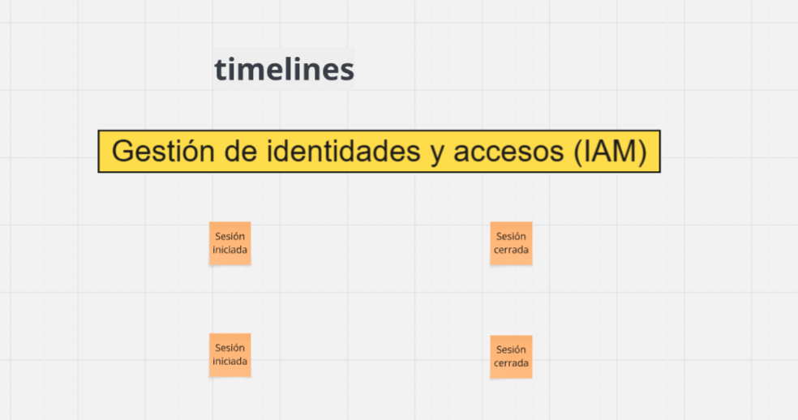
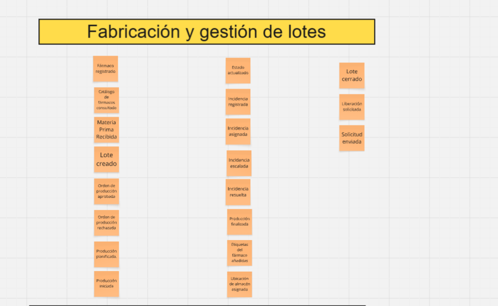
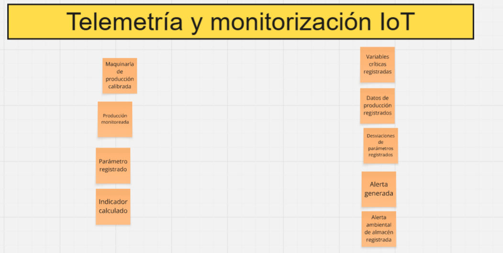
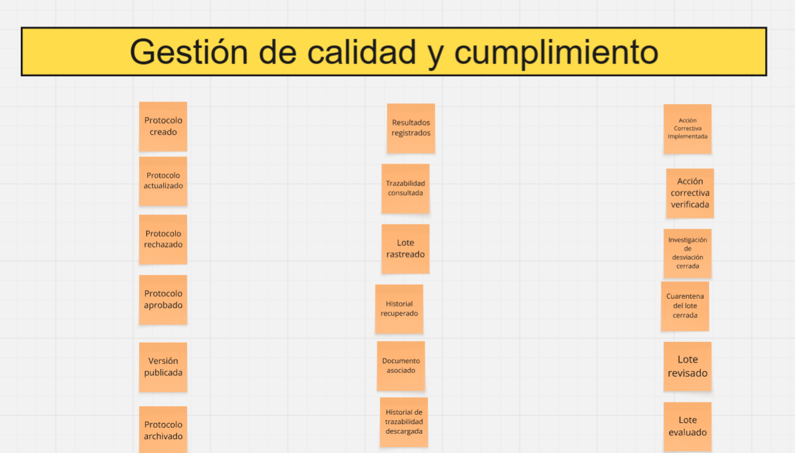
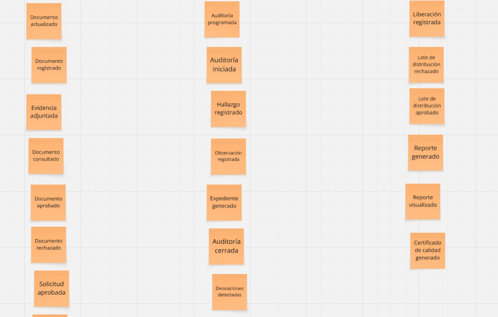
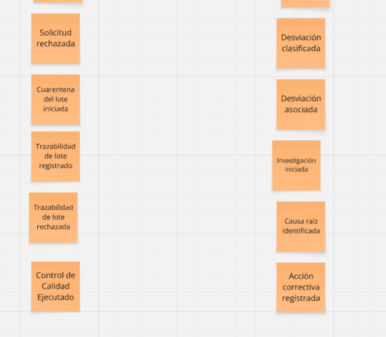
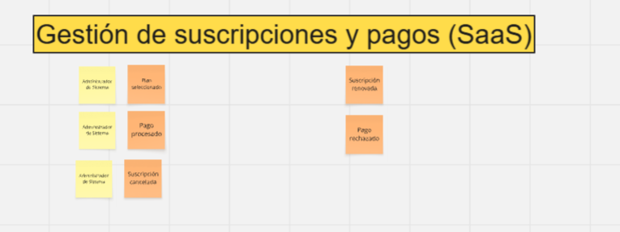
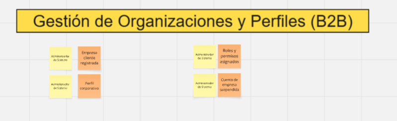

#### Paso 2: Commands
Definimos los comandos (post-its azules, acciones en verbo imperativo) que los actores ejecutan en el sistema para mutar el estado de la aplicación:

| Actor / Sistema | Comandos Principales (Intenciones de acción)                                                                                                                                                                                             |
| :--- |:-----------------------------------------------------------------------------------------------------------------------------------------------------------------------------------------------------------------------------------------|
| **Administrador de Sistema** | Registrar empresa cliente, Asignar roles y permisos, Suspender cuenta de empresa, Seleccionar plan de suscripción, Procesar pago, Cancelar suscripción.                                                                                  |
| **Especialista de control de calidad (QA/QC)** | Iniciar sesión, Crear protocolo, Aprobar protocolo, Publicar versión, Clasificar desviación, Registrar acción correctiva, Iniciar auditoría, Registrar hallazgo, Evaluar lote, Aprobar distribución, Generar reporte.                    |
| **Jefe de Producción Farmacéutica** | Crear lote, Iniciar producción, Actualizar estado, Cerrar lote, Solicitar liberación, Registrar fármaco, Recibir materia prima, Calibrar maquinaria de producción, Monitorear producción.                                                |
| **Sistemas Internos / IoT** | Renovar suscripción, Rechazar pago, Registrar variables críticas, Registrar desviaciones, Generar alertas.                                                                                                                               |
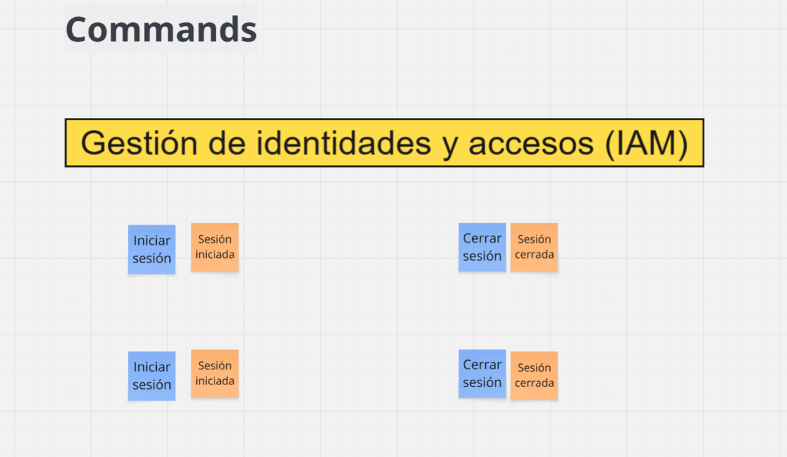
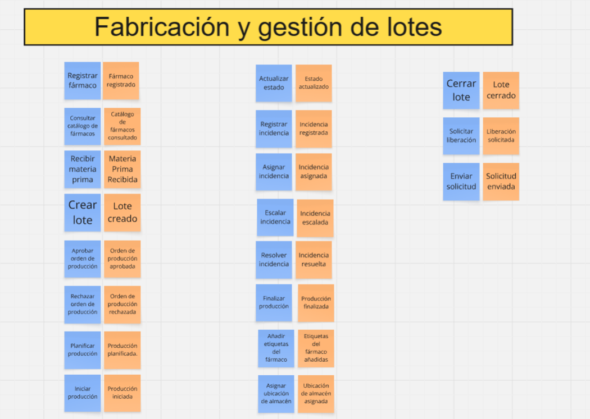
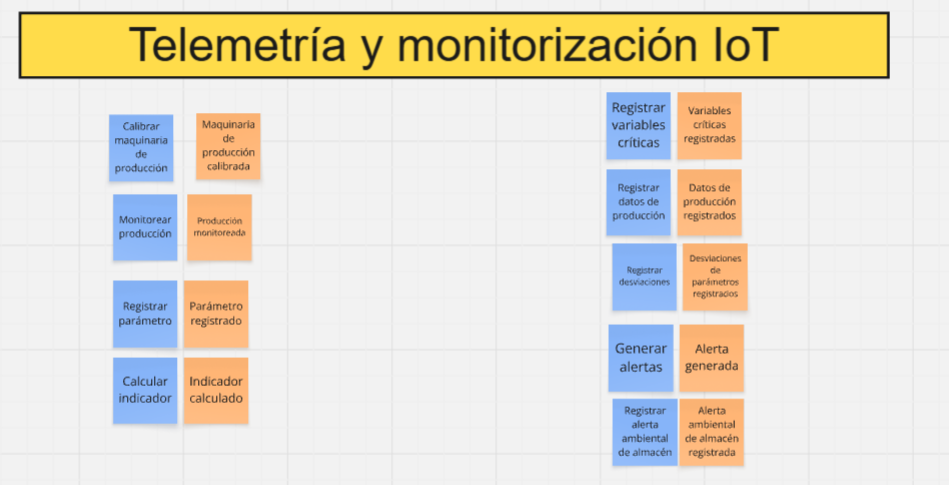
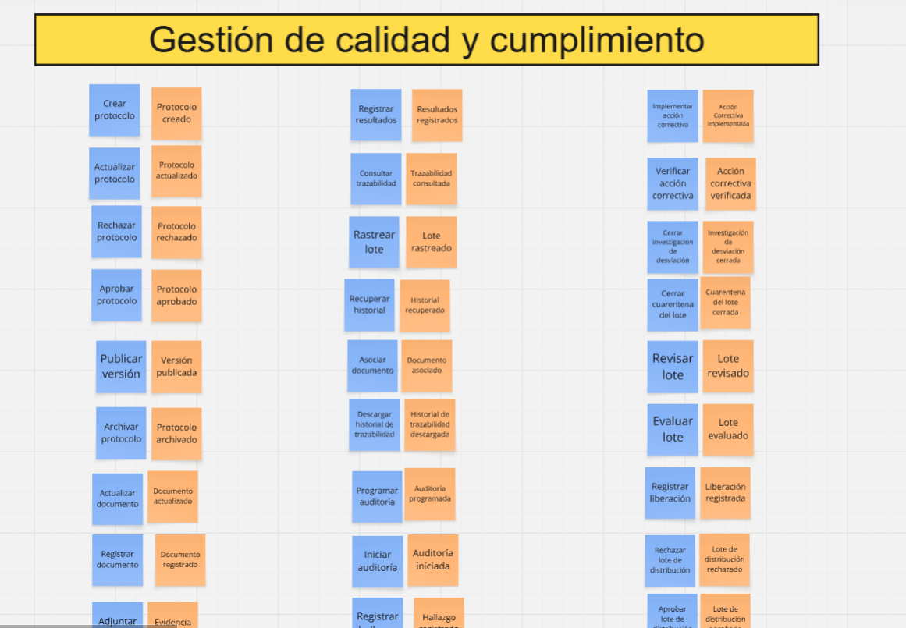
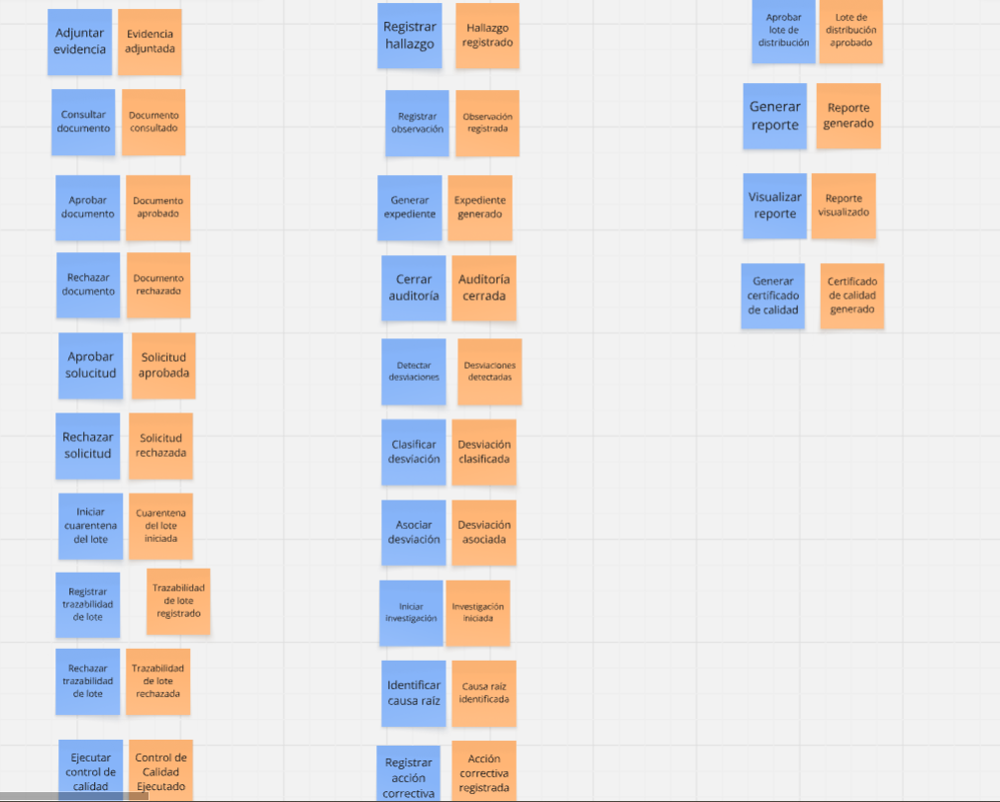


#### Paso 3: Policies & actors

Identificamos a los actores del sistema (post-its amarillos: Especialista QA/QC, Jefe de Producción, Administrador) y las reglas de negocio automáticas implícitas en el flujo para garantizar el cumplimiento de las BPM:

*   **CUANDO** se intenta iniciar sesión **ENTONCES** exigir validación mediante *Google Authenticator*[cite: 4].
*   **CUANDO** se procesa un pago a través de la pasarela **ENTONCES** renovar la suscripción y activar el panel[cite: 9].
*   **CUANDO** se recibe materia prima **ENTONCES** actualizar el *Inventario de Materia Prima y Almacén*[cite: 5].
*   **CUANDO** los dispositivos IoT registran desviaciones de parámetros **ENTONCES** disparar el motor de alertas y generar alerta ambiental de almacén[cite: 6].
*   **CUANDO** se identifica una causa raíz **ENTONCES** registrar acción correctiva en el registro CAPA[cite: 7].
*   **CUANDO** el Especialista QA aprueba la distribución **ENTONCES** generar reporte y certificado de calidad[cite: 8].
*   **CUANDO** se cierra el lote de producción **ENTONCES** habilitar la solicitud de liberación[cite: 5].
    
    
    
    

#### Paso 4: Read Models

Los Modelos de Lectura (post-its verdes) representan las vistas de consulta críticas que los actores necesitan para tomar decisiones:

*   **Administración B2B:** *Directorio de Empresas Clientes*, *Matriz de Roles y Permisos*, *Tabla de Planes de Suscripción*[cite: 9].
*   **Control de Acceso:** *Pantalla de Verificación 2FA*, *Estado de Sesión*[cite: 4].
*   **Producción y Logística:** *Panel de Control de Lote*, *Dashboard de Tendencias Operativas*, *Catálogo Maestro de Fármacos*, *Inventario de Materia Prima y Almacén*[cite: 5].
*   **Control de Calidad (QA/QC):** *Bandeja de Solicitudes de Calidad*, *Panel de Resultados de Laboratorio*, *Agenda y Registro de Auditorías*[cite: 7, 8].
*   **Monitoreo Industrial:** *Historial de Calibración de Maquinaria*, *Dashboard de Telemetría en Tiempo Real*, *Panel de Alertas y Desviaciones Sensoriales*[cite: 6].
    
    
    
    
    
    
    

#### Paso 5: External Systems

Mapeamos los sistemas e infraestructura externos (post-its rosados) que interactúan con nuestro dominio central para delegar responsabilidades específicas:

*   **Google Authenticator:** Utilizado en el proceso de inicio de sesión para el control de doble factor (2FA)[cite: 4].
*   **Pasarela de Pago:** Sistema financiero externo para procesar renovaciones o rechazar pagos de las suscripciones SaaS[cite: 9].
*   **Dispositivos IoT:** Hardware en planta encargado de capturar y emitir parámetros y variables críticas hacia el sistema[cite: 6].
*   **Motor de Alertas:** Servicio externo o microservicio encargado de despachar las alertas ambientales generadas por desviaciones de la maquinaria[cite: 6].
    
    
    
    
    
    
    

#### Paso 6: Aggregates

Agrupamos los comandos y eventos en Agregados (grandes bloques amarillos centrales), los cuales actúan como las entidades transaccionales raíz que protegen la consistencia de los datos:

*   **Perfil Corporativo y Tenant:** Centraliza los datos de la empresa cliente y la asignación de roles.
*   **Motor de Facturación y Suscripción:** Gestiona el estado del plan, pagos y cuenta de la empresa[cite: 9].
*   **Módulo de Credenciales y Sesión:** Controla el ciclo de vida de la sesión autenticada[cite: 4].
*   **Inventario y Materia Prima:** Gestiona el catálogo de fármacos y la recepción logística[cite: 5].
*   **Lote de Producción:** Controla las órdenes, estados e incidencias del ciclo de manufactura[cite: 5].
*   **Registro de Maquinaria y Telemetría:** Agrupa la calibración de equipos, ingesta de parámetros y el cálculo de indicadores IoT[cite: 6].
*   **Repositorio Documental y Protocolos:** Controla las versiones y aprobaciones de los estándares de calidad[cite: 7].
*   **Registro de Investigación y CAPA:** Gestiona las desviaciones de calidad, análisis de causa raíz y verificaciones[cite: 7].
*   **Expediente de Trazabilidad y Auditoría:** Consolida rastreos de lotes, auditorías, hallazgos y certificados de liberación final[cite: 7, 8].
    
    
    
    
    
    

#### Paso 7: Bounded Contexts

Finalmente, consolidamos la arquitectura modular de DoofPlus definiendo formalmente 6 *Bounded Contexts* a partir de la agrupación de los Agregados:

| Bounded Context | Agregados Core y Responsabilidad |
| :--- | :--- |
| **BC: Gestión de Organizaciones y Perfiles (B2B)** | Contiene *Perfil Corporativo y Tenant*. Gestiona el registro multi-tenant y la matriz de roles y permisos del sistema. |
| **BC: Gestión de suscripciones y pagos (SaaS)** | Contiene el *Motor de Facturación y Suscripción*. Administra los planes comerciales y la integración con la pasarela de pagos[cite: 9]. |
| **BC: Gestión de identidades y accesos (IAM)** | Contiene el *Módulo de Credenciales y Sesión*. Responsable de la seguridad, login y validación 2FA[cite: 4]. |
| **BC: Fabricación y gestión de lotes** | Agrupa *Inventario y Materia Prima* y *Lote de Producción*. Coordina todo el flujo operativo de manufactura farmacéutica[cite: 5]. |
| **BC: Telemetría y monitorización IoT** | Contiene el *Registro de Maquinaria y Telemetría*. Procesa la ingesta de datos industriales y el disparo del motor de alertas[cite: 6]. |
| **BC: Gestión de calidad y cumplimiento** | Agrupa el *Repositorio Documental*, *Registro CAPA* y el *Expediente de Trazabilidad y Auditoría*. Asegura las certificaciones, auditorías y liberación de producto[cite: 7, 8]. |


### 4.6.2. Software Architecture Context Diagram

En esta sección, el equipo presenta el diagrama de contexto (Nivel 1 del modelo C4), el cual ofrece una visión general de alto nivel de la arquitectura de la plataforma **Doof-Plus**. El objetivo de este nivel es ilustrar el sistema como una "caja negra" central, delimitando claramente sus fronteras frente a los usuarios humanos que lo operan y los sistemas externos de los cuales depende para ejecutar sus flujos de negocio.


**Explicación del diagrama:**
El sistema central, **Doof-Plus**, se ubica en el centro como una plataforma SaaS farmacéutica B2B unificada. A su alrededor, interactúan dos grupos principales:

1. **Usuarios (Actores):**
    - **Jefe de Producción Farmacéutica:** Interactúa con el sistema mediante peticiones HTTPS para planificar manufactura, gestionar lotes y monitorear la telemetría operativa de la planta.
    - **Especialista QA/QC:** Utiliza la plataforma para realizar la auditoría de procesos, gestionar normativas, aprobar acciones correctivas (CAPA) y emitir certificados de liberación.
    - **Administrador de Sistema:** Opera la plataforma para gestionar la alta de empresas clientes (Tenants), distribuir roles globales y administrar los planes de suscripción.

2. **Sistemas Externos:**
    - **Google Authenticator:** Proveedor de identidad externo con el que Doof-Plus se comunica vía REST API para validar códigos de seguridad de doble factor (2FA).
    - **ThingsBoard:** Plataforma externa especializada en IoT que procesa en crudo los datos de los sensores de la planta, y luego envía de forma consolidada las alertas ambientales y métricas a Doof-Plus.
    - **Niubiz (Payment Gateway):** Pasarela de pagos externa utilizada para procesar, autorizar y tokenizar el cobro de las suscripciones del modelo SaaS.

### 4.6.3. Software Architecture Container Diagrams

En esta sección, se presenta el diagrama de contenedores (Nivel 2 del modelo C4), el cual realiza un acercamiento a la arquitectura interna de Doof-Plus. Este nivel expone las unidades de despliegue independientes, mostrando la distribución de responsabilidades, las decisiones tecnológicas clave y la comunicación entre los contenedores.


**Explicación del diagrama y decisiones tecnológicas:**
La arquitectura de Doof-Plus está diseñada bajo un patrón de microservicios con una capa de persistencia híbrida, garantizando escalabilidad y separación de responsabilidades (*Bounded Contexts*). Los contenedores y su comunicación se estructuran de la siguiente manera:

1. **Capa de Presentación (Front-End):**
    - **Aplicación Web (SPA):** Desarrollada en **TypeScript** (empleando React/Angular). Es la unidad desplegable con la que interactúan los actores a través de su navegador web. Se comunica con los microservicios backend de forma síncrona mediante peticiones HTTP/REST (JSON).

2. **Capa de Microservicios Backend (APIs):**
    - **API de IAM y Gestión de Tenants:** (Java/TypeScript). Centraliza el control de acceso, la emisión de JWT y la multitenencia.
    - **API Principal de Fabricación:** (Java/TypeScript). Núcleo transaccional del dominio que gestiona la lógica de órdenes de producción y la actualización del inventario de materias primas.
    - **Motor de Calidad y Cumplimiento:** (Java/TypeScript). Servicio regulatorio que administra los flujos normativos y la inmutabilidad de los reportes CAPA y de auditoría.
    - **Servicio de Suscripciones y Facturación:** (Java/TypeScript). Gestiona la lógica comercial del SaaS y orquesta los pagos delegándolos a la API de Niubiz.
    - **Motor de Ingesta de Telemetría IoT:** Desarrollado en **Node.js/TypeScript** por su naturaleza no bloqueante, ideal para recibir un alto volumen de Webhooks entrantes desde ThingsBoard.

3. **Capa de Persistencia (Bases de Datos):**
    - **Base de Datos Relacional (MySQL):** Seleccionada por su cumplimiento ACID. Persiste los datos transaccionales estrictos: credenciales, catálogos, trazabilidad de lotes y facturación (comunicación vía TCP/IP SQL).
    - **Base de Datos Documental (MongoDB):** Seleccionada por su flexibilidad de esquemas y rendimiento en operaciones de escritura. Almacena las series temporales masivas generadas por el motor IoT (comunicación vía MongoDB Wire Protocol).

### 4.6.4. Software Architecture Components Diagrams

En esta sección, el equipo presenta los diagramas de componentes (Nivel 3 del modelo C4) correspondientes a cada uno de los microservicios (Containers) backend considerados. Estos diagramas detallan los bloques estructurales de código (Controladores, Servicios y Repositorios), sus responsabilidades de implementación y cómo interactúan para resolver la lógica de dominio antes de persistir los datos.

**1. Descomposición del Container: API de IAM y Gestión de Tenants**

- **Controlador de Autenticación:** *REST Controller* que intercepta peticiones HTTP para login y 2FA.
- **Servicio de Validación de Tokens:** Lógica de negocio encargada de generar y firmar criptográficamente los tokens JWT.
- **Servicio de Gestión de Tenants:** Gestiona la segregación de datos para aislar la información de cada empresa B2B.
- **Repositorio IAM:** Componente ORM que accede a MySQL para validar credenciales.

**2. Descomposición del Container: API Principal de Fabricación**

- **Controlador de Lotes:** *REST Controller* que recibe los comandos operativos (ej. Iniciar Lote, Cerrar Lote).
- **Servicio de Dominio de Manufactura:** Clase de servicio que orquesta las reglas de negocio sobre los estados de la producción.
- **Servicio de Inventario:** Lógica que valida y descuenta los insumos del almacén para evitar quiebres de stock.
- **Repositorio de Lotes e Inventario:** Componente ORM que traduce las entidades a consultas transaccionales hacia MySQL.

**3. Descomposición del Container: Motor de Calidad y Cumplimiento**

- **Controlador de Cumplimiento:** *REST Controller* para la gestión de cuarentenas y aprobaciones.
- **Servicio de Investigación CAPA:** Bloque que controla el ciclo de vida de las desviaciones normativas y sus resoluciones.
- **Repositorio de Trazabilidad y Auditoría:** Componente encargado de garantizar la inmutabilidad de los registros históricos en la base de datos relacional.

**4. Descomposición del Container: Servicio de Suscripciones y Facturación**

- **Controlador de Facturación:** Interfaz HTTP para consultar planes y realizar actualizaciones de cuenta.
- **Gestor de Planes de Suscripción:** Servicio que valida las restricciones operativas según el límite del plan adquirido por el Tenant.
- **Cliente de Pasarela de Pagos:** Componente de integración externa que serializa la petición hacia Niubiz para autorizar cargos.
- **Repositorio de Facturación:** ORM responsable de guardar el historial de transacciones en MySQL.

**5. Descomposición del Container: Motor de Ingesta de Telemetría IoT**

- **Receptor de Webhooks:** Controlador optimizado en Node.js para recibir flujos continuos de datos JSON desde ThingsBoard.
- **Motor de Reglas de Alertas:** Servicio lógico que contrasta las variables operativas contra umbrales de seguridad predefinidos.
- **Cliente de Notificaciones:** Componente disparador que emite eventos de advertencia hacia la plataforma si ocurre una anomalía en planta.
- **Repositorio de Series Temporales:** Adaptador de datos que persiste los logs y métricas a alta velocidad en las colecciones de MongoDB.

## 4.7. Software Object-Oriented Design

En esta sección, el equipo presenta el diseño orientado a objetos y los diagramas de clases tácticos basados en Domain-Driven Design (DDD) para cada uno de los **6 Bounded Contexts** de la plataforma **Doof-Plus**. Esta aproximación detalla las entidades, objetos de valor, enumeraciones, multiplicidades y los miembros de cada clase, especificando atributos y métodos con sus respectivos niveles de visibilidad (`+` para public y `-` para private).

### 4.7.1. Class Diagrams

#### 1. Bounded Context: IAM & Tenant Management
Este diagrama modela el diseño táctico para el control de identidades, la seguridad perimetral y la separación lógica de las empresas clientes (Tenants) bajo un esquema multitenant B2B.
- **Clases Principales:** `Tenant` (Raíz de Agregado), `User`, `Credential`, y `UserSession`.
- **Enumeraciones:** `AuthProvider`, `SessionStatus`.
- **Detalle de Relaciones:** El `Tenant` agrupa múltiples usuarios, los cuales se componen estrictamente de credenciales y generan sesiones de usuario asociadas a proveedores de identidad externos.


#### 2. Bounded Context: Core Manufacturing
Modela el núcleo operativo y transaccional de la planta farmacéutica, abarcando la creación de lotes, órdenes de producción, control de materias primas e incidentes en línea.
- **Clases Principales:** `ProductionBatch` (Raíz de Agregado), `BatchOrder`, `RawMaterialInventory`, y `OperationalIncident`.
- **Enumeraciones:** `BatchStatus`, `IncidentSeverity`.
- **Detalle de Relaciones:** Cada lote de producción gestiona una orden, consume inventario de materias primas y registra incidencias operativas asociadas a su severidad.


#### 3. Bounded Context: Quality & Compliance
Encapsula el diseño normativo y regulatorio de las Buenas Prácticas de Manufactura (BPM), permitiendo la trazabilidad inmutable y el control de calidad.
- **Clases Principales:** `QualityProtocol` (Raíz de Agregado), `QuarantineRecord`, y `CapaInvestigation`.
- **Enumeraciones:** `ComplianceVerdict`, `CapaState`.
- **Detalle de Relaciones:** El protocolo de calidad controla los registros de cuarentena de los lotes y origina investigaciones de Acciones Correctivas y Preventivas (CAPA) en caso de desviaciones.


#### 4. Bounded Context: Subscription & Billing (SaaS)
Modela la lógica comercial orientada al modelo SaaS de la plataforma B2B, gestionando planes de suscripción, cuentas corporativas, facturación y pagos.
- **Clases Principales:** `SubscriptionPlan`, `TenantBillingAccount` (Raíz de Agregado), `Invoice`, y `PaymentTransaction`.
- **Enumeraciones:** PlanTier, `PaymentStatus`.
- **Detalle de Relaciones:** La cuenta de facturación del Tenant se suscribe a un plan, genera facturas periódicas y procesa transacciones de pago mediante la pasarela externa.


#### 5. Bounded Context: IoT Telemetry & Integration
Diseñado para el procesamiento de eventos de maquinaria en tiempo real, conectando los flujos de datos con las reglas de alerta de la planta.
- **Clases Principales:** `MachineEquipment`, `SensorTelemetryStream` (Raíz de Agregado), y `AlertRuleEngine`.
- **Enumeraciones:** `SensorType`, `AlertLevel`.
- **Detalle de Relaciones:** Los flujos de telemetría son emitidos por los equipos de maquinaria y evaluados continuamente por el motor de reglas de alertas.


#### 6. Bounded Context: Plant Asset & Device
Modela la gestión de dispositivos de hardware en planta, específicamente el rastreo y control de lectores RFID y activos físicos vinculados a las líneas de producción.
- **Clases Principales:** `RfidReaderDevice` (Raíz de Agregado) y `PlantAsset`.
- **Enumeraciones:** `DeviceStatus`.
- **Detalle de Relaciones:** El dispositivo lector RFID se encarga de rastrear un activo de planta específico manteniendo un estado operativo actualizado.


## 4.8. Database Design

En esta sección se presenta el diseño de la base de datos relacional orientada a soportar los diferentes Bounded Contexts identificados para la plataforma DoofPlus. El diseño garantiza la persistencia, integridad y trazabilidad de la información crítica del negocio farmacéutico y la telemetría IoT.

Las principales características consideradas para este diseño son:

- Aislamiento por Contexto (Desacoplamiento): Las tablas se han agrupado lógicamente según su Bounded Context. En una arquitectura de microservicios, cada contexto gestionaría su propio esquema físico. Las referencias inter-contexto se manejan mediante identificadores únicos (UUIDs) en lugar de Foreign Keys estrictas a nivel de base de datos física, favoreciendo la escalabilidad.

- Integridad Referencial y Restricciones (Constraints): Dentro de cada contexto, se aplican Primary Keys (PK) y Foreign Keys (FK) para garantizar la consistencia de los datos. Se utilizan restricciones NOT NULL, UNIQUE y validaciones de estado para proteger las reglas de negocio (BPM).

- Trazabilidad y Auditoría (Auditability): Cumple con normativas como la FDA 21 CFR Part 11, entidades críticas incluyen campos de control de concurrencia y marcas de tiempo exactas, soportadas por tablas de registro inmutable.

### 4.8.1. Database Diagrams
En esta sección se presenta el diseño de la base de datos relacional de DoofPlus, organizado por bounded context. Cada contexto gestiona su propio conjunto de tablas, lo que nos garantiza la separación de responsabilidades y la alineación con la arquitectura DDD definida en los apartados anteriores. Para el diseño y modelado de estos diagramas se utilizará la herramienta de Lucichart. La base de datos está orientada a implementarse en MySQL y sus tablas principales incluyen campos de auditoría como created_at y updated_at, con el objetivo de mantener trazabilidad sobre la creación y actualización de los registros.

Los diagramas de base de datos se organizan en los siguientes contextos:

- Base de datos completa: muestra la integración general de las tablas principales de todos los bounded contexts de DoofPlus.

- Gestión de organizaciones (B2B) Database: contiene las tablas relacionadas con el registro multi-tenant de laboratorios clientes, perfiles corporativos y la matriz de roles y permisos.

- Suscripciones y pagos (SaaS) Database: contiene planes de suscripción, suscripciones activas, pagos procesados y transacciones de facturación.

- IAM Database: contiene credenciales de usuarios, autenticación de doble factor (2FA) y control de sesiones activas.

- Fabricación y gestión de lotes Database: contiene el catálogo de fármacos, registro de materias primas (RFID), órdenes de manufactura y uso de insumos en lotes de producción.

- Telemetría y monitorización IoT Database: contiene el inventario de maquinaria, sensores IoT, registros de telemetría y alertas ambientales/operativas.

- Gestión de calidad y cumplimiento Database: contiene protocolos documentales, investigaciones de desviaciones (CAPA), certificados de liberación y el historial de auditoría inmutable.

Diagrama de base de datos completo:


Para ver a detalle [haga click aquí](https://lucid.app/lucidchart/6102493d-2535-49c1-a3e5-bf2ab643abdc/edit?viewport_loc=-2209%2C-1329%2C5810%2C2503%2C0_0&invitationId=inv_5c9ee0d8-9bc3-4332-9822-98bf6cc97570)