# Capítulo V: Product Implementation, Validation & Deployment

## 5.1. Software Configuration Management

En esta sección se describen las decisiones, convenciones y herramientas utilizadas por el equipo Inges Company para gestionar el ciclo de vida, implementación, validación y despliegue de **DoofPlus**. Estas decisiones permitieron mantener la trazabilidad sobre los cambios realizados en cada sprint para la Landing Page, Frontend Web Application y Backend Web Services.

### 5.1.1. Software Development Environment Configuration

Se detallan las herramientas utilizadas en el ciclo de vida del producto:

* **Project Management**
    * **Jira / Trello:** Planificación de sprints, gestión del Product Backlog y seguimiento visual de tareas. (Referencia: https://www.atlassian.com/software/jira, https://trello.com)
* **Requirements Management**
    * **Markdown:** Documentación del proyecto. (Referencia: https://www.markdownguide.org)
    * **Gherkin:** Redacción de criterios de aceptación (Given-When-Then). (Referencia: https://cucumber.io/docs/gherkin)
* **Product UX/UI Design**
    * **Figma:** Elaboración de Wireframes, Mock-ups y Prototypes. (Referencia: https://www.figma.com)
    * **UXPressia:** Elaboración de User Personas, Empathy Maps, Journey Maps e Impact Maps. (Referencia: https://uxpressia.com)
    * **Lucidchart:** Diagramación técnica y diseño de base de datos. (Referencia: https://www.lucidchart.com)
* **Software Development**
    * **WebStorm / IntelliJ IDEA:** Entornos de desarrollo integrados para codificación. (Descarga: https://www.jetbrains.com)
    * **HTML5, CSS3 y JavaScript:** Tecnologías core utilizadas para el desarrollo exclusivo del Landing Page.
    * **Angular Framework:** Framework basado en TypeScript utilizado para el desarrollo de Frontend Web Applications, integrando **Angular Material** como biblioteca de componentes de interfaz basados en Material Design. (Referencia: https://angular.dev)
    * **Spring Boot & Spring Data JPA:** Frameworks basados en Java para el desarrollo de los RESTful Web Services. (Referencia: https://spring.io)
    * **PostgreSQL:** Sistema gestor de base de datos relacional. (Referencia: https://www.postgresql.org)
* **Software Testing**
    * **Swagger UI / Chrome DevTools / pgAdmin:** Ejecución de pruebas de APIs, inspección de rendimiento frontend y revisión directa de la persistencia en bases de datos.
* **Software Documentation**
    * **OpenAPI (Swagger):** Documentación técnica y contratos de los RESTful Web Services. (Referencia: https://swagger.io)
    * **PlantUML:** Aplicación de Diagram-as-Code para diagramas UML y diagramas de base de datos. (Referencia: https://plantuml.com)
* **Software Deployment**
    * **GitHub Pages / Firebase / Render / Railway:** Plataformas cloud para el despliegue de los distintos repositorios y servicios de la solución.

### 5.1.2. Source Code Management

El código fuente de la solución es gestionado mediante **GitHub** como plataforma y sistema de control de versiones distribuido.
* **Landing Page:** https://github.com/IngesCompanyCC/IngesCompanyCC-Landing-Page
* **Frontend Web Application:** https://github.com/IngesCompany-7742/DoofPlus-Frontend
* **Backend Web Services:** https://github.com/IngesCompany-7742/doofplus-platform

**GitFlow Workflow**
El proyecto adopta **GitFlow** para la organización de ramas:
* `main`: Rama principal para el código en producción estable.
* `develop`: Rama de integración donde se consolidan las funcionalidades de todo el equipo.
* `feature/<nombre>`: Convención para desarrollar nuevas funcionalidades (ej. `feature/auth-module`).
* `release/v<version>`: Ramas creadas desde develop para preparar y asegurar una nueva versión.
* `hotfix/<nombre>`: Ramas que nacen de `main` para corregir errores críticos en producción.

**Semantic Versioning y Conventional Commits**
Se aplica **Semantic Versioning 2.0.0** (`MAJOR.MINOR.PATCH`) para nombrar las releases.
Todos los mensajes siguen la convención **Conventional Commits** (`tipo[scope opcional]: descripción`) usando prefijos como `feat`, `fix`, `docs`, `style`, `refactor`, `test`, `chore` (ej. `feat(landing): add benefits section`).

### 5.1.3. Source Code Style Guide & Coding Conventions

Toda la nomenclatura y lógica programática en el código fuente se desarrolla estrictamente en **inglés**, respetando el Ubiquitous Language del dominio de calidad farmacéutica. Se han adoptado las siguientes convenciones estándar oficiales para la programación:

* **HTML/CSS:** *Google HTML/CSS Style Guide* y *HTML Style Guide and Coding Conventions*.
* **JavaScript / TypeScript:** *Google JavaScript Style Guide*, *Google TypeScript Style Guide* y *Angular coding style guide*.
* **Java / Spring Boot:** *Google Java Style Guide* y buenas prácticas de *Spring Boot Features* para controladores RESTful y abstracción JPA.
* **BDD:** *Gherkin Conventions for Readable Specifications*.

### 5.1.4. Software Deployment Configuration

Pasos y configuración necesarios para el despliegue de la solución en la nube a partir de los repositorios de código:

1. **Landing Page (GitHub Pages):** Se navega a la configuración del repositorio, se habilita GitHub Pages apuntando a la raíz (`/root`) de la rama `main` y el código estático es servido públicamente de manera automática por GitHub.
2. **Frontend Web Application (Firebase Hosting):**
    - Se ejecuta la construcción optimizada localmente (`ng build --configuration production`).
    - Se utiliza Firebase CLI y el comando `firebase deploy --only hosting` apuntando a la carpeta de distribución para sincronizar la SPA a la nube.
3. **Backend Web Services (Render & Railway):**
    - Se aprovisiona la base de datos PostgreSQL en **Railway**, obteniendo la URL y credenciales.
    - El backend se despliega como Web Service en **Render** vinculado automáticamente a la rama `main` de su repositorio. Se inyectan las variables de entorno de producción (credenciales de BBDD, JWT keys, tokens de **Niubiz** para flujos de suscripción). En cada commit a `main`, Render compila el proyecto y lo expone públicamente.

## 5.2. Landing Page, Services & Applications Implementation

En esta sección se explica y evidencia el proceso de implementación, pruebas, documentación y despliegue de **DoofPlus**, incluyendo la Landing Page, Web Services y Frontend Web Applications. Se presenta el avance organizado por Sprints a partir del Product Backlog.

### 5.2.1. Sprint 1

En esta sección se registra y explica el avance en términos de producto y trabajo colaborativo para el **Sprint 1**, el cual tuvo como enfoque principal la construcción y despliegue de la primera versión de la Landing Page de DoofPlus, así como la configuración inicial de los repositorios y entornos de despliegue.

#### 5.2.1.1. Sprint Planning 1

El Sprint Planning Meeting sirvió para definir los objetivos iniciales, asignar responsabilidades y seleccionar las User Stories prioritarias orientadas a la presentación comercial de DoofPlus. A continuación, se presenta el resumen de la reunión de planificación:

| Sprint # | Sprint 1 |
|----------|----------|
| **Sprint Planning Background** | |
| **Date** | 2026-09-20 |
| **Time** | 10:00 AM |
| **Location** | Reunión virtual vía Discord |
| **Prepared By** | Cobades, Yhoshua |
| **Attendees (to planning meeting)** | Angulo, Marcelo / Cobades, Yhoshua / Flores, Ricardo / Rojas, Nestor / Zavaleta, Rodolfo |
| **Sprint 1 – 1 Review Summary** | (No aplica por ser el primer Sprint del proyecto). |
| **Sprint 1 – 1 Retrospective Summary** | (No aplica por ser el primer Sprint del proyecto). |
| **Sprint Goal & User Stories** | |
| **Sprint 1 Goal** | **Our focus is on** delivering a complete and responsive Landing Page. **We believe it delivers** a clear understanding of DoofPlus' value proposition to our potential pharmaceutical clients. **This will be confirmed when** visitors can navigate through the features, plans, and team information flawlessly on both desktop and mobile devices. |
| **Sprint 1 Velocity** | 12 Story Points |
| **Sum of Story Points** | 12 Story Points |

#### 5.2.1.2. Aspect Leaders and Collaborators

A continuación se presenta el Leadership-and-Collaboration Matrix (LACX), que indica quién es el líder (L) y quiénes son los colaboradores (C) para cada aspecto dentro del alcance del Sprint 1 (enfocado principalmente en la Landing Page y setup inicial).

| Team Member | GitHub Username | Landing Page (UI/UX) | Landing Page (Code) | Deployment & Setup | Documentation |
|-------------|-----------------|----------------------|---------------------|--------------------|---------------|
| Angulo, Marcelo | mangulo | L | C |  | C |
| Cobades, Yhoshua | yhocz | C | C |  | C |
| Cristina Yarleque | Cris06luna / rflores | C | C |  | C |
| Rojas, Nestor | nrojas | C | C |  |  |
| Zavaleta, Rodolfo | rzavaleta | C | L |  | L |

#### 5.2.1.3. Sprint Backlog 1

El objetivo principal de este Sprint fue implementar el sitio web estático (Landing Page) para dar a conocer a Inges Company y el producto DoofPlus.

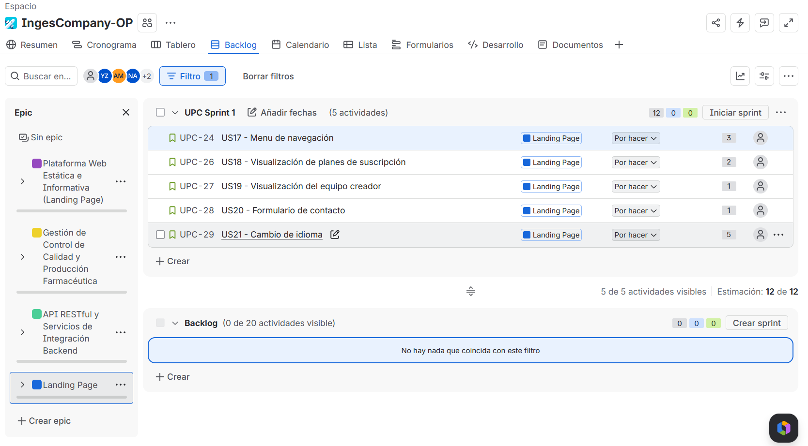

| User Story | Work-Item / Task | Status |
|------------|------------------|--------|
| **Story Id** \| **Story Title** | **Task Id** \| **Task Title** | **Task Description** | **Estimation (Hours)** | **Assigned To** | **(To-do / In-Process / To-Review / Done)** |
| US01 \| Menú de navegación | T001 \| Implementar navbar responsivo | Estructurar el menú de navegación con los enlaces a Home, Features, Benefits, Plans y Contact. | 2h | Zavaleta, Rodolfo | Done |
| US01 \| Menú de navegación | T002 \| Estilos y hamburger menu | Aplicar estilos CSS al menú y añadir comportamiento responsive con menú hamburguesa para móvil. | 2h | Angulo, Marcelo | Done |
| US02 \| Visualización de planes de suscripción | T003 \| Diseñar tarjetas de planes | Crear las tarjetas de los planes Standard Lab ($199/mes) y Enterprise ($599/mes) con sus características. | 3h | Flores, Ricardo | Done |
| US02 \| Visualización de planes de suscripción | T004 \| Toggle mensual/anual | Implementar el toggle de cambio entre precios mensuales y anuales con descuento del 15%. | 2h | Cobades, Yhoshua | Done |
| US03 \| Visualización del equipo creador | T005 \| Maquetar sección Our Team | Implementar las tarjetas de los 5 integrantes del equipo Inges Company con foto, nombre y descripción. | 2h | Rojas, Nestor | Done |
| US03 \| Visualización del equipo creador | T006 \| Correcciones sección Our Team | Corregir la estructura y contenido de la sección del equipo tras revisión de pares. | 1h | Angulo, Marcelo | Done |
| US04 \| Formulario de contacto | T007 \| Implementar footer y formulario | Desarrollar el footer con el formulario de suscripción por email, datos de contacto y links legales. | 3h | Zavaleta, Rodolfo | Done |
| US04 \| Formulario de contacto | T008 \| Correcciones de estructura index | Corregir la estructura general del index.html para asegurar consistencia semántica y accesibilidad. | 2h | Flores, Ricardo | Done |
| US05 \| Cambio de idioma | T009 \| Lógica i18n y toggle de idioma | Implementar el switcher de idioma ES/EN con archivos de traducción y lógica JavaScript de i18n. | 3h | Cobades, Yhoshua | Done |
| — \| Documentos legales | T010 \| Agregar Terms of Service | Redactar e implementar la página de Términos de Servicio de DoofPlus. | 2h | Rojas, Nestor | Done |
| — \| Documentos legales | T011 \| Agregar Privacy Policy | Redactar e implementar la Política de Privacidad conforme a la legislación peruana. | 2h | Angulo, Marcelo | Done |

#### 5.2.1.4. Development Evidence for Sprint Review

En esta sección se presentan los principales avances en la implementación del Landing Page.

| Repository | Branch | Commit Id | Commit Message | Commit Message Body | Commited on (Date) |
|------------|--------|-----------|----------------|---------------------|--------------------|
| DoofPlus-LandingPage | main | `1f1a22f` | Merge branch 'release/v1.0.0-rc.1' into main | Se fusionó la rama de liberación a producción. | 20/09/2026 |
| DoofPlus-LandingPage | main | `e530153` | fix: change the defect language | Corrección del idioma predeterminado. | 20/09/2026 |
| DoofPlus-LandingPage | main | `7eded14` | build: add the option to change the language in main.js | Adición de lógica para alternar idiomas en el script principal. | 20/09/2026 |
| DoofPlus-LandingPage | main | `432fb64` | fix: update links of the images in index.html | Actualización de rutas y enlaces de las imágenes. | 20/09/2026 |
| DoofPlus-LandingPage | main | `46b51b6` | build: add styles | Incorporación de la hoja de estilos CSS. | 20/09/2026 |
| DoofPlus-LandingPage | main | `86d4578` | chore: add images | Inclusión de recursos gráficos al proyecto. | 20/09/2026 |
| DoofPlus-LandingPage | main | `06bd5ef` | build: Add footer | Creación de la sección del pie de página. | 20/09/2026 |
| DoofPlus-LandingPage | main | `be8e428` | build: add body | Estructuración y contenido del cuerpo principal. | 20/09/2026 |
| DoofPlus-LandingPage | main | `9b082a5` | feat: add language switching functionality in main.js | Implementación de funcionalidad de cambio de idioma. | 20/09/2026 |
| DoofPlus-LandingPage | main | `b9ff9e6` | ci: add translations | Adición de diccionarios y archivos de traducción. | 20/09/2026 |
| DoofPlus-LandingPage | main | `6a1377f` | docs: update README.md | Actualización de la documentación del proyecto. | 20/09/2026 |
| DoofPlus-LandingPage | main | `0de92b6` | fix: refactor README.md | Refactorización de formato en el README. | 20/09/2026 |
| DoofPlus-LandingPage | main | `6e6efc0` | docs: add README.md | Creación inicial del archivo README. | 20/09/2026 |
| DoofPlus-LandingPage | develop | `8dca66b` | Merge remote-tracking branch 'origin/develop' into develop | Sincronización de la rama develop. | 20/09/2026 |
| DoofPlus-LandingPage | develop | `a8c7448` | chore: Create template | Creación de plantilla base del proyecto. | 20/09/2026 |

#### 5.2.1.5. Execution Evidence for Sprint Review

Lo alcanzado en este Sprint corresponde a la Landing Page totalmente funcional, responsiva y con soporte bilingüe.

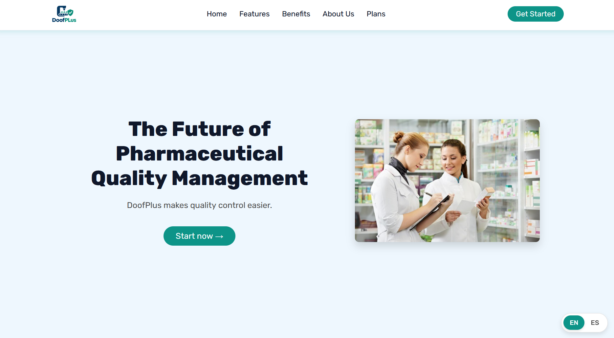

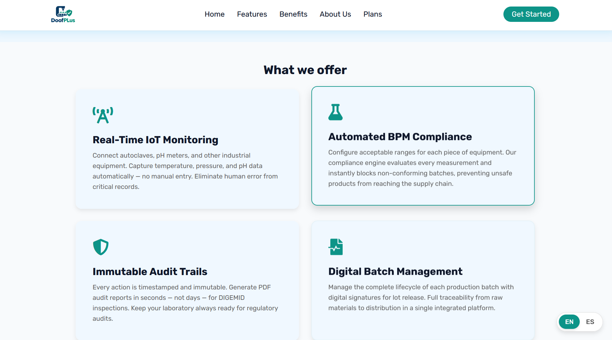

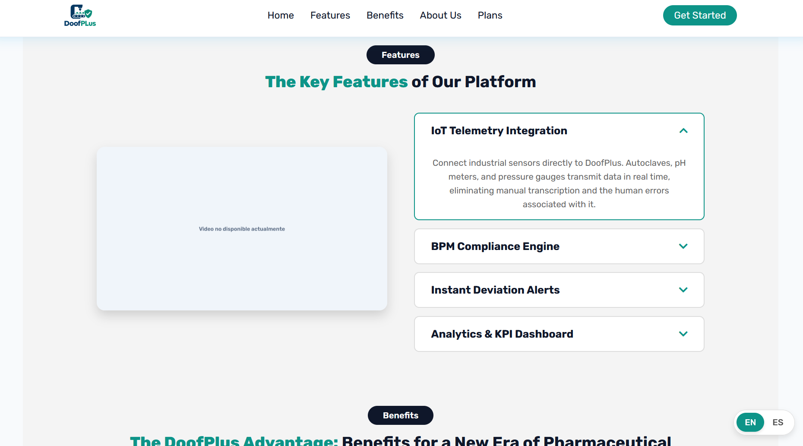

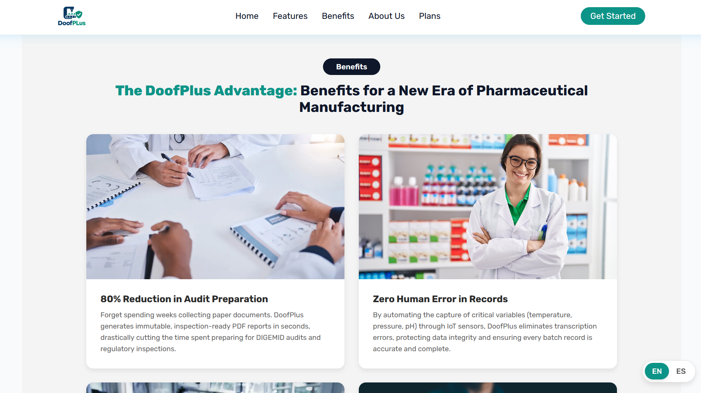

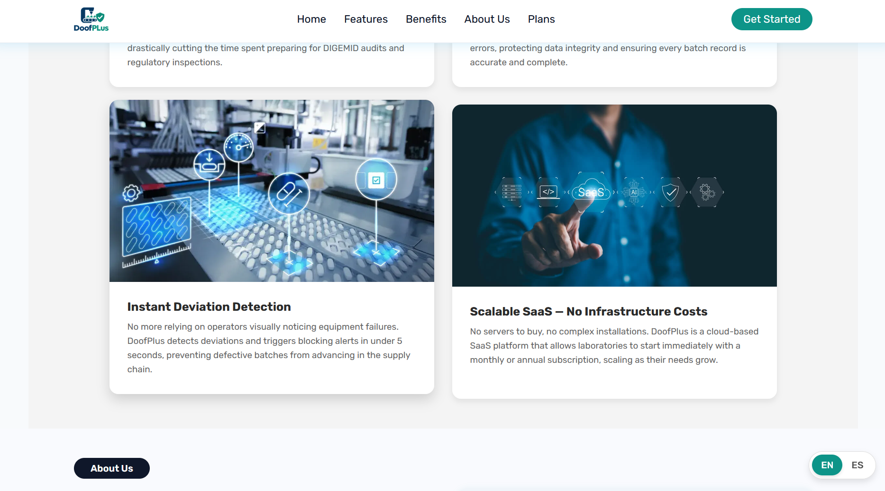

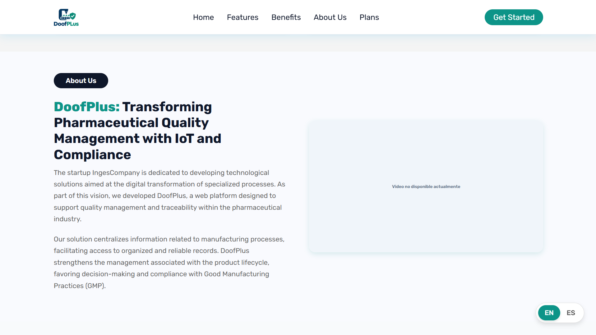

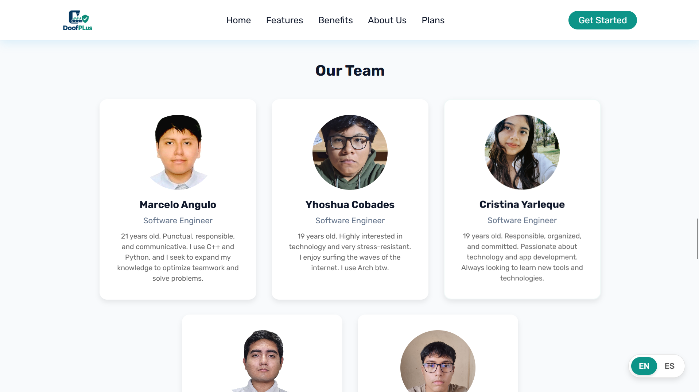

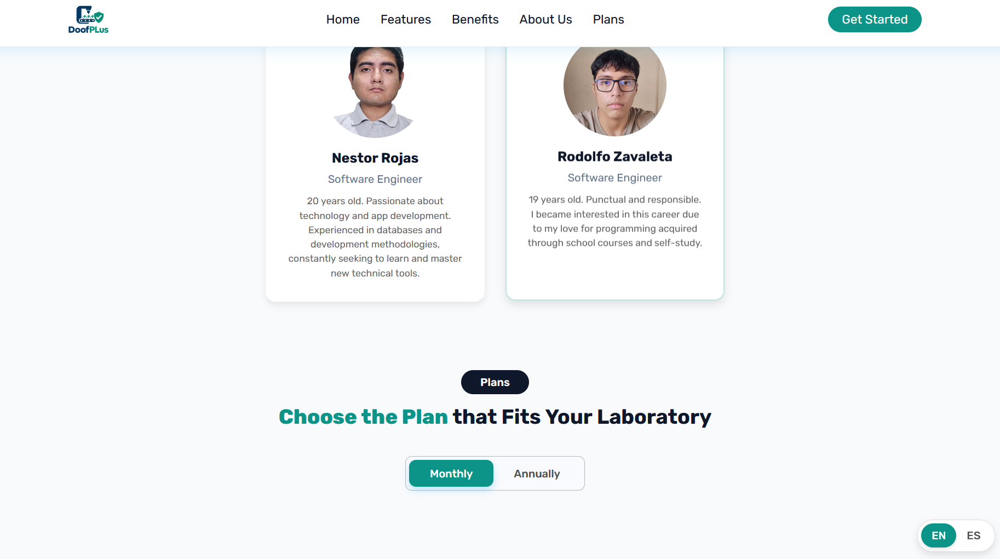

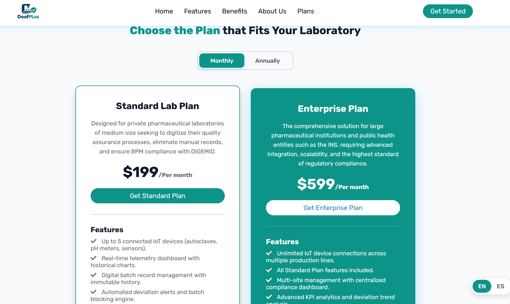

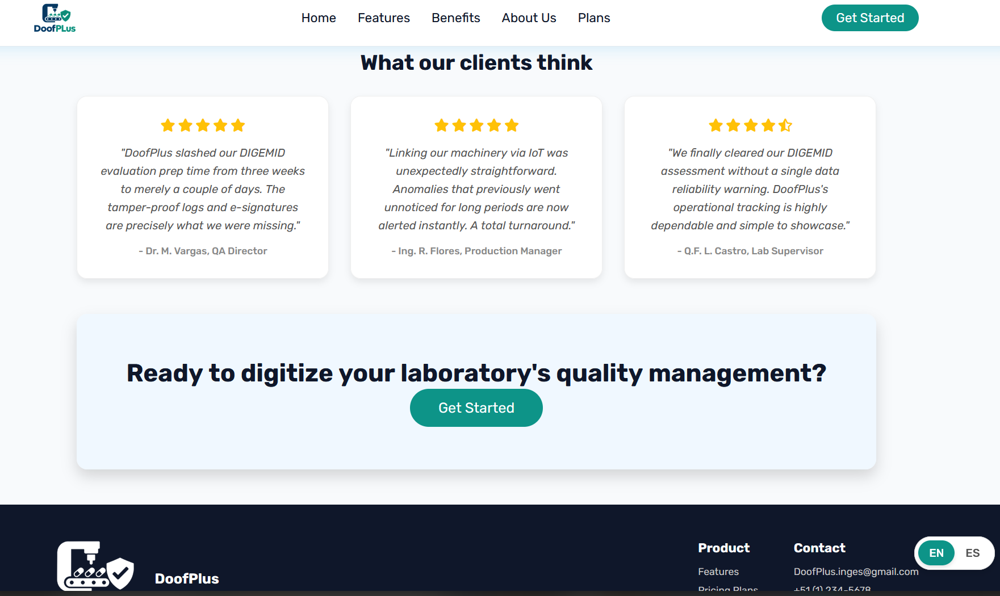

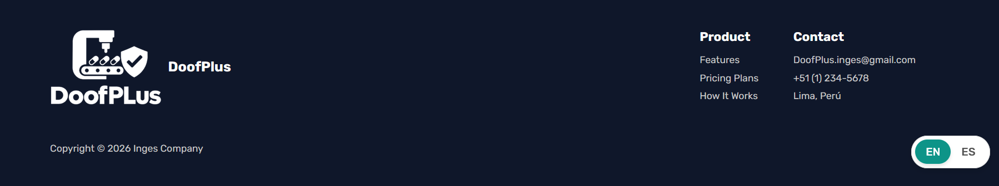

#### 5.2.1.6. Services Documentation Evidence for Sprint Review

Dado que el enfoque del Sprint 1 fue la Landing Page, la documentación de servicios backend mediante OpenAPI (Swagger) se abordará en los Sprints siguientes conforme se implementen los RESTful Web Services.

#### 5.2.1.7. Software Deployment Evidence for Sprint Review

Durante este Sprint, el equipo configuró los entornos en la nube para el alojamiento del Landing Page.
Se configuró **GitHub Pages** apuntando a la rama `main` del repositorio `DoofPlus-LandingPage`, permitiendo que cualquier cambio en el código se publique automáticamente.

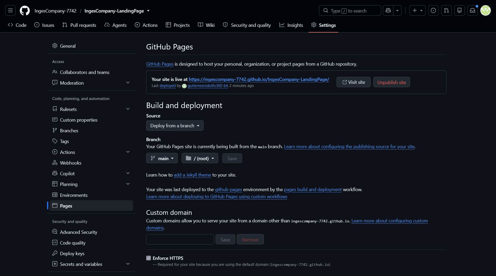

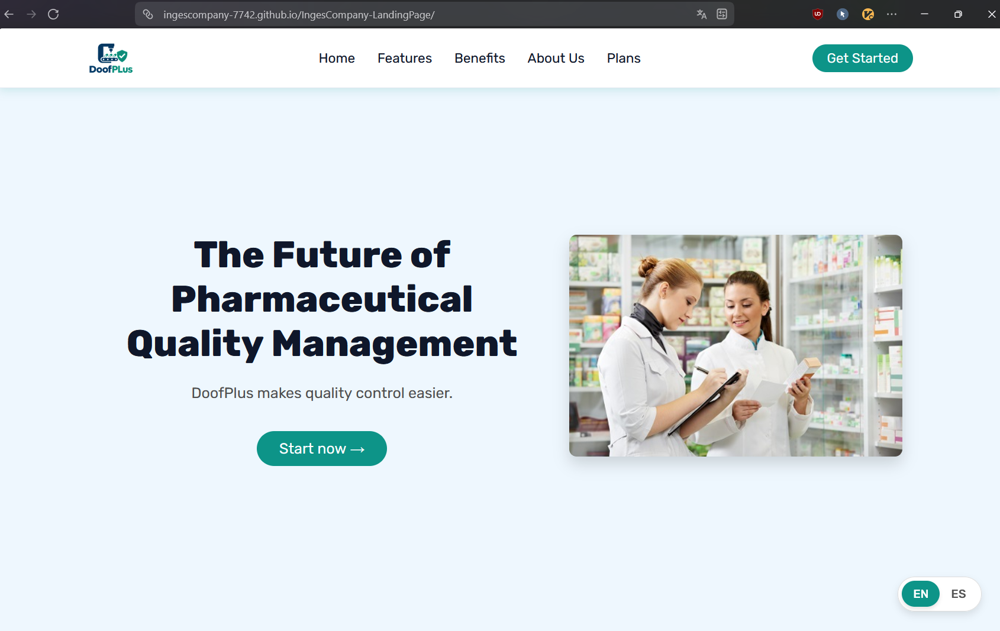

#### 5.2.1.8. Team Collaboration Insights during Sprint

Todos los miembros del equipo participaron activamente en la implementación de la Landing Page, organizándose a través de ramas y realizando Pull Requests que fueron revisados por sus pares antes de ser fusionados a `main`.

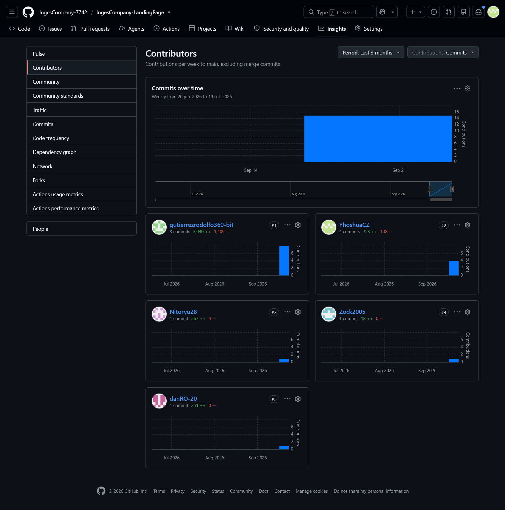

## 5.3. Validation Interviews

### 5.3.1. Diseño de Entrevistas

### 5.3.2. Registro de Entrevistas

### 5.3.3. Evaluaciones según heurísticas

## 5.4. Video About-the-Product

# Conclusiones

## Conclusiones y recomendaciones

## Video About-the-Team

# Bibliografía

# Anexos