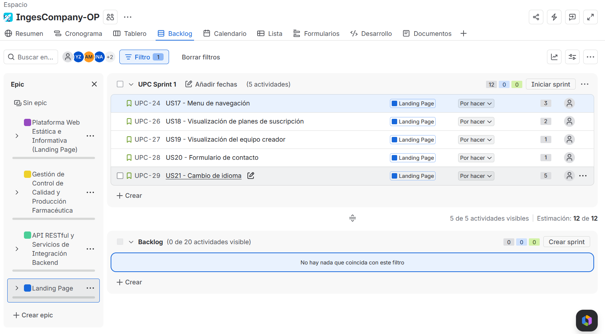
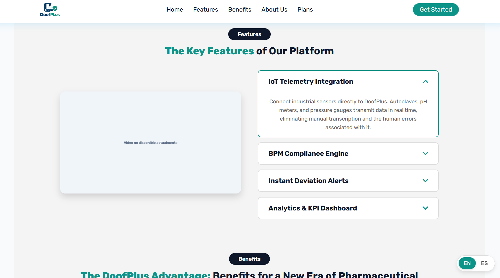
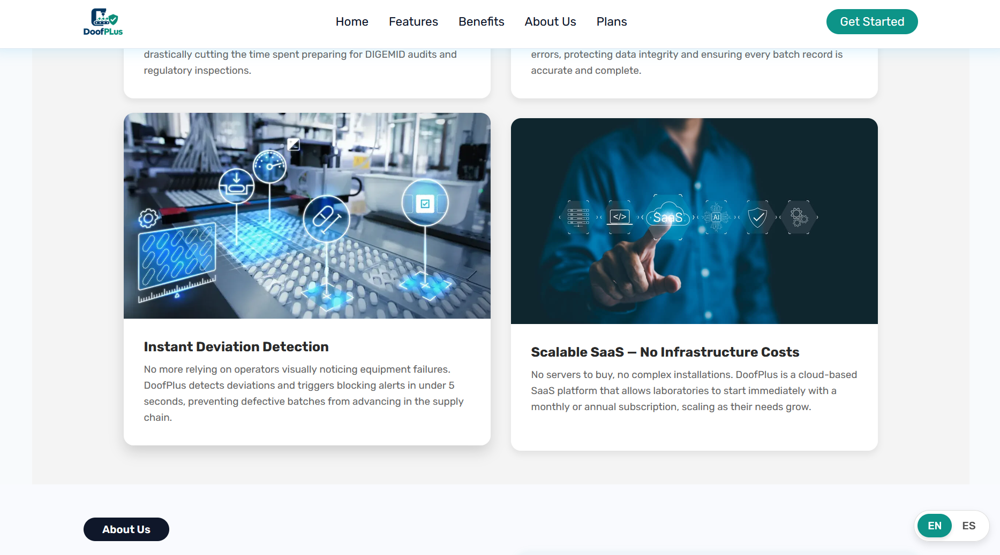
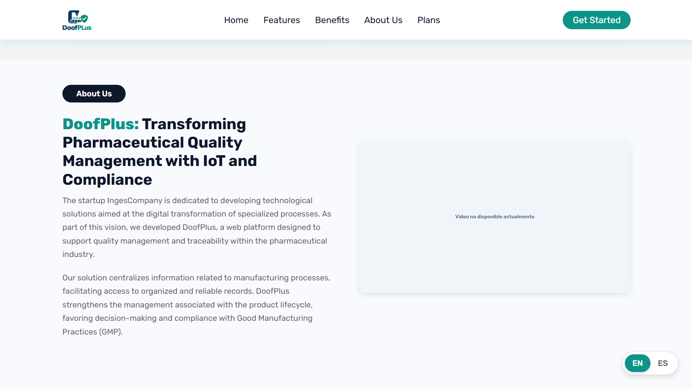
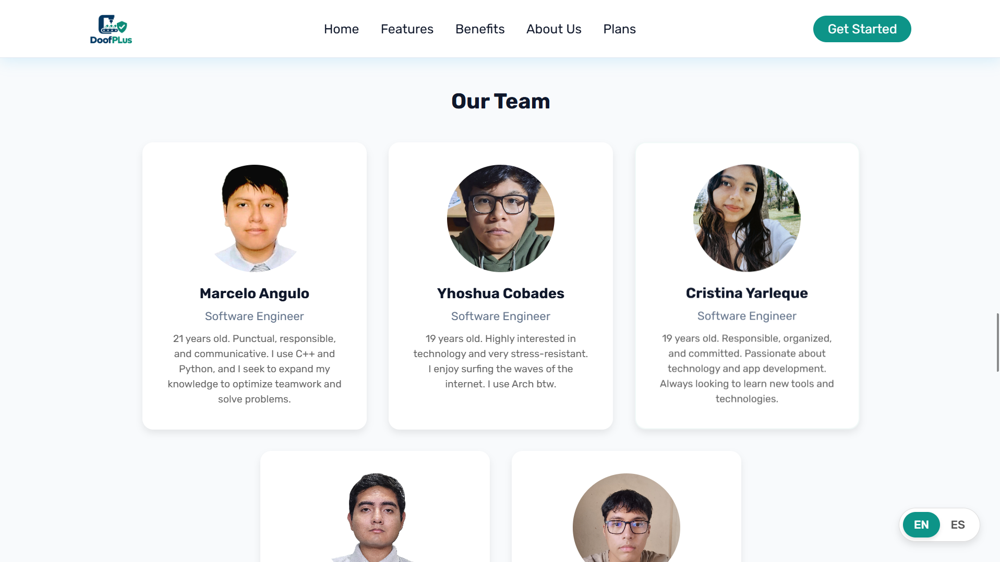
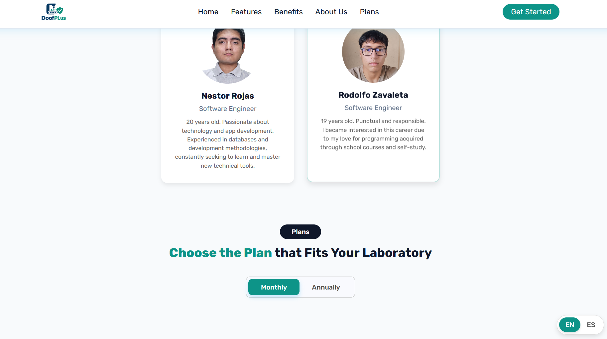
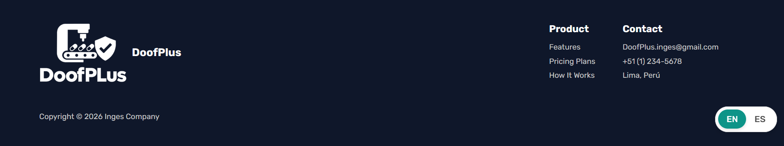
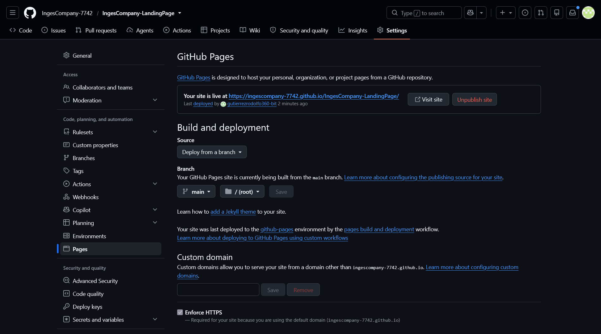

# Capítulo V: Product Implementation, Validation & Deployment

## 5.1. Software Configuration Management

En esta sección se describen las decisiones, convenciones y herramientas utilizadas por el equipo Inges Company para gestionar el ciclo de vida, implementación, validación y despliegue de **DoofPlus**. Estas decisiones permitieron mantener la trazabilidad sobre los cambios realizados en cada sprint para la Landing Page, Frontend Web Application y Backend Web Services.

### 5.1.1. Software Development Environment Configuration

A continuación se detallan los productos de software que los miembros del equipo utilizan para colaborar en el ciclo de vida de DoofPlus, indicando su propósito y su ruta de referencia (productos SaaS) o de descarga (productos que se ejecutan en el computador de cada integrante).

* **Project Management**
    * **Jira Software:** Gestión del Product Backlog, planificación de sprints y seguimiento de tareas en el board del proyecto. (Referencia: https://www.atlassian.com/software/jira)
    * **Discord:** Canal de comunicación del equipo para las reuniones de Sprint Planning, Sprint Review y coordinación diaria. (Referencia: https://discord.com)
* **Requirements Management**
    * **Jira Software:** Registro de User Stories y Technical Stories con sus Story Points y criterios de aceptación. (Referencia: https://www.atlassian.com/software/jira)
    * **Gherkin:** Redacción de criterios de aceptación con la estructura Given-When-Then. (Referencia: https://cucumber.io/docs/gherkin/reference)
    * **Miro:** Elaboración del Big Picture Event Storming y del Design-Level Event Storming. (Referencia: https://miro.com)
* **Product UX/UI Design**
    * **Figma:** Elaboración de Wireframes, Mock-ups y Prototypes de la Landing Page y la Web Application. (Referencia: https://www.figma.com)
    * **FigJam:** Elaboración de los Wireflows y User Flows de la Web Application. (Referencia: https://www.figma.com/figjam)
    * **UXPressia:** Elaboración de User Personas, Empathy Maps, Journey Maps e Impact Maps. (Referencia: https://uxpressia.com)
    * **Structurizr DSL:** Elaboración de los diagramas C4 de contexto, contenedores y componentes bajo el enfoque Diagram-as-Code. (Referencia: https://structurizr.com)
    * **Mermaid:** Elaboración de los diagramas de clases y de base de datos bajo el enfoque Diagram-as-Code. (Referencia: https://mermaid.js.org)
* **Software Development**
    * **Git:** Sistema de control de versiones distribuido utilizado en todos los repositorios. (Descarga: https://git-scm.com/downloads)
    * **GitHub:** Plataforma de alojamiento de los repositorios de la organización y de colaboración mediante ramas y Pull Requests. (Referencia: https://github.com/IngesCompanyCC)
    * **WebStorm:** IDE para el desarrollo de la Landing Page (HTML5, CSS3 y JavaScript) y de la Frontend Web Application en Vue.js. (Descarga: https://www.jetbrains.com/webstorm/download)
    * **IntelliJ IDEA:** IDE para el desarrollo de los RESTful Web Services en Java con Spring Boot. (Descarga: https://www.jetbrains.com/idea/download)
    * **Node.js y npm:** Entorno de ejecución y gestor de paquetes requeridos para el ecosistema de Vue y Vite. (Descarga: https://nodejs.org/en/download)
    * **Vite y Vue 3:** Entorno de construcción rápido y framework progresivo para desarrollar y compilar la Frontend Web Application, integrando **PrimeVue** como biblioteca de componentes, **Pinia** para la gestión del estado global y **Vue I18n** para la internacionalización. (Referencia: https://vuejs.org y https://vitejs.dev)
    * **Spring Boot y Spring Data JPA:** Frameworks de Java para el desarrollo de los RESTful Web Services. (Referencia: https://spring.io/projects/spring-boot)
    * **MySQL:** Sistema gestor de base de datos relacional (MySQL 8). (Descarga: https://dev.mysql.com/downloads)
* **Software Testing**
    * **Chrome DevTools:** Inspección del diseño responsive y depuración de la Landing Page y la Web Application. (Referencia: https://developer.chrome.com/docs/devtools)
    * **json-server:** Fake API para simular los endpoints REST desde la Web Application mientras se implementan los Web Services. (Referencia: https://github.com/typicode/json-server)
    * **Swagger UI:** Ejecución de pruebas sobre los endpoints documentados de los RESTful Web Services. (Referencia: https://swagger.io/tools/swagger-ui)
* **Software Documentation**
    * **Markdown en GitHub:** Redacción del informe del proyecto bajo el enfoque Docs-as-Code en el repositorio del informe. (Referencia: https://www.markdownguide.org)
    * **OpenAPI (Swagger):** Documentación de los RESTful Web Services. (Referencia: https://swagger.io/specification)
* **Software Deployment**
    * **GitHub Pages:** Publicación de la Landing Page. (Referencia: https://pages.github.com)
    * **Firebase Hosting:** Publicación de la Frontend Web Application. (Referencia: https://firebase.google.com/docs/hosting)
    * **Render:** Publicación de los RESTful Web Services. (Referencia: https://render.com)
    * **Railway:** Base de datos MySQL gestionada en la nube. (Referencia: https://railway.com)

### 5.1.2. Source Code Management

El equipo utiliza **GitHub** como plataforma y **Git** como sistema de control de versiones. Todos los repositorios pertenecen a la organización [IngesCompanyCC](https://github.com/IngesCompanyCC): https://github.com/IngesCompanyCC

| Producto | Repositorio |
|----------|-------------|
| Landing Page | https://github.com/IngesCompanyCC/IngesCompanyCC-LandingPage.git |
| Frontend Web Application | https://github.com/IngesCompanyCC/IngesCompanyCC-Frontend.git |
| RESTful Web Services | Se creará en el Sprint 3. |
| Informe del proyecto | https://github.com/IngesCompanyCC/IngesCompanyCC-Project-Report.git |

**GitFlow Workflow**

El equipo aplica el modelo GitFlow propuesto por Vincent Driessen en *A successful Git branching model*:

* **`main`:** Contiene únicamente versiones estables listas para producción. Solo recibe merges desde ramas `release/*` y `hotfix/*`, y cada merge se etiqueta con su versión (por ejemplo, `v1.0.0`).
* **`develop`:** Rama de integración. Consolida las funcionalidades terminadas antes de preparar una nueva versión.
* **Feature branches:** Nacen de `develop` y regresan a `develop` mediante Pull Request. Convención: `feature/<nombre-en-kebab-case>`, nombrando el bounded context o la funcionalidad (por ejemplo, `feature/shared`, `feature/manufacturing`, `feature/project-configuration`). En el repositorio del informe se usa `feature/chapter<n>`.
* **Release branches:** Nacen de `develop` cuando un incremento está listo para entregarse y se fusionan con `main` y `develop`. Convención: `release/v<MAJOR>.<MINOR>.<PATCH>`, admitiendo el sufijo de pre-release `-rc.<n>` (por ejemplo, `release/v1.0.0-rc.1`, usada en la Landing Page).
* **Hotfix branches:** Nacen de `main` para corregir errores críticos en producción y se fusionan con `main` y `develop`. Convención: `hotfix/v<MAJOR>.<MINOR>.<PATCH>` (por ejemplo, `hotfix/v1.0.1`).

**Semantic Versioning**

Las releases se nombran según **Semantic Versioning 2.0.0** con el formato `MAJOR.MINOR.PATCH`:

* **MAJOR:** Cambios incompatibles con versiones anteriores (por ejemplo, `v2.0.0`).
* **MINOR:** Nuevas funcionalidades compatibles con la versión anterior (por ejemplo, `v1.1.0`).
* **PATCH:** Correcciones de errores compatibles (por ejemplo, `v1.0.1`).

**Conventional Commits**

Los mensajes de commit siguen la especificación **Conventional Commits 1.0.0**:

```
<type>(<optional scope>): <description>

<optional body>

<optional footer(s)>
```

* **type:** `feat` (nueva funcionalidad), `fix` (corrección de errores), `docs` (documentación), `style` (formato sin cambios de lógica), `refactor` (reestructuración sin cambio de comportamiento), `test` (pruebas), `build` (sistema de build o dependencias), `ci` (integración continua), `chore` (tareas de mantenimiento).
* **scope:** Módulo o bounded context afectado, por ejemplo `feat(lots): ...` o `docs(chapter5): ...`.
* **description:** Resumen breve en inglés, en modo imperativo y en minúsculas.
* **body y footer:** Detalle del cambio y referencias a tareas; los cambios incompatibles se marcan con `BREAKING CHANGE:` o con `!` después del type.

### 5.1.3. Source Code Style Guide & Coding Conventions

Toda la nomenclatura y lógica programática en el código fuente se desarrolla estrictamente en **inglés**, respetando el Ubiquitous Language del dominio de calidad farmacéutica. Se han adoptado las siguientes convenciones estándar oficiales para la programación:

* **HTML/CSS:** *Google HTML/CSS Style Guide* y *HTML Style Guide and Coding Conventions*.
* **JavaScript / TypeScript:** *Google JavaScript Style Guide*, *Google TypeScript Style Guide* y *Angular coding style guide*.
* **Java / Spring Boot:** *Google Java Style Guide* y buenas prácticas de *Spring Boot Features* para controladores RESTful y abstracción JPA.
* **BDD:** *Gherkin Conventions for Readable Specifications*.

### 5.1.4. Software Deployment Configuration

Pasos y configuración necesarios para el despliegue de la solución en la nube a partir de los repositorios de código:

1. **Landing Page (GitHub Pages):** Se navega a la configuración del repositorio, se habilita GitHub Pages apuntando a la raíz (`/root`) de la rama `main` y el código estático es servido públicamente de manera automática por GitHub.
2. **Frontend Web Application (Firebase Hosting):**
    - Se ejecuta la construcción optimizada localmente (`ng build --configuration production`).
    - Se utiliza Firebase CLI y el comando `firebase deploy --only hosting` apuntando a la carpeta de distribución para sincronizar la SPA a la nube.
3. **Backend Web Services (Render & Railway):**
    - Se aprovisiona la base de datos PostgreSQL en **Railway**, obteniendo la URL y credenciales.
    - El backend se despliega como Web Service en **Render** vinculado automáticamente a la rama `main` de su repositorio. Se inyectan las variables de entorno de producción (credenciales de BBDD, JWT keys, tokens de **Niubiz** para flujos de suscripción). En cada commit a `main`, Render compila el proyecto y lo expone públicamente.

## 5.2. Landing Page, Services & Applications Implementation

En esta sección se explica y evidencia el proceso de implementación, pruebas, documentación y despliegue de **DoofPlus**, incluyendo la Landing Page, Web Services y Frontend Web Applications. Se presenta el avance organizado por Sprints a partir del Product Backlog.

### 5.2.1. Sprint 1

En esta sección se registra y explica el avance en términos de producto y trabajo colaborativo para el **Sprint 1**, el cual tuvo como enfoque principal la construcción y despliegue de la primera versión de la Landing Page de DoofPlus, así como la configuración inicial de los repositorios y entornos de despliegue.

#### 5.2.1.1. Sprint Planning 1

El Sprint Planning Meeting sirvió para definir los objetivos iniciales, asignar responsabilidades y seleccionar las User Stories prioritarias orientadas a la presentación comercial de DoofPlus. A continuación, se presenta el resumen de la reunión de planificación:

| Sprint # | Sprint 1 |
|----------|----------|
| **Sprint Planning Background** | |
| **Date** | 2026-09-20 |
| **Time** | 10:00 AM |
| **Location** | Reunión virtual vía Discord |
| **Prepared By** | Cobades, Yhoshua |
| **Attendees (to planning meeting)** | Angulo, Marcelo / Cobades, Yhoshua / Yarleque, Cristina / Rojas, Nestor / Zavaleta, Rodolfo |
| **Sprint 0 Review Summary** | (No aplica por ser el primer Sprint del proyecto). |
| **Sprint 0 Retrospective Summary** | (No aplica por ser el primer Sprint del proyecto). |
| **Sprint Goal & User Stories** | |
| **Sprint 1 Goal** | **Our focus is on** delivering a complete and responsive Landing Page.<br>**We believe it delivers** a clear understanding of DoofPlus' value proposition to our potential pharmaceutical clients.<br>**This will be confirmed when** visitors can navigate through the features, plans, and team information flawlessly on both desktop and mobile devices. |
| **Sprint 1 Velocity** | 12 Story Points |
| **Sum of Story Points** | 12 Story Points |

#### 5.2.1.2. Aspect Leaders and Collaborators

A continuación se presenta el Leadership-and-Collaboration Matrix (LACX), que indica quién es el líder (L) y quiénes son los colaboradores (C) para cada aspecto dentro del alcance del Sprint 1 (enfocado principalmente en la Landing Page y setup inicial).

| Team Member (Last Name, First Name) | GitHub Username | Landing Page UI/UX Leader (L) / Collaborator (C) | Landing Page Code Leader (L) / Collaborator (C) | Documentation Leader (L) / Collaborator (C) |
|-------------------------------------|-----------------|--------------------------------------------------|-------------------------------------------------|---------------------------------------------|
| Angulo, Marcelo                     | mangulo         | L                                                | C                                               | C                                           |
| Cobades, Yhoshua                    | yhocz           | C                                                | C                                               | C                                           |
| Yarleque, Cristina                  | Cris06luna / rflores | C                                           | C                                               | C                                           |
| Rojas, Nestor                       | nrojas          | C                                                | C                                               |                                             |
| Zavaleta, Rodolfo                   | rzavaleta       | C                                                | L                                               | L                                           |

#### 5.2.1.3. Sprint Backlog 1

El objetivo principal de este Sprint fue implementar el sitio web estático (Landing Page) para dar a conocer a Inges Company y el producto DoofPlus.




| User Story | Work-Item / Task | Status |
|------------|------------------|--------|
| **Story Id** \| **Story Title** | **Task Id** \| **Task Title** | **Task Description** | **Estimation (Hours)** | **Assigned To** | **(To-do / In-Process / To-Review / Done)** |
| US01 \| Menú de navegación | T001 \| Implementar navbar responsivo | Estructurar el menú de navegación con los enlaces a Home, Features, Benefits, Plans y Contact. | 2h | Zavaleta, Rodolfo | Done |
| US01 \| Menú de navegación | T002 \| Estilos y hamburger menu | Aplicar estilos CSS al menú y añadir comportamiento responsive con menú hamburguesa para móvil. | 2h | Angulo, Marcelo | Done |
| US02 \| Visualización de planes de suscripción | T003 \| Diseñar tarjetas de planes | Crear las tarjetas de los planes Standard Lab ($199/mes) y Enterprise ($599/mes) con sus características. | 3h | Yarleque, Cristina | Done |
| US02 \| Visualización de planes de suscripción | T004 \| Toggle mensual/anual | Implementar el toggle de cambio entre precios mensuales y anuales con descuento del 15%. | 2h | Cobades, Yhoshua | Done |
| US03 \| Visualización del equipo creador | T005 \| Maquetar sección Our Team | Implementar las tarjetas de los 5 integrantes del equipo Inges Company con foto, nombre y descripción. | 2h | Rojas, Nestor | Done |
| US03 \| Visualización del equipo creador | T006 \| Correcciones sección Our Team | Corregir la estructura y contenido de la sección del equipo tras revisión de pares. | 1h | Angulo, Marcelo | Done |
| US04 \| Formulario de contacto | T007 \| Implementar footer y formulario | Desarrollar el footer con el formulario de suscripción por email, datos de contacto y links legales. | 3h | Zavaleta, Rodolfo | Done |
| US04 \| Formulario de contacto | T008 \| Correcciones de estructura index | Corregir la estructura general del index.html para asegurar consistencia semántica y accesibilidad. | 2h | Yarleque, Cristina | Done |
| US05 \| Cambio de idioma | T009 \| Lógica i18n y toggle de idioma | Implementar el switcher de idioma ES/EN con archivos de traducción y lógica JavaScript de i18n. | 3h | Cobades, Yhoshua | Done |
| — \| Documentos legales | T010 \| Agregar Terms of Service | Redactar e implementar la página de Términos de Servicio de DoofPlus. | 2h | Rojas, Nestor | Done |
| — \| Documentos legales | T011 \| Agregar Privacy Policy | Redactar e implementar la Política de Privacidad conforme a la legislación peruana. | 2h | Angulo, Marcelo | Done |

#### 5.2.1.4. Development Evidence for Sprint Review

En esta sección se presentan los principales avances en la implementación del Landing Page.

| Repository | Branch | Commit Id | Commit Message | Commit Message Body | Commited on (Date) |
|------------|--------|-----------|----------------|---------------------|--------------------|
| DoofPlus-LandingPage | main | `1f1a22f` | Merge branch 'release/v1.0.0-rc.1' into main | Se fusionó la rama de liberación a producción. | 20/09/2026 |
| DoofPlus-LandingPage | main | `e530153` | fix: change the defect language | Corrección del idioma predeterminado. | 20/09/2026 |
| DoofPlus-LandingPage | main | `7eded14` | build: add the option to change the language in main.js | Adición de lógica para alternar idiomas en el script principal. | 20/09/2026 |
| DoofPlus-LandingPage | main | `432fb64` | fix: update links of the images in index.html | Actualización de rutas y enlaces de las imágenes. | 20/09/2026 |
| DoofPlus-LandingPage | main | `46b51b6` | build: add styles | Incorporación de la hoja de estilos CSS. | 20/09/2026 |
| DoofPlus-LandingPage | main | `86d4578` | chore: add images | Inclusión de recursos gráficos al proyecto. | 20/09/2026 |
| DoofPlus-LandingPage | main | `06bd5ef` | build: Add footer | Creación de la sección del pie de página. | 20/09/2026 |
| DoofPlus-LandingPage | main | `be8e428` | build: add body | Estructuración y contenido del cuerpo principal. | 20/09/2026 |
| DoofPlus-LandingPage | main | `9b082a5` | feat: add language switching functionality in main.js | Implementación de funcionalidad de cambio de idioma. | 20/09/2026 |
| DoofPlus-LandingPage | main | `b9ff9e6` | ci: add translations | Adición de diccionarios y archivos de traducción. | 20/09/2026 |
| DoofPlus-LandingPage | main | `6a1377f` | docs: update README.md | Actualización de la documentación del proyecto. | 20/09/2026 |
| DoofPlus-LandingPage | main | `0de92b6` | fix: refactor README.md | Refactorización de formato en el README. | 20/09/2026 |
| DoofPlus-LandingPage | main | `6e6efc0` | docs: add README.md | Creación inicial del archivo README. | 20/09/2026 |
| DoofPlus-LandingPage | develop | `8dca66b` | Merge remote-tracking branch 'origin/develop' into develop | Sincronización de la rama develop. | 20/09/2026 |
| DoofPlus-LandingPage | develop | `a8c7448` | chore: Create template | Creación de plantilla base del proyecto. | 20/09/2026 |

#### 5.2.1.5. Execution Evidence for Sprint Review

Lo alcanzado en este Sprint corresponde a la Landing Page totalmente funcional, responsiva y con soporte bilingüe.
















#### 5.2.1.6. Services Documentation Evidence for Sprint Review

Dado que el enfoque del Sprint 1 fue la Landing Page, la documentación de servicios backend mediante OpenAPI (Swagger) se abordará en los Sprints siguientes conforme se implementen los RESTful Web Services.

#### 5.2.1.7. Software Deployment Evidence for Sprint Review

Durante este Sprint, el equipo configuró los entornos en la nube para el alojamiento del Landing Page.
Se configuró **GitHub Pages** apuntando a la rama `main` del repositorio `DoofPlus-LandingPage`, permitiendo que cualquier cambio en el código se publique automáticamente.




#### 5.2.1.8. Team Collaboration Insights during Sprint

Todos los miembros del equipo participaron activamente en la implementación de la Landing Page, organizándose a través de ramas y realizando Pull Requests que fueron revisados por sus pares antes de ser fusionados a `main`.


## 5.3. Validation Interviews

### 5.3.1. Diseño de Entrevistas

### 5.3.2. Registro de Entrevistas

### 5.3.3. Evaluaciones según heurísticas

## 5.4. Video About-the-Product

# Conclusiones

## Conclusiones y recomendaciones
### Conclusiones

1. **Sobre los Problem Statements:** En relación a los *Problem Statements* especificados, se concluye que la falta de digitalización y la trazabilidad manual generan un riesgo regulatorio crítico y pérdidas invisibles en los laboratorios farmacéuticos. DoofPlus aborda directamente este problema centralizando la documentación de calidad y los datos de producción en una única plataforma alineada a las normativas BPM/GMP.
2. **Assumptions vs. Comportamiento Real:** Durante el proceso, el equipo estableció como *Assumption* que los especialistas de QA/QC y Supervisores de Producción tendrían una alta resistencia al cambio tecnológico. Sin embargo, en contraste con el comportamiento real observado durante las entrevistas y validaciones, los segmentos mostraron una alta disposición a adoptar la herramienta, siempre y cuando la experiencia de usuario (UX) reduzca los clics necesarios para liberar un lote.
3. **Hypotheses Statements y Criterios de Éxito (Lean UX):** Respecto a nuestros *Hypotheses Statements*, se confirmó la hipótesis de que implementar firmas electrónicas y un *Audit Trail* automatizado reduce drásticamente el tiempo de revisión de lotes. Los resultados obtenidos de las validaciones de nuestros prototipos y *wireframes* superaron los criterios de éxito especificados en el proceso de Lean UX (logrando una aceptación del flujo de trabajo superior a la métrica esperada).

### Recomendaciones

1. **Roadmap - Desarrollo Backend y Seguridad:** En relación al *Roadmap* de los productos digitales, se recomienda priorizar para el siguiente sprint o hito (AV2) la construcción de la arquitectura Backend y la base de datos relacional. Es imperativo consolidar el *Bounded Context* de IAM (Identity and Access Management) antes de avanzar, ya que el valor del sistema depende de las firmas electrónicas y la seguridad de los roles.
2. **Roadmap - Integración de Telemetría (IoT):** Como siguiente paso en el alcance del modelo de negocio digital, se sugiere que el equipo investigue e integre simuladores de *WebSockets* o APIs en tiempo real. Esto permitirá validar técnicamente el módulo de monitoreo IoT (temperatura y humedad) establecido en el *Roadmap* sin necesidad de depender de hardware físico inmediato.
## Video About-the-Team
## Video About-the-Team

# Bibliografía

<div style="padding-left: 40px; text-indent: -40px; margin-bottom: 15px;">
Brown, S. (2018). <em>Software Architecture for Developers: Visualise, document and explore your software architecture</em>. Leanpub.
</div>

<div style="padding-left: 40px; text-indent: -40px; margin-bottom: 15px;">
Brown, T. (2009). <em>Change by design: How design thinking transforms organizations and inspires innovation</em>. HarperBusiness.
</div>

<div style="padding-left: 40px; text-indent: -40px; margin-bottom: 15px;">
DrugXafe. (2025). <em>DrugXafe: Sistema de Seguimiento y Rastreo Farmacéutico</em>. tiga. https://www.tigahealth.com/es/productos/drugxafe-sistema-de-seguimiento-y-rastreo-farmaceutico/
</div>

<div style="padding-left: 40px; text-indent: -40px; margin-bottom: 15px;">
Evans, E. (2004). <em>Domain-driven design: Tackling complexity in the heart of software</em>. Addison-Wesley Professional.
</div>

<div style="padding-left: 40px; text-indent: -40px; margin-bottom: 15px;">
Google. (2024). <em>Angular Documentation: The modern web developer's platform</em>. https://angular.dev/
</div>

<div style="padding-left: 40px; text-indent: -40px; margin-bottom: 15px;">
Gothelf, J., & Seiden, J. (2021). <em>Lean UX: Designing great products with agile teams</em> (3rd ed.). O'Reilly Media.
</div>

<div style="padding-left: 40px; text-indent: -40px; margin-bottom: 15px;">
LoLimsa. (2026). <em>EMPRESA DE SOFTWARE MÉDICO. Expertos en tecnología para la salud</em>. https://www.lolimsa.com.pe
</div>

<div style="padding-left: 40px; text-indent: -40px; margin-bottom: 15px;">
Martin, R. C. (2017). <em>Clean architecture: A craftsman's guide to software structure and design</em>. Prentice Hall.
</div>

<div style="padding-left: 40px; text-indent: -40px; margin-bottom: 15px;">
MasterControl. (2024). <em>Quality Management System (QMS) Software for Life Sciences</em>. https://www.mastercontrol.com/
</div>

<div style="padding-left: 40px; text-indent: -40px; margin-bottom: 15px;">
Organización Mundial de la Salud. (2014). <em>Buenas prácticas de manufactura (BPM) para productos farmacéuticos</em>. https://www.who.int/es/news-room/fact-sheets/detail/good-manufacturing-practices
</div>

<div style="padding-left: 40px; text-indent: -40px; margin-bottom: 15px;">
Osterwalder, A., & Pigneur, Y. (2010). <em>Business model generation: A handbook for visionaries, game changers, and challengers</em>. John Wiley & Sons.
</div>

<div style="padding-left: 40px; text-indent: -40px; margin-bottom: 15px;">
Patton, J. (2014). <em>User story mapping: Discover the whole story, build the right product</em>. O'Reilly Media.
</div>

<div style="padding-left: 40px; text-indent: -40px; margin-bottom: 15px;">
Ries, E. (2011). <em>The lean startup: How today's entrepreneurs use continuous innovation to create radically successful businesses</em>. Crown Business.
</div>

<div style="padding-left: 40px; text-indent: -40px; margin-bottom: 15px;">
Schwaber, K., & Sutherland, J. (2020). <em>The Scrum Guide</em>. Scrum.org.
</div>

<div style="padding-left: 40px; text-indent: -40px; margin-bottom: 15px;">
tuhub. (2025). <em>Más control en la operación. Menos pérdidas invisibles.</em>. https://tuhub.co
</div>

<div style="padding-left: 40px; text-indent: -40px; margin-bottom: 15px;">
Tulip Interfaces. (2024). <em>Frontline Operations Platform for Manufacturing</em>. https://tulip.co/
</div>

<div style="padding-left: 40px; text-indent: -40px; margin-bottom: 15px;">
Veeva Systems. (2024). <em>Veeva Vault Quality: Modernizing Quality Management</em>. https://www.veeva.com/products/vault-quality/
</div>

<div style="padding-left: 40px; text-indent: -40px; margin-bottom: 15px;">
Vernon, V. (2013). <em>Implementing Domain-Driven Design</em>. Addison-Wesley Professional.
</div>
# Anexos

## Anexo A. Videos de Exposiciones

En este anexo se incluirán de forma progresiva los hipervínculos a los videos de exposición para cada entrega del proyecto.

* **Entrega AV1 (Sprint 1):** [Video de Exposición AV1 - Microsoft Stream](https://web.microsoftstream.com/video/...) / [YouTube](https://youtube.com/...)
* **Entrega TB1:** *(Pendiente)*
* **Entrega AV2:** *(Pendiente)*
* **Entrega TB2:** *(Pendiente)*